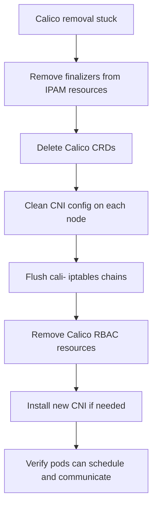

# How to Fix Problems During Calico CNI Removal

Author: [nawazdhandala](https://github.com/nawazdhandala)

Tags: Calico, Kubernetes, Networking, Troubleshooting

Description: Fix issues during Calico CNI removal by removing finalizers, cleaning up CNI configs, flushing iptables rules, and completing CRD deletion.

---

## Introduction

Fixing problems during Calico CNI removal requires addressing each stuck component individually. The recommended approach is to work through the layers in order: first resolve stuck finalizers on IPAM resources, then clean up CNI configuration files on each node, flush remaining iptables rules, and finally remove the CRDs.

Manual finalizer removal should be done carefully - finalizers exist to prevent data loss during cleanup. In the case of Calico IPAM resources, remove finalizers only after confirming Calico will not be restored to complete cleanup and after accounting for any remaining IPAM state manually.

## Symptoms

- `kubectl delete crd` hangs or times out
- New CNI not working because Calico CNI config still present
- iptables cali-* chains still present after Calico removal

## Root Causes

- IPAMBlocks with `projectcalico.org/block-affinities-cleanup` finalizers
- calico-node DaemonSet removed without running cleanup scripts
- Manual resource deletion leaving partial state

## Diagnosis Steps

```bash
# Check what's stuck

kubectl get ipamblocks.crd.projectcalico.org 2>/dev/null | head
kubectl get crd | grep calico
```

## Solution

**Fix 1: Remove finalizers from stuck IPAM resources**

```bash
# Remove finalizers from all IPAMBlocks
for BLOCK in $(kubectl get ipamblocks.crd.projectcalico.org \
  -o jsonpath='{.items[*].metadata.name}' 2>/dev/null); do
  kubectl patch ipamblock $BLOCK --type=json \
    -p='[{"op":"remove","path":"/metadata/finalizers"}]' 2>/dev/null || true
done

# Remove finalizers from IPAMHandles
for HANDLE in $(kubectl get ipamhandles.crd.projectcalico.org \
  -o jsonpath='{.items[*].metadata.name}' 2>/dev/null); do
  kubectl patch ipamhandle $HANDLE --type=json \
    -p='[{"op":"remove","path":"/metadata/finalizers"}]' 2>/dev/null || true
done

# Remove finalizers from BlockAffinities
for BA in $(kubectl get blockaffinities.crd.projectcalico.org \
  -o jsonpath='{.items[*].metadata.name}' 2>/dev/null); do
  kubectl patch blockaffinity $BA --type=json \
    -p='[{"op":"remove","path":"/metadata/finalizers"}]' 2>/dev/null || true
done
```

**Fix 2: Delete Calico CRDs**

```bash
# Delete remaining Calico CRDs
kubectl get crd | grep projectcalico.org | awk '{print $1}' | xargs -r kubectl delete crd
```

**Fix 3: Clean up CNI config on each node**

```bash
for NODE in $(kubectl get nodes -o jsonpath='{.items[*].metadata.name}'); do
  ssh $NODE "rm -f /etc/cni/net.d/10-calico.conflist \
                    /etc/cni/net.d/calico-kubeconfig \
                    /opt/cni/bin/calico \
                    /opt/cni/bin/calico-ipam"
  echo "Cleaned $NODE"
done
```

**Fix 4: Flush iptables cali-* chains**

```bash
# On each node
for NODE in $(kubectl get nodes -o jsonpath='{.items[*].metadata.name}'); do
  ssh $NODE << 'EOF'
# Remove references to cali- chains, then delete the chains.
for TABLE in filter nat mangle raw; do
  iptables-save -t "$TABLE" 2>/dev/null | grep -E '^-A .* -j cali-' | \
    sed 's/^-A /-D /' | while read -r RULE; do
      iptables -t "$TABLE" $RULE 2>/dev/null || true
    done

  iptables -t "$TABLE" -S 2>/dev/null | awk '/^-N cali-/ {print $2}' | while read -r CHAIN; do
    iptables -t "$TABLE" -F "$CHAIN" 2>/dev/null || true
  done

  iptables -t "$TABLE" -S 2>/dev/null | awk '/^-N cali-/ {print $2}' | while read -r CHAIN; do
    iptables -t "$TABLE" -X "$CHAIN" 2>/dev/null || true
  done
done
echo "iptables cleanup done"
EOF
done
```

**Fix 5: Clean up RBAC and Namespace**

```bash
kubectl delete clusterrole calico-node calico-kube-controllers 2>/dev/null || true
kubectl delete clusterrolebinding calico-node calico-kube-controllers 2>/dev/null || true
kubectl delete serviceaccount calico-node calico-kube-controllers -n kube-system 2>/dev/null || true
kubectl delete configmap calico-config -n kube-system 2>/dev/null || true
```


```mermaid
flowchart TD
    A[Calico removal stuck] --> B[Remove finalizers from IPAM resources]
    B --> C[Delete Calico CRDs]
    C --> D[Clean CNI config on each node]
    D --> E[Flush cali- iptables chains]
    E --> F[Remove Calico RBAC resources]
    F --> G[Install new CNI if needed]
    G --> H[Verify pods can schedule and communicate]
```

## Prevention

- Let `calico-node` terminate cleanly so its configured `/bin/calico-node -shutdown` preStop hook can run before removing host state
- Test removal in a staging cluster before production
- Keep the removal procedure documented in the cluster runbook

## Conclusion

Fixing Calico removal problems requires a systematic approach: remove finalizers from stuck IPAM resources, delete CRDs, clean CNI config files from each node, flush cali-* iptables chains, and remove RBAC resources. Work through these steps in order to achieve a clean Calico removal.
