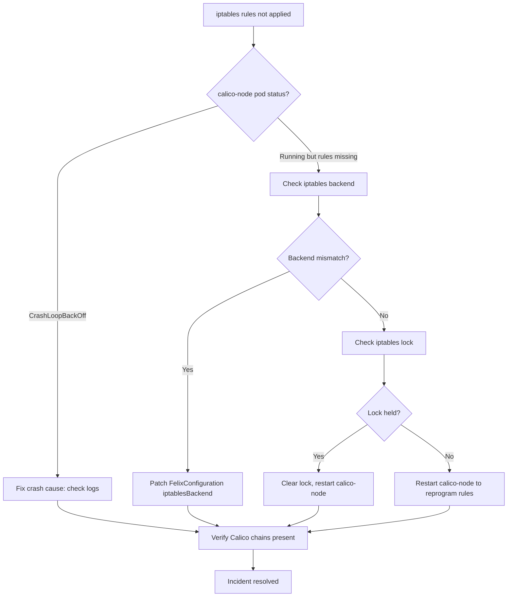

# How to Fix Calico iptables Rules Not Applied

Author: [nawazdhandala](https://github.com/nawazdhandala)

Tags: Calico, Iptables, Networking, Troubleshooting, Kubernetes, Felix

Description: Fix Calico iptables rules not being applied by resolving Felix configuration errors, clearing iptables conflicts, and restarting calico-node to trigger rule reprogramming.

---

## Introduction

When Calico's Felix daemon fails to apply iptables rules, pods lose network policy enforcement and NAT functionality. Fixing this requires resolving the specific reason Felix is not programming rules - which may be a Felix configuration error, an iptables backend conflict, a failed calico-node pod, or a locked iptables state from another process.

Felix is designed to be resilient: it retries iptables programming and will reprogram rules after a pod restart. The primary fix path is identifying what is blocking Felix and removing the blocker, then verifying Felix successfully reprograms all expected chains.

## Symptoms

- Network policies not enforced on a specific node
- MASQUERADE rules missing for pod CIDR
- calico-node pod restarting frequently

## Root Causes

- Felix in error state due to invalid FelixConfiguration
- iptables locked by another process
- calico-node pod in CrashLoopBackOff

## Solution

**Fix 1: Restart calico-node to trigger iptables reprogramming**

```bash
# Most common fix - restart calico-node on affected node
NODE_POD=$(kubectl get pods -n kube-system -l k8s-app=calico-node \
  --field-selector spec.nodeName=<node-name> -o jsonpath='{.items[0].metadata.name}')

kubectl delete pod $NODE_POD -n kube-system
# Wait for DaemonSet to reschedule

kubectl get pods -n kube-system -l k8s-app=calico-node \
  --field-selector spec.nodeName=<node-name>
# Expected: 1/1 Running
```

**Fix 2: Resolve iptables backend mismatch**

```bash
# Check if node uses iptables-legacy or iptables-nft
ssh <node-name> "update-alternatives --display iptables 2>/dev/null || ls -la /etc/alternatives/iptables"

# If Felix is using wrong backend, set it explicitly in FelixConfiguration
kubectl patch felixconfiguration default --type merge \
  --patch '{"spec":{"iptablesBackend":"Auto"}}'
# Or explicitly: "NFT" for nftables-based kernels, "Legacy" for older kernels
```

**Fix 3: Clear iptables lock**

```bash
# Check if iptables lock is held
ssh <node-name> "sudo lsof /run/xtables.lock 2>/dev/null"

# If another process holds the lock, identify and stop it
ssh <node-name> "sudo fuser /run/xtables.lock"

# Clear stale lock if process no longer running
ssh <node-name> "sudo rm -f /run/xtables.lock"

# Then restart calico-node
kubectl delete pod $NODE_POD -n kube-system
```

**Fix 4: Fix invalid FelixConfiguration**

```bash
# Check for Felix configuration errors in logs
kubectl logs $NODE_POD -n kube-system -c calico-node | grep -i "felix\|error\|config"

# Validate FelixConfiguration
calicoctl get felixconfiguration default -o yaml

# Reset to defaults if corrupted
calicoctl delete felixconfiguration default
# Felix will recreate with defaults on next calico-node start
kubectl rollout restart daemonset calico-node -n kube-system
```

**Fix 5: Verify chains after fix**

```bash
# After restarting calico-node, verify Calico chains are present
ssh <node-name> "sudo iptables -L | grep -c '^Chain cali'"
# Expected: several Calico chains (cali-FORWARD, cali-INPUT, cali-OUTPUT, etc.)

ssh <node-name> "sudo iptables -t nat -L | grep -c '^Chain cali'"
# Expected: cali-nat-outgoing and related NAT chains
```

**Fix 6: Force iptables save/restore if rules were manually flushed**

```bash
# If iptables were manually flushed with iptables -F
# Restarting calico-node will repopulate all Calico chains
kubectl rollout restart daemonset calico-node -n kube-system
kubectl rollout status daemonset calico-node -n kube-system --timeout=300s

# Verify
ssh <node-name> "sudo iptables -L cali-FORWARD -n 2>/dev/null | head -5"
```



## Prevention

- Never run `iptables -F` on Kubernetes nodes without a plan to restore Calico rules
- Monitor calico-node pod health and restart counts
- Avoid running other iptables-managing tools alongside Calico

## Conclusion

Fixing Calico iptables rules not being applied requires identifying why Felix is not programming rules - whether due to a pod crash, backend mismatch, or lock contention - and then restarting calico-node to trigger rule reprogramming. Verify Calico chains are present after the fix before closing the incident.
