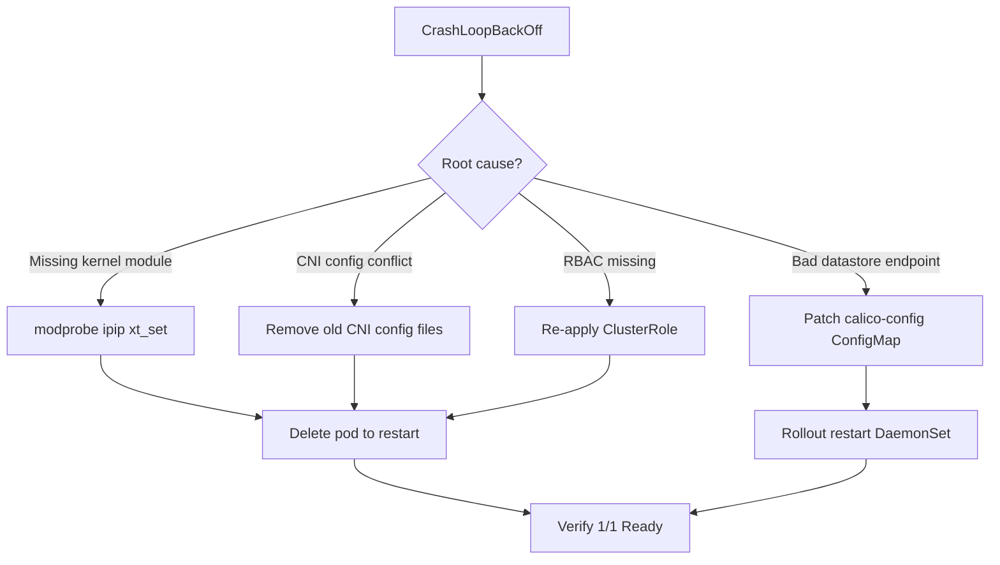

# How to Fix Calico Node CrashLoopBackOff

Author: [nawazdhandala](https://github.com/nawazdhandala)

Tags: Calico, Kubernetes, Networking, Troubleshooting

Description: Targeted fixes for calico-node CrashLoopBackOff including kernel module loading, CNI config repair, RBAC correction, and datastore reconnection.

---

## Introduction

Fixing a calico-node CrashLoopBackOff requires matching the repair action to the specific failure identified during diagnosis. Applying the wrong fix - for example, restarting the pod when the issue is a missing kernel module - wastes time and may mask the actual problem. This guide covers the four most common root causes and their corresponding fixes.

Each fix is designed to be applied with minimal disruption. Where node-level changes are required (such as loading a kernel module), the steps are written to be applied one node at a time. Cluster-wide configuration changes (such as RBAC corrections) take effect immediately without a node drain.

After applying any fix, the calico-node pod must be restarted cleanly. A fresh start with the corrected configuration confirms that the fix resolves the crash and does not just temporarily hide the symptom.

## Symptoms

- calico-node pods stuck in CrashLoopBackOff
- Previous container logs show crash reason
- Nodes report CNI unavailable or pods stuck in ContainerCreating

## Root Causes

- Kernel modules not loaded (`ipip`, `xt_set`, `nf_conntrack`)
- CNI config at `/etc/cni/net.d/` is corrupted or belongs to another CNI
- RBAC ClusterRole missing required API group permissions
- etcd endpoint in calico-config ConfigMap is stale or unreachable

## Diagnosis Steps

```bash
# Get crash reason from previous container
NODE_POD=<calico-node-pod-name>
kubectl logs $NODE_POD -n kube-system --previous -c calico-node | tail -30
```

## Solution

**Fix 1: Load missing kernel modules**

```bash
# On the affected node (run as root)
modprobe ipip
modprobe xt_set
modprobe nf_conntrack

# Make permanent across reboots
cat >> /etc/modules <<EOF
ipip
xt_set
nf_conntrack
EOF

# Restart calico-node pod after loading modules
kubectl delete pod $NODE_POD -n kube-system
```

**Fix 2: Repair CNI configuration**

```bash
# On the affected node - remove conflicting CNI config
ls /etc/cni/net.d/
# Remove config from old CNI (e.g., flannel, weave)
rm /etc/cni/net.d/10-flannel.conflist

# Regenerate Calico CNI config by restarting calico-node
kubectl delete pod $NODE_POD -n kube-system
```

**Fix 3: Fix RBAC permissions**

```bash
# Re-apply the Calico ClusterRole and ClusterRoleBinding
kubectl apply -f https://raw.githubusercontent.com/projectcalico/calico/v3.27.0/manifests/calico.yaml \
  --server-side --field-manager=calico

# Or patch specific missing permissions
kubectl patch clusterrole calico-node --type=json \
  -p='[{"op":"add","path":"/rules/-","value":{"apiGroups":[""],"resources":["pods","nodes","namespaces"],"verbs":["get","list","watch"]}}]'
```

**Fix 4: Update stale datastore endpoint**

```bash
# Update the calico-config ConfigMap
kubectl patch configmap calico-config -n kube-system --type=merge \
  -p '{"data":{"etcd_endpoints":"https://<correct-etcd-ip>:2379"}}'

# Restart the entire DaemonSet
kubectl rollout restart daemonset calico-node -n kube-system
kubectl rollout status daemonset calico-node -n kube-system
```

**Fix 5: Reset calico-node on a single node**

```bash
# Cordon the node first to prevent workload disruption
kubectl cordon <node-name>

# Delete calico-node pod
kubectl delete pod $NODE_POD -n kube-system

# Wait for replacement to be ready
kubectl wait pods -l k8s-app=calico-node -n kube-system \
  --for=condition=Ready --timeout=120s

# Uncordon
kubectl uncordon <node-name>
```



## Prevention

- Check kernel module availability in pre-flight checks before installing Calico
- Use a cluster provisioning checklist that removes other CNI plugins fully
- Store RBAC manifests in Git and apply via GitOps to prevent drift

## Conclusion

Calico node CrashLoopBackOff is fixable once the root cause is identified from the previous container log. Load missing kernel modules, clean up conflicting CNI configs, correct RBAC permissions, or update the datastore endpoint as appropriate. Always verify the fix by waiting for the pod to reach 1/1 Ready status and confirming cross-node pod connectivity is restored.
