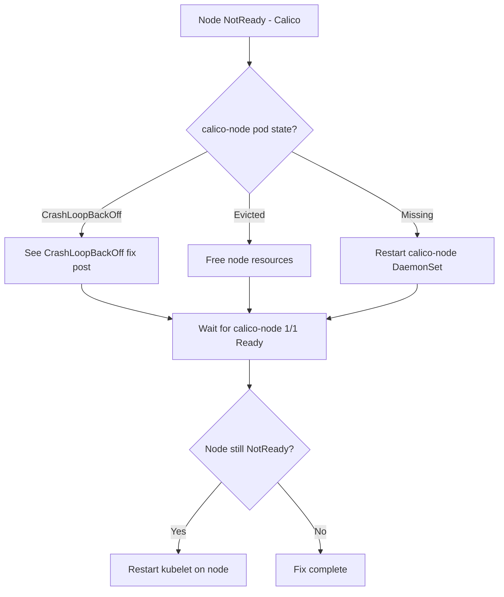

# How to Fix Calico Node Not Ready Status

Author: [nawazdhandala](https://github.com/nawazdhandala)

Tags: Calico, Kubernetes, Networking, Troubleshooting

Description: Fix Kubernetes node NotReady status caused by Calico issues by restoring calico-node pod health, reinstalling CNI binaries, and resolving Felix connectivity problems.

---

## Introduction

Fixing a node's NotReady status caused by Calico requires restoring the calico-node pod to a healthy running state. The specific fix depends on the root cause identified during diagnosis. The most common fixes are resolving a calico-node CrashLoopBackOff (addressed in that companion post), uncordoning the node after eviction, or reinstalling the calico-node DaemonSet to restore missing CNI binaries.

## Symptoms

- Node shows NotReady status in `kubectl get nodes`
- calico-node pod on the node is not in 1/1 Running state
- Pods cannot be scheduled on the affected node

## Root Causes

- calico-node CrashLoopBackOff (see companion post)
- calico-node pod evicted from the node
- CNI binary missing from /opt/cni/bin
- Felix datastore connectivity issue

## Diagnosis Steps

```bash
kubectl get nodes
kubectl get pods -n kube-system -l k8s-app=calico-node -o wide | grep <node-name>
```

## Solution

**Fix 1: Recover from calico-node CrashLoopBackOff**

```bash
# See companion CrashLoopBackOff fix post for detailed steps
# Quick restart attempt:
NODE_POD=$(kubectl get pods -n kube-system -l k8s-app=calico-node \
  --field-selector spec.nodeName=<node-name> -o name)
kubectl delete pod $NODE_POD -n kube-system
kubectl wait pods -n kube-system -l k8s-app=calico-node \
  --field-selector spec.nodeName=<node-name> \
  --for=condition=Ready --timeout=120s
```

**Fix 2: Restore evicted calico-node pod**

```bash
# If calico-node was evicted due to resource pressure
# First, check node disk/memory pressure
kubectl describe node <node-name> | grep -i "pressure\|condition"

# Free up resources on the node or increase node size
# Then, verify calico-node reschedules
kubectl get pods -n kube-system -l k8s-app=calico-node --field-selector spec.nodeName=<node-name>
```

**Fix 3: Reinstall calico-node to restore CNI binary**

```bash
# Force calico-node DaemonSet to redeploy on the node
# This regenerates CNI binaries
kubectl rollout restart daemonset calico-node -n kube-system

# Wait for the pod on the affected node
kubectl wait pods -n kube-system -l k8s-app=calico-node \
  --field-selector spec.nodeName=<node-name> \
  --for=condition=Ready --timeout=180s
```

**Fix 4: Force node readiness re-evaluation**

```bash
# After calico-node is healthy, kubelet should automatically re-evaluate node readiness
# Force kubelet to re-check CNI:
ssh <node-name> "sudo systemctl restart kubelet"

# Check node status
kubectl get node <node-name>
# Expected: Ready
```

**Verify fix**

```bash
kubectl get nodes
# Expected: all nodes show Ready status
kubectl get pods -n kube-system -l k8s-app=calico-node -o wide
# Expected: all pods show 1/1 Running
```



## Prevention

- Set resource requests on calico-node to prevent eviction
- Monitor node conditions to detect NotReady before workloads are affected
- Include calico-node readiness in cluster health dashboards

## Conclusion

Fixing Calico-induced node NotReady status centers on restoring the calico-node pod to healthy state. The specific fix matches the pod's failure mode: restart for CrashLoopBackOff, resource adjustment for eviction, or DaemonSet restart for missing CNI binary. After calico-node recovers, restart kubelet if the node status does not automatically recover.
