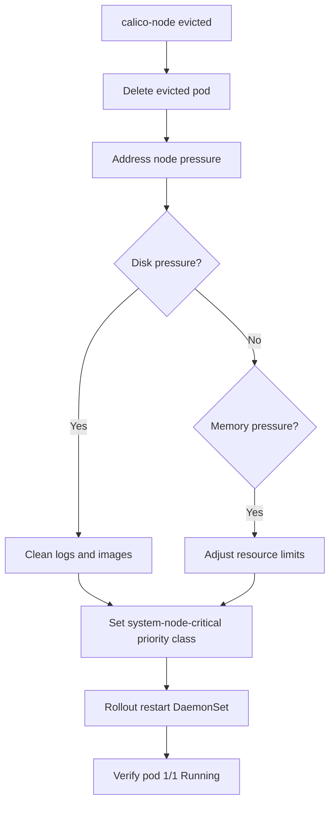

# How to Fix Calico Node Pod Eviction

Author: [nawazdhandala](https://github.com/nawazdhandala)

Tags: Calico, Kubernetes, Networking, Troubleshooting

Description: Fix calico-node pod eviction by setting system-node-critical priority class, clearing node pressure, and adjusting resource limits to prevent re-eviction.

---

## Introduction

Fixing calico-node pod eviction requires two steps: clearing the current pressure condition to allow the pod to reschedule, and then applying the `system-node-critical` priority class to prevent future evictions. Without the priority class change, calico-node will be evicted again the next time node pressure occurs.

## Symptoms

- calico-node pod in Evicted state
- Node in DiskPressure or MemoryPressure condition

## Root Causes

- Node disk or memory pressure
- calico-node lacks system-node-critical priority class

## Diagnosis Steps

```bash
kubectl get pods -n kube-system -l k8s-app=calico-node -o wide
kubectl describe node <node-name> | grep -i "pressure\|conditions"
```

## Solution

**Fix 1: Clear evicted pod and address disk pressure**

```bash
# Delete evicted pod (will reschedule automatically)
kubectl delete pod <evicted-calico-node-pod> -n kube-system

# Address disk pressure on the node
ssh <node-name> << 'EOF'
# Check what's using disk space
df -h
du -sh /var/log/* | sort -rh | head -10

# Clean Docker/container runtime logs
journalctl --vacuum-size=500M

# Clean old container images
docker system prune -f 2>/dev/null || crictl rmi --prune 2>/dev/null

# Verify disk freed
df -h
EOF
```

**Fix 2: Set system-node-critical priority class (prevents future eviction)**

```bash
kubectl patch daemonset calico-node -n kube-system --type=json \
  -p='[{"op":"add","path":"/spec/template/spec/priorityClassName","value":"system-node-critical"}]'

# Rollout restart to apply
kubectl rollout restart daemonset calico-node -n kube-system
kubectl rollout status daemonset calico-node -n kube-system
```

**Fix 3: Reduce calico-node log verbosity if logs filling disk**

```bash
kubectl patch felixconfiguration default \
  --type merge \
  --patch '{"spec":{"logSeverityScreen":"Warning"}}'

# Restart calico-node to apply new log level
kubectl rollout restart daemonset calico-node -n kube-system
```

**Fix 4: Set resource limits to control calico-node resource use**

```bash
kubectl patch daemonset calico-node -n kube-system --type=json \
  -p='[{
    "op": "replace",
    "path": "/spec/template/spec/containers/0/resources",
    "value": {
      "requests": {"cpu": "250m", "memory": "256Mi"},
      "limits": {"cpu": "500m", "memory": "512Mi"}
    }
  }]'
```

**Verify fix**

```bash
kubectl get pods -n kube-system -l k8s-app=calico-node --field-selector spec.nodeName=<node>
# Expected: 1/1 Running
kubectl describe node <node> | grep -i "pressure"
# Expected: no pressure conditions
```



## Prevention

- Set system-node-critical priority class in initial Calico installation
- Monitor node disk and memory pressure
- Configure log rotation for calico-node verbosity

## Conclusion

Fixing calico-node eviction requires clearing the pressure condition, deleting the evicted pod to trigger rescheduling, and setting system-node-critical priority class to prevent future evictions. Address the root pressure cause to prevent immediate re-eviction.
