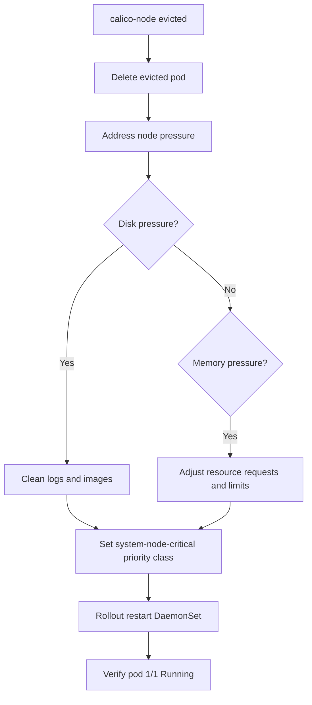

# How to Fix Calico Node Pod Eviction

Author: [nawazdhandala](https://github.com/nawazdhandala)

Tags: Calico, Kubernetes, Networking, Troubleshooting

Description: Fix calico-node pod eviction by setting system-node-critical priority class, clearing node pressure, and adjusting resource limits to prevent re-eviction.

---

## Introduction

Fixing calico-node pod eviction requires two steps: clearing the current pressure condition to allow the pod to reschedule, and then applying the `system-node-critical` priority class to give the networking pod the highest built-in priority. This does not prevent every possible eviction, but it helps keep calico-node available and makes it less likely to be selected before lower-priority pods during node pressure.

## Symptoms

- calico-node pod in Evicted state
- Node in DiskPressure or MemoryPressure condition

## Root Causes

- Node disk or memory pressure
- calico-node lacks system-node-critical priority class, making it lower priority during eviction decisions

## Diagnosis Steps

```bash
kubectl get pods -n kube-system -l k8s-app=calico-node -o wide
kubectl describe node <node-name> | grep -i "pressure\|conditions"
```

## Solution

**Fix 1: Clear evicted pod and address disk pressure**

```bash
# Delete evicted pod (will reschedule automatically)

kubectl delete pod <evicted-calico-node-pod> -n kube-system

# Address disk pressure on the node
ssh <node-name> << 'EOF'
# Check what's using disk space
df -h
du -sh /var/log/* | sort -rh | head -10

# Clean systemd journal logs
journalctl --vacuum-size=500M

# Clean unused container runtime data/images
docker system prune -f 2>/dev/null || crictl rmi --prune 2>/dev/null

# Verify disk freed
df -h
EOF
```

**Fix 2: Set system-node-critical priority class (improves eviction priority and rescheduling)**

```bash
kubectl patch daemonset calico-node -n kube-system --type=json \
  -p='[{"op":"add","path":"/spec/template/spec/priorityClassName","value":"system-node-critical"}]'

# Rollout restart to apply
kubectl rollout restart daemonset calico-node -n kube-system
kubectl rollout status daemonset calico-node -n kube-system
```

**Fix 3: Reduce calico-node log verbosity if logs filling disk**

```bash
kubectl patch felixconfiguration default \
  --type merge \
  --patch '{"spec":{"logSeverityScreen":"Warning"}}'

# Restart calico-node to apply new log level
kubectl rollout restart daemonset calico-node -n kube-system
```

**Fix 4: Set resource requests and limits to control calico-node resource use**

```bash
kubectl patch daemonset calico-node -n kube-system --type=strategic \
  -p='{"spec":{"template":{"spec":{"containers":[{"name":"calico-node","resources":{"requests":{"cpu":"250m","memory":"256Mi"},"limits":{"cpu":"500m","memory":"512Mi"}}}]}}}}'
```

Tune these values for your cluster. Limits that are too low can cause calico-node to be OOMKilled.

**Verify fix**

```bash
kubectl get pods -n kube-system -l k8s-app=calico-node --field-selector spec.nodeName=<node>
# Expected: 1/1 Running
kubectl describe node <node> | grep -i "pressure"
# Expected: DiskPressure and MemoryPressure are False
```


```mermaid
flowchart TD
    A[calico-node evicted] --> B[Delete evicted pod]
    B --> C[Address node pressure]
    C --> D{Disk pressure?}
    D -- Yes --> E[Clean logs and images]
    D -- No --> F{Memory pressure?}
    F -- Yes --> G[Adjust resource requests and limits]
    E & G --> H[Set system-node-critical priority class]
    H --> I[Rollout restart DaemonSet]
    I --> J[Verify pod 1/1 Running]
```

## Prevention

- Set system-node-critical priority class in initial Calico installation when calico-node is a critical node-level add-on
- Monitor node disk and memory pressure
- Configure log rotation for calico-node verbosity

## Conclusion

Fixing calico-node eviction requires clearing the pressure condition, deleting the evicted pod to trigger rescheduling, and setting system-node-critical priority class to improve eviction priority and rescheduling. Address the root pressure cause to prevent immediate re-eviction.
