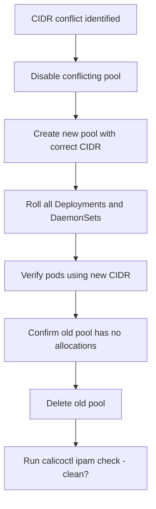

# How to Fix Calico Pod CIDR Conflicts

Author: [nawazdhandala](https://github.com/nawazdhandala)

Tags: Calico, Kubernetes, Networking, Troubleshooting

Description: Fix Calico pod CIDR conflicts by replacing overlapping IP pools, reassigning pod IPs from the new CIDR, and updating routing configuration.

---

## Introduction

Fixing a Calico pod CIDR conflict requires replacing the conflicting IP pool with one using a non-overlapping CIDR. Because this affects running pods - they currently have IP addresses from the conflicting pool - the fix must be performed as a migration: disable the old pool, allow Calico to assign IPs from the new pool as pods are rescheduled, and eventually remove the old pool once no pods are using it.

This process requires pod rescheduling, which means a brief disruption for each workload as pods are deleted and recreated with IPs from the new CIDR. For most workloads, this is handled transparently by Kubernetes Deployments.

## Symptoms

- Traffic to specific pod IPs misrouted to physical hosts
- `calicoctl ipam check` reports conflicts
- Intermittent connectivity between specific pods and nodes

## Root Causes

- Pod CIDR overlaps with node host subnet
- Two IP pools with overlapping CIDRs

## Diagnosis Steps

```bash
calicoctl get ippool -o yaml
kubectl get nodes -o wide
# Confirm the specific overlap
```

## Solution

**Fix: Replace conflicting IP pool**

```bash
# Step 1: Disable the conflicting IP pool (stops new allocations from it)
calicoctl patch ippool <conflicting-pool-name> \
  --patch='{"spec": {"disabled": true}}'

# Step 2: Create a new IP pool with non-overlapping CIDR
cat <<EOF | calicoctl apply -f -
apiVersion: projectcalico.org/v3
kind: IPPool
metadata:
  name: new-pod-ippool
spec:
  cidr: 192.168.0.0/16  # Non-overlapping CIDR
  ipipMode: Always
  natOutgoing: true
  disabled: false
EOF

# Step 3: Verify the new pool is active
calicoctl get ippool new-pod-ippool -o yaml

# Step 4: Roll all pods to get IPs from the new pool
# For each Deployment/DaemonSet, trigger a rollout
kubectl rollout restart deployment --all --all-namespaces
kubectl rollout restart daemonset --all --all-namespaces

# Step 5: Verify pods have new IPs from non-overlapping CIDR
kubectl get pods --all-namespaces -o wide | grep -v "192.168" | grep -v "kube-system"

# Step 6: Once all pods are using the new CIDR, delete the old pool
# First confirm no IPs are still allocated from the old pool
calicoctl ipam show --show-blocks | grep <old-cidr>

# Then delete
calicoctl delete ippool <conflicting-pool-name>
```

**Fix if clusters just being set up:**

```bash
# Simpler: delete and recreate the entire cluster with correct CIDRs
# Or just delete and recreate the IP pool before any pods are scheduled

calicoctl delete ippool default-ipv4-ippool
cat <<EOF | calicoctl apply -f -
apiVersion: projectcalico.org/v3
kind: IPPool
metadata:
  name: default-ipv4-ippool
spec:
  cidr: 192.168.0.0/16
  ipipMode: Always
  natOutgoing: true
EOF
```



## Prevention

- Reserve distinct CIDRs for pods (192.168.x.x), nodes (10.0.x.x), and services (172.16.x.x)
- Create an IP address management (IPAM) plan before cluster provisioning
- Run `calicoctl ipam check` during cluster setup to confirm no conflicts

## Conclusion

Fixing Calico CIDR conflicts requires a rolling IP migration: disable the conflicting pool, create a replacement, roll all pods to receive new IPs, then delete the old pool. This process is disruptive but manageable with Kubernetes rolling updates.
