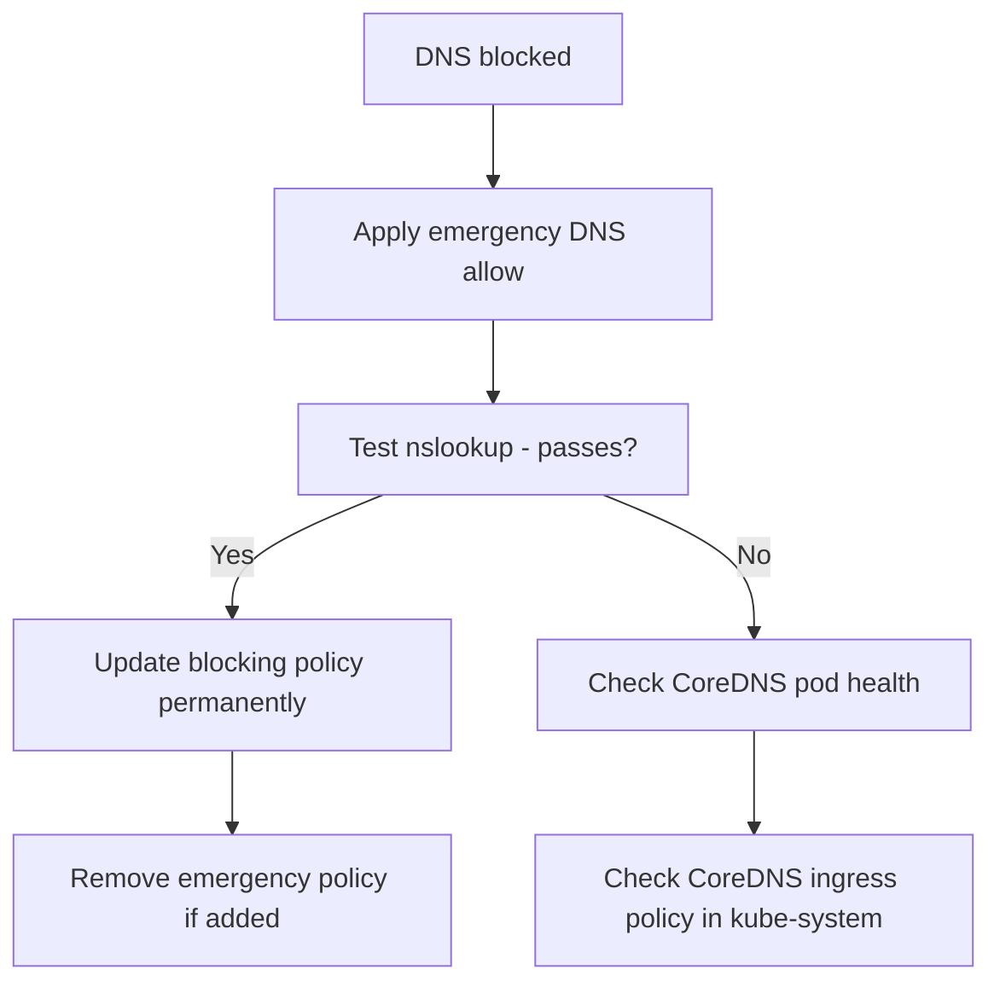

# How to Fix Calico Policy Blocking DNS

Author: [nawazdhandala](https://github.com/nawazdhandala)

Tags: Calico, Kubernetes, Networking, Troubleshooting

Description: Fix DNS failures caused by Calico NetworkPolicies by adding correct UDP port 53 egress allow rules for CoreDNS access from affected namespaces.

---

## Introduction

The fix for Calico policies blocking DNS is straightforward: add an egress allow rule for UDP and TCP port 53 to the `kube-system` namespace. The challenge is applying it quickly during an incident while ensuring the permanent fix is correct.

## Symptoms

- DNS failures in specific namespace
- nslookup returns SERVFAIL or times out
- `nc -zuv <coredns-ip> 53` fails from affected pod

## Root Causes

- Default-deny egress without DNS allow
- Wrong namespace selector not matching kube-system

## Diagnosis Steps

```bash
COREDNS_IP=$(kubectl get svc kube-dns -n kube-system -o jsonpath='{.spec.clusterIP}')
kubectl exec <pod> -n <namespace> -- nc -zuv $COREDNS_IP 53 2>&1
```

## Solution

**Fix 1: Add DNS egress allow (Kubernetes NetworkPolicy)**

```yaml
apiVersion: networking.k8s.io/v1
kind: NetworkPolicy
metadata:
  name: allow-dns-egress
  namespace: <affected-namespace>
spec:
  podSelector: {}
  policyTypes:
  - Egress
  egress:
  - to:
    - namespaceSelector:
        matchLabels:
          kubernetes.io/metadata.name: kube-system
    ports:
    - protocol: UDP
      port: 53
    - protocol: TCP
      port: 53
```

**Fix 2: Apply immediately and test**

```bash
kubectl apply -f allow-dns-egress.yaml

# Test DNS immediately
kubectl exec <pod-name> -n <namespace> -- nslookup kubernetes.default
# Expected: resolves to 10.96.0.1 or similar kubernetes service IP
```

**Fix 3: Fix incorrect namespaceSelector**

```bash
# Verify kube-system labels
kubectl get namespace kube-system --show-labels
# The canonical label is: kubernetes.io/metadata.name: kube-system

# Update an incorrect selector
kubectl patch networkpolicy <policy-name> -n <namespace> --type=json \
  -p='[{"op":"replace","path":"/spec/egress/0/to/0/namespaceSelector/matchLabels","value":{"kubernetes.io/metadata.name":"kube-system"}}]'
```

**Fix 4: Also allow DNS in Calico GlobalNetworkPolicy**

```yaml
apiVersion: projectcalico.org/v3
kind: GlobalNetworkPolicy
metadata:
  name: allow-dns-global
spec:
  order: 10
  selector: all()
  types:
  - Egress
  egress:
  - action: Allow
    protocol: UDP
    destination:
      ports: [53]
  - action: Allow
    protocol: TCP
    destination:
      ports: [53]
```



## Prevention

- Include DNS allow in all namespace policy templates
- Use `kubernetes.io/metadata.name: kube-system` as the canonical selector label
- Test DNS in new namespaces during provisioning

## Conclusion

Fixing DNS blocking by Calico requires adding egress allow rules for UDP and TCP port 53 to the kube-system namespace. Use the `kubernetes.io/metadata.name` label in the namespaceSelector to reliably match kube-system. Verify with nslookup immediately after applying the fix.
