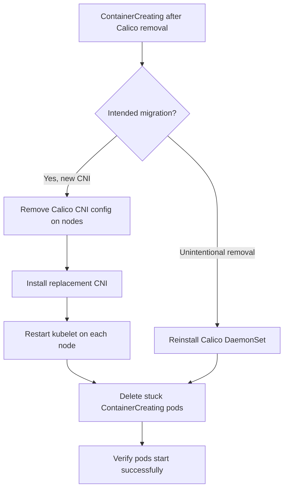

# How to Fix ContainerCreating After Uninstalling Calico

Author: [nawazdhandala](https://github.com/nawazdhandala)

Tags: Calico, Kubernetes, Networking, Troubleshooting

Description: Fix pods stuck in ContainerCreating after Calico uninstall by removing stale CNI configs, installing a replacement CNI, or restoring Calico if the uninstall was unintentional.

---

## Introduction

Fixing ContainerCreating after Calico uninstall depends on the intended state: are you migrating to a new CNI plugin, or was the Calico removal accidental? Each scenario requires a different response, but both share the need to restore a functioning CNI configuration on each affected node.

The fastest resolution is to install a replacement CNI immediately. If the cluster must stay on Calico, reinstalling the calico-node DaemonSet restores functionality. The key action in either case is ensuring that only one CNI config file exists in `/etc/cni/net.d/` and that it references available CNI binaries.

## Symptoms

- Pods stuck in ContainerCreating with `failed to find plugin "calico"` error
- kubelet logs show CNI plugin not found
- No CNI config files in `/etc/cni/net.d/` (all removed)

## Root Causes

- Calico CNI binaries removed but config file still referencing them
- No replacement CNI installed after Calico removal
- Calico config file conflicts with new CNI config file

## Diagnosis Steps

```bash
# Quick check
NODE=$(kubectl get pod <stuck-pod> -o jsonpath='{.spec.nodeName}')
ssh $NODE "ls /etc/cni/net.d/ && ls /opt/cni/bin/ | grep -E 'calico|flannel|cilium'"
```

## Solution

**Fix 1: Install a replacement CNI (e.g., Flannel)**

```bash
# If migrating from Calico to Flannel
# First, clean Calico CNI config on all nodes
for NODE in $(kubectl get nodes -o jsonpath='{.items[*].metadata.name}'); do
  ssh $NODE "rm -f /etc/cni/net.d/10-calico.conflist \
                    /etc/cni/net.d/calico-kubeconfig"
done

# Install Flannel
kubectl apply -f https://raw.githubusercontent.com/coreos/flannel/master/Documentation/kube-flannel.yml

# Wait for Flannel to deploy
kubectl rollout status daemonset kube-flannel-ds -n kube-flannel
```

**Fix 2: Reinstall Calico (if removal was unintentional)**

```bash
# Reinstall Calico
kubectl apply -f https://raw.githubusercontent.com/projectcalico/calico/v3.27.0/manifests/calico.yaml

# Wait for calico-node to be ready
kubectl rollout status daemonset calico-node -n kube-system --timeout=120s

# Verify pods can now start
kubectl get pods --all-namespaces | grep ContainerCreating
```

**Fix 3: Remove conflicting CNI config (if new CNI is installed but Calico config conflicts)**

```bash
for NODE in $(kubectl get nodes -o jsonpath='{.items[*].metadata.name}'); do
  ssh $NODE << 'EOF'
# List CNI configs in priority order
ls -la /etc/cni/net.d/
# Remove the Calico config (lower number = higher priority, may be overriding new CNI)
rm -f /etc/cni/net.d/10-calico.conflist
rm -f /etc/cni/net.d/calico-kubeconfig
echo "Removed Calico CNI config"
EOF
done

# Restart kubelet to pick up new config
for NODE in $(kubectl get nodes -o jsonpath='{.items[*].metadata.name}'); do
  ssh $NODE "sudo systemctl restart kubelet"
  echo "Restarted kubelet on $NODE"
done
```

**Fix 4: Re-schedule stuck pods after CNI fix**

```bash
# Delete stuck pods so they restart with working CNI
kubectl get pods --all-namespaces | grep ContainerCreating | \
  awk '{print $1 " " $2}' | while read NS POD; do
  kubectl delete pod $POD -n $NS
done
```

**Verify fix**

```bash
kubectl get pods --all-namespaces | grep ContainerCreating
# Expected: empty result
```



## Prevention

- Have replacement CNI manifests ready before removing Calico
- Clean `/etc/cni/net.d/` as part of Calico removal, not after
- Test pod scheduling on one node before removing Calico from all nodes

## Conclusion

Fixing ContainerCreating after Calico uninstall requires either installing a replacement CNI or reinstalling Calico, then ensuring the CNI config in `/etc/cni/net.d/` references available CNI binaries. Delete stuck ContainerCreating pods after the CNI is fixed — they will not automatically retry scheduling.
