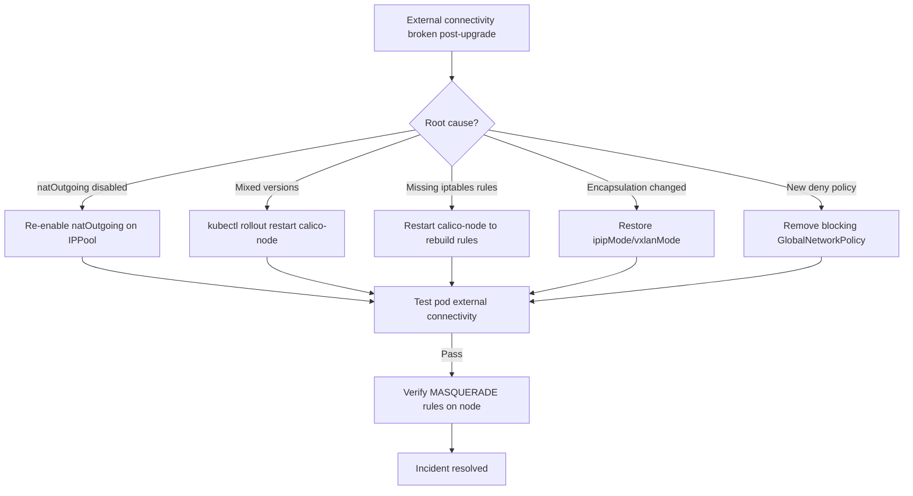

# How to Fix External Connectivity Broken After Calico Upgrade

Author: [nawazdhandala](https://github.com/nawazdhandala)

Tags: Calico, Kubernetes, Networking, Troubleshooting

Description: Fix external connectivity after Calico upgrades by re-enabling natOutgoing on IP pools, completing mixed-version upgrades, and restoring iptables MASQUERADE rules.

---

## Introduction

After diagnosing the cause of external connectivity loss following a Calico upgrade, the fix targets the specific root cause identified. The most common fix is re-enabling `natOutgoing` on the Calico IP pool, which restores the MASQUERADE rule that allows pods to communicate with external IPs through the node's IP address.

A secondary but equally important fix is completing interrupted upgrades. When calico-node runs mixed versions across nodes, routing inconsistencies cause intermittent external connectivity failures that are difficult to reproduce. Bringing all nodes to the same version is essential before applying any configuration fixes.

## Symptoms

- Pods cannot reach external IPs after Calico upgrade
- `curl` from pod to external service times out or connection refused
- iptables MASQUERADE rules missing for pod CIDR on nodes

## Root Causes

- natOutgoing disabled or set to `Disabled` in IP pool after upgrade
- Mixed calico-node versions across cluster nodes
- iptables rules not rebuilt after upgrade

## Solution

**Fix 1: Re-enable natOutgoing on IP pool**

```bash
# Get current IP pool configuration
calicoctl get ippool -o yaml > /tmp/ippool-backup.yaml

# Edit to re-enable natOutgoing
calicoctl get ippool default-ipv4-ippool -o yaml | \
  sed 's/natOutgoing: false/natOutgoing: true/' | \
  calicoctl apply -f -

# Verify change applied
calicoctl get ippool default-ipv4-ippool -o yaml | grep natOutgoing
# Expected: natOutgoing: true
```

**Fix 2: Complete a mixed-version upgrade**

```bash
# Check all calico-node versions
kubectl get pods -n kube-system -l k8s-app=calico-node \
  -o jsonpath='{range .items[*]}{.metadata.name}{"\t"}{.spec.containers[0].image}{"\n"}{end}'

# If images differ, force a rolling restart to pull consistent image
kubectl rollout restart daemonset calico-node -n kube-system
kubectl rollout status daemonset calico-node -n kube-system --timeout=300s
```

**Fix 3: Rebuild iptables NAT rules**

```bash
# Restart calico-node to force iptables rebuild
kubectl rollout restart daemonset calico-node -n kube-system

# After rollout completes, verify MASQUERADE rule exists on a node
ssh <node-name> "sudo iptables -t nat -L POSTROUTING -n | grep -E 'MASQUERADE|cali'"
# Expected: at least one MASQUERADE rule for pod CIDR
```

**Fix 4: Fix encapsulation mode if changed during upgrade**

```bash
# If ipipMode was changed, restore original setting
calicoctl get ippool default-ipv4-ippool -o yaml | grep -E "ipipMode|vxlanMode"

# To restore to CrossSubnet (common default):
calicoctl patch ippool default-ipv4-ippool \
  --patch='{"spec":{"ipipMode":"CrossSubnet"}}'
```

**Fix 5: Restore GlobalNetworkPolicy that permits egress**

```bash
# If a new GlobalNetworkPolicy was created that blocks egress:
calicoctl get globalnetworkpolicy -o yaml | grep -B5 -A20 "deny"

# If a deny egress policy was created by upgrade, remove it
calicoctl delete globalnetworkpolicy <offending-policy-name>
```

**Verify fix**

```bash
# Test external connectivity from a pod
kubectl run ext-test --image=busybox --restart=Never -- sleep 120
kubectl exec ext-test -- ping -c 3 8.8.8.8
kubectl exec ext-test -- wget -qO- --timeout=10 http://example.com 2>&1 | head -3
kubectl delete pod ext-test
```



## Prevention

- Back up IP pool configuration before every Calico upgrade
- Verify natOutgoing setting post-upgrade in staging before production
- Read Calico release notes for changes to default IP pool settings

## Conclusion

Fixing external connectivity broken by a Calico upgrade most commonly requires re-enabling `natOutgoing` on the IP pool or completing a mixed-version upgrade. After any configuration change, restart calico-node to rebuild iptables rules and verify external connectivity from a test pod.
