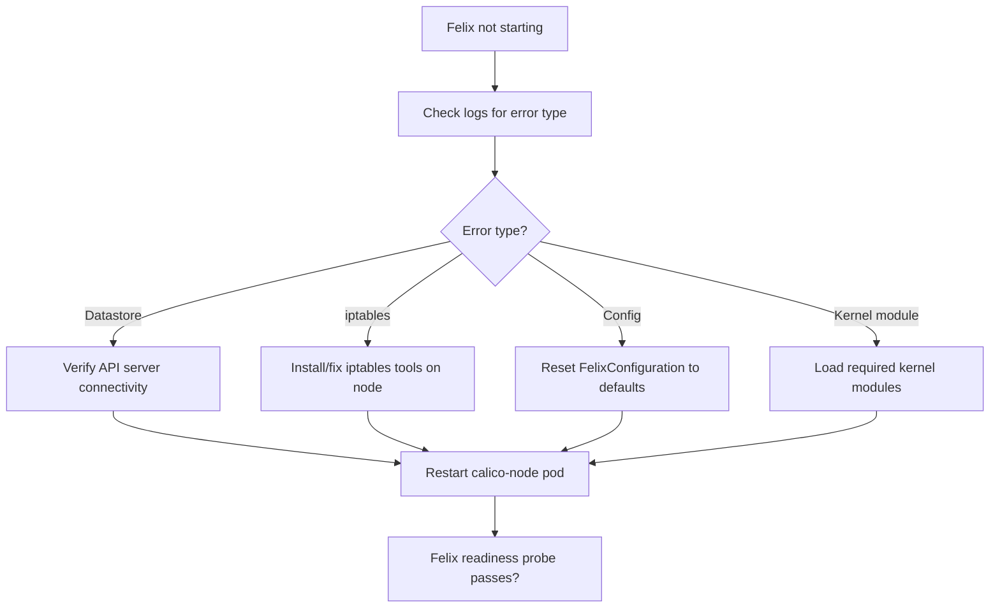

# How to Fix Felix Not Starting in Calico

Author: [nawazdhandala](https://github.com/nawazdhandala)

Tags: Calico, Kubernetes, Networking, Troubleshooting

Description: Fix Felix startup failures in Calico by resolving datastore connectivity, iptables availability, and FelixConfiguration errors.

---

## Introduction

Fixing Felix startup failures requires matching the repair to the specific error identified in Felix logs. The three most common categories are datastore connectivity failures, iptables tool availability issues, and FelixConfiguration validation errors. Each category has a distinct fix path.

## Symptoms

- calico-node pod Running but 0/1 Ready
- Felix startup error in calico-node logs
- NetworkPolicy not being enforced on the node

## Root Causes

- Datastore (etcd or Kubernetes API) unreachable from Felix
- iptables binary missing or wrong version
- FelixConfiguration CRD has invalid settings

## Diagnosis Steps

```bash
NODE_POD=<calico-node-pod-name>
kubectl logs $NODE_POD -n kube-system -c calico-node | grep -i "felix\|error" | tail -30
```

## Solution

**Fix 1: Resolve datastore connectivity**

```bash
# Verify calico-config has correct datastore settings
kubectl get configmap calico-config -n kube-system -o yaml

# For Kubernetes datastore: verify API server is reachable
kubectl exec $NODE_POD -n kube-system -- \
  wget -qO- https://kubernetes.default.svc/api/v1 \
  --header "Authorization: Bearer $(cat /var/run/secrets/kubernetes.io/serviceaccount/token)" \
  -o /dev/null -w "%{http_code}\n" 2>/dev/null

# Fix: Update datastore endpoint if wrong
kubectl patch configmap calico-config -n kube-system --type=merge \
  -p '{"data":{"cluster_type":"k8s,bgp"}}'
```

**Fix 2: Install missing iptables tools**

```bash
# On the affected node
ssh <node-name> "apt-get install -y iptables" || \
  ssh <node-name> "yum install -y iptables"

# Or install iptables-legacy (required for some kernel versions)
ssh <node-name> "apt-get install -y iptables-legacy && \
  update-alternatives --set iptables /usr/sbin/iptables-legacy"

# Restart calico-node to pick up iptables
kubectl delete pod $NODE_POD -n kube-system
```

**Fix 3: Fix invalid FelixConfiguration**

```bash
# Check for validation errors
calicoctl get felixconfiguration default -o yaml

# Reset to defaults if configuration is corrupted
calicoctl delete felixconfiguration default 2>/dev/null || true

# Apply valid minimal configuration
cat <<EOF | calicoctl apply -f -
apiVersion: projectcalico.org/v3
kind: FelixConfiguration
metadata:
  name: default
spec:
  ipv6Support: false
  logSeverityScreen: Info
EOF

# Restart calico-node to pick up new config
kubectl rollout restart daemonset calico-node -n kube-system
```

**Fix 4: Kernel module fix for Felix**

```bash
# Felix requires specific kernel modules
ssh <node-name> << 'EOF'
modprobe nf_conntrack
modprobe ip_tables
modprobe xt_conntrack
modprobe xt_set
modprobe xt_mark
echo -e "nf_conntrack\nip_tables\nxt_conntrack\nxt_set\nxt_mark" >> /etc/modules
EOF

kubectl delete pod $NODE_POD -n kube-system
```



## Prevention

- Verify iptables and kernel module requirements on nodes before Calico installation
- Test datastore connectivity in pre-installation checks
- Validate FelixConfiguration changes in a test cluster first

## Conclusion

Fixing Felix startup failures requires identifying the specific error category from logs and applying the matching fix: datastore connectivity repair, iptables tool installation, FelixConfiguration reset, or kernel module loading. After applying the fix, restart calico-node and verify Felix readiness probe passes.
