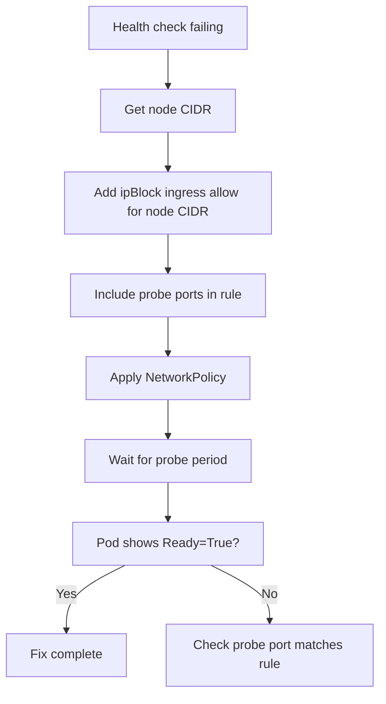

# How to Fix Health Checks Failing After Enabling Calico Policies

Author: [nawazdhandala](https://github.com/nawazdhandala)

Tags: Calico, Kubernetes, Networking, Troubleshooting

Description: Fix liveness and readiness probe failures caused by Calico NetworkPolicies by adding node subnet ipBlock ingress rules and probe port allows.

---

## Introduction

Fixing health check failures caused by Calico NetworkPolicies requires adding an ipBlock ingress allow rule that covers the node subnet, enabling kubelet probe traffic to reach the pod. Because kubelet probes originate from the node's primary IP address (not from a pod), podSelector and namespaceSelector rules are insufficient — only an ipBlock rule that covers the node's IP will allow probe traffic.

This fix must be applied to every namespace where pods with health checks are subject to a default-deny ingress policy. The node CIDR used in the ipBlock must cover all node IPs in the cluster, or the fix will only work for pods on nodes within the covered range.

## Symptoms

- Liveness/readiness probes failing after NetworkPolicy is applied
- Pods in restart loops despite healthy application
- Pods in NotReady state but application responds correctly when tested manually

## Root Causes

- Default-deny ingress policy without node CIDR ipBlock allow
- Probe port not included in any ingress allow rule
- Incorrect node CIDR in ipBlock (too narrow)

## Diagnosis Steps

```bash
# Get the node CIDR used in your cluster
kubectl get nodes -o jsonpath='{range .items[*]}{.status.addresses[?(@.type=="InternalIP")].address}{"\n"}{end}'
# Determine the encompassing CIDR (e.g., 10.0.0.0/8 for 10.x.x.x addresses)
```

## Solution

**Fix 1: Add node CIDR ipBlock for probe ports**

```yaml
apiVersion: networking.k8s.io/v1
kind: NetworkPolicy
metadata:
  name: allow-kubelet-probes
  namespace: <namespace>
spec:
  podSelector: {}
  policyTypes:
  - Ingress
  ingress:
  # Allow kubelet health check probes from node IPs
  - from:
    - ipBlock:
        cidr: 10.0.0.0/8  # Replace with your node subnet CIDR
    ports:
    - protocol: TCP
      port: 8080  # Replace with your probe port
    - protocol: TCP
      port: 8443  # HTTPS probe port if applicable
    - protocol: TCP
      port: 9090  # Metrics port if applicable
```

**Fix 2: For Calico GlobalNetworkPolicy**

```yaml
apiVersion: projectcalico.org/v3
kind: GlobalNetworkPolicy
metadata:
  name: allow-kubelet-probes
spec:
  selector: all()
  order: 50
  types:
  - Ingress
  ingress:
  # Allow node-originating traffic (covers kubelet probes)
  - action: Allow
    source:
      nets:
      - 10.0.0.0/8  # Your node CIDR
    destination:
      ports:
      - 8080
      - 8443
      - 9090
```

**Fix 3: Allow from host network (simpler approach)**

```yaml
# In some clusters, using a broad allow for the node subnet is cleanest
apiVersion: networking.k8s.io/v1
kind: NetworkPolicy
metadata:
  name: allow-node-access
  namespace: <namespace>
spec:
  podSelector: {}
  policyTypes:
  - Ingress
  ingress:
  - from:
    - ipBlock:
        cidr: <node-cidr>/16  # Use actual node network CIDR
```

**Verify the fix**

```bash
# Watch probe results
kubectl describe pod <pod-name> -n <namespace> \
  | grep -A 5 "Conditions:\|Liveness:\|Readiness:"

# Pod should show Ready=True within probe's initialDelaySeconds
kubectl get pod <pod-name> -n <namespace> --watch
```



## Prevention

- Include node CIDR ipBlock in all default ingress policy templates
- Document node CIDR in network policy design guide
- Test pod readiness immediately after applying any ingress NetworkPolicy

## Conclusion

Fixing health check failures from Calico NetworkPolicies requires adding an ipBlock ingress allow for the node CIDR covering the probe port. Since kubelet probes come from the node IP rather than from a pod, namespace and pod selectors are ineffective — only ipBlock rules can allow this traffic.
