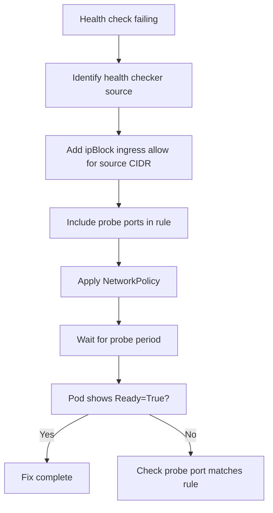

# How to Fix Health Checks Failing After Enabling Calico Policies

Author: [nawazdhandala](https://github.com/nawazdhandala)

Tags: Calico, Kubernetes, Networking, Troubleshooting

Description: Fix liveness and readiness probe failures caused by Calico NetworkPolicies by adding node subnet ipBlock ingress rules and probe port allows.

---

## Introduction

Fixing health check failures after enabling Calico NetworkPolicies starts with identifying which health check is failing. Kubernetes liveness and readiness probes are sent by the kubelet to the Pod IP, and Calico allows host-to-local-workload traffic so local kubelet probes can work. A namespace default-deny pod NetworkPolicy should not normally block kubelet liveness or readiness probes by itself.

An ipBlock ingress allow is useful when the failing health check comes from outside the selected pods, such as a load balancer, monitoring system, hostNetwork component, or node-originated check that is not the local kubelet probe. In that case, the CIDR used in the ipBlock must cover the actual health checker source IPs, and the rule must include the health check port.

## Symptoms

- Health checks failing after NetworkPolicy is applied
- Pods in restart loops despite healthy application
- Pods in NotReady state but application responds correctly when tested manually

## Root Causes

- Default-deny ingress policy without an allow rule for the actual health checker source CIDR
- Probe port not included in any ingress allow rule
- Incorrect source CIDR in ipBlock (too narrow or the wrong network)
- Host endpoint, pre-DNAT, or external load balancer policy blocking health check traffic

## Diagnosis Steps

```bash
# Check the failing probe or health check event first
kubectl describe pod <pod-name> -n <namespace> \
  | grep -A 5 "Liveness:\|Readiness:\|Events:"

# If the source is node-originated or hostNetwork-based, list node InternalIPs
kubectl get nodes -o jsonpath='{range .items[*]}{.status.addresses[?(@.type=="InternalIP")].address}{"\n"}{end}'
# Determine the exact source CIDR to allow (for example, 10.0.0.0/24 for 10.0.0.x node addresses)
```

## Solution

**Fix 1: Add source CIDR ipBlock for health check ports**

```yaml
apiVersion: networking.k8s.io/v1
kind: NetworkPolicy
metadata:
  name: allow-health-checks
  namespace: <namespace>
spec:
  podSelector: {}
  policyTypes:
  - Ingress
  ingress:
  # Allow health checks from the actual source network
  - from:
    - ipBlock:
        cidr: 10.0.0.0/24  # Replace with your health checker source CIDR
    ports:
    - protocol: TCP
      port: 8080  # Replace with your probe port
    - protocol: TCP
      port: 8443  # HTTPS probe port if applicable
    - protocol: TCP
      port: 9090  # Metrics port if applicable
```

**Fix 2: For Calico GlobalNetworkPolicy**

```yaml
apiVersion: projectcalico.org/v3
kind: GlobalNetworkPolicy
metadata:
  name: allow-health-checks
spec:
  selector: all()
  order: 50
  types:
  - Ingress
  ingress:
  # Allow health checks from the actual source network
  - action: Allow
    protocol: TCP
    source:
      nets:
      - 10.0.0.0/24  # Your health checker source CIDR
    destination:
      ports:
      - 8080
      - 8443
      - 9090
```

**Fix 3: Allow from host network health checkers**

```yaml
# Use this only when the health checker really runs from hostNetwork or node IPs
apiVersion: networking.k8s.io/v1
kind: NetworkPolicy
metadata:
  name: allow-hostnetwork-health-checks
  namespace: <namespace>
spec:
  podSelector: {}
  policyTypes:
  - Ingress
  ingress:
  - from:
    - ipBlock:
        cidr: 10.0.0.0/24  # Use the actual node or hostNetwork source CIDR
    ports:
    - protocol: TCP
      port: 8080  # Replace with your health check port
```

**Verify the fix**

```bash
# Watch probe results
kubectl describe pod <pod-name> -n <namespace> \
  | grep -A 5 "Conditions:\|Liveness:\|Readiness:"

# Pod should show Ready=True within probe's initialDelaySeconds
kubectl get pod <pod-name> -n <namespace> --watch
```


```mermaid
flowchart TD
    A[Health check failing] --> B[Identify health checker source]
    B --> C[Add ipBlock ingress allow for source CIDR]
    C --> D[Include probe ports in rule]
    D --> E[Apply NetworkPolicy]
    E --> F[Wait for probe period]
    F --> G[Pod shows Ready=True?]
    G -- Yes --> H[Fix complete]
    G -- No --> I[Check probe port matches rule]
```

## Prevention

- Include health checker source CIDRs in default ingress policy templates
- Document load balancer, monitoring, hostNetwork, and node source CIDRs in the network policy design guide
- Test pod readiness immediately after applying any ingress NetworkPolicy

## Conclusion

Fixing health check failures after enabling Calico NetworkPolicies requires confirming the health checker source and allowing that source CIDR on the probe port when the traffic comes from outside the selected pods. Do not assume a namespace default-deny pod policy is blocking local kubelet probes; check host endpoint, pre-DNAT, load balancer, monitoring, and probe configuration before adding broad node CIDR rules.
