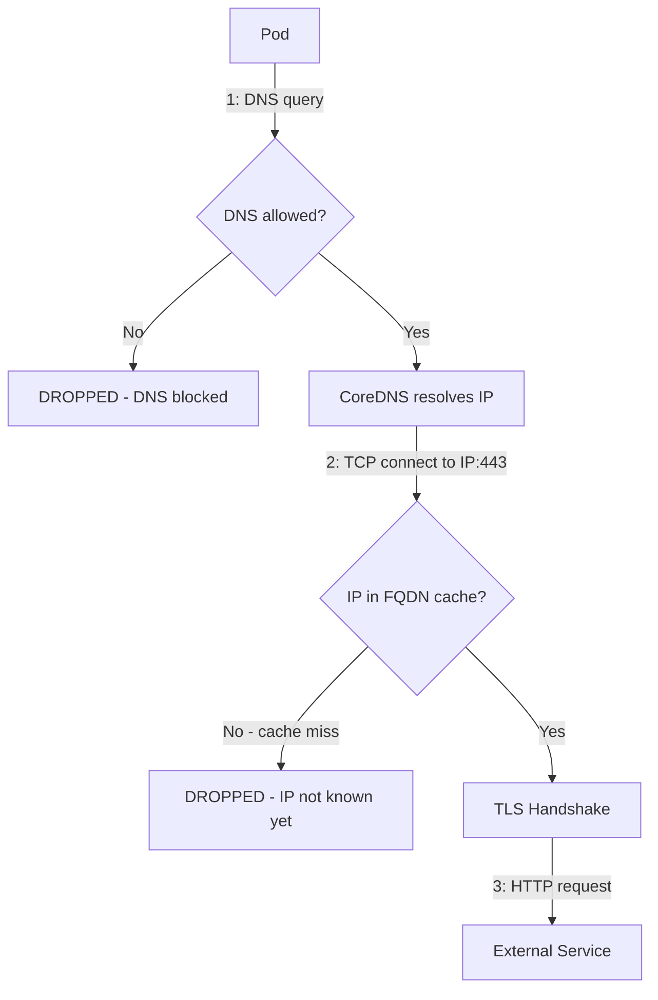

# How to Fix HTTP and HTTPS Egress Rules That Still Fail in Cilium Network Policies

Author: [nawazdhandala](https://github.com/nawazdhandala)

Tags: Cilium, Kubernetes, Network Policy, Egress, HTTP, HTTPS, Troubleshooting

Description: Diagnose and fix Cilium egress policies for HTTP and HTTPS traffic that fail despite appearing correctly configured, covering DNS resolution timing, port matching, and SNI issues.

---

## Introduction

HTTP and HTTPS egress rules in Cilium are among the most commonly misconfigured policies. Traffic can fail even when the policy appears correct due to several subtle issues: DNS not being allowed before the FQDN rule is evaluated, port 443 being blocked while port 80 is allowed, SNI-based filtering blocking HTTPS connections, or the DNS cache not being populated when traffic is first attempted.

Understanding the full path of an HTTPS connection helps identify where it fails: DNS resolution, TCP connection, TLS handshake, or HTTP request.

## Prerequisites

- Cilium with DNS proxy enabled
- `kubectl`, `hubble` CLIs

## Common Failure: Missing DNS Allow

HTTPS to an FQDN requires DNS resolution first. If DNS is blocked, the IP is never resolved and the FQDN policy never matches:

```yaml
# WRONG: Missing DNS rule
spec:
  egress:
    - toFQDNs:
        - matchName: "api.example.com"
      toPorts:
        - ports:
            - port: "443"
              protocol: TCP
```

```yaml
# CORRECT: Include DNS allow
spec:
  egress:
    - toEndpoints:
        - matchLabels:
            k8s-app: kube-dns
            io.kubernetes.pod.namespace: kube-system
      toPorts:
        - ports:
            - port: "53"
              protocol: UDP
          rules:
            dns:
              - matchPattern: "*"
    - toFQDNs:
        - matchName: "api.example.com"
      toPorts:
        - ports:
            - port: "443"
              protocol: TCP
```

## Architecture



## Common Failure: Port 80 Redirect to 443

Some services redirect HTTP to HTTPS. If port 80 is not allowed, the redirect fails:

```yaml
spec:
  egress:
    - toFQDNs:
        - matchName: "api.example.com"
      toPorts:
        - ports:
            - port: "80"
              protocol: TCP
            - port: "443"
              protocol: TCP
```

## Check DNS Cache State

```bash
kubectl exec -n kube-system ds/cilium -- \
  cilium-dbg fqdn cache list
```

If the FQDN is not in the cache, DNS has not been resolved recently. Trigger a DNS lookup and retry.

## Debug with Hubble

```bash
hubble observe --from-label app=my-app \
  --verdict DROPPED --since 5m
```

Look for `POLICY_DENIED` drops with destination port 53 (DNS blocked) or 443 (HTTPS blocked).

## Common Failure: CIDR vs FQDN Conflict

If the same destination is matched by both a CIDR allow rule and an FQDN rule, behavior depends on rule ordering. Prefer FQDN rules for external services.

## Conclusion

HTTP and HTTPS egress failures in Cilium are most commonly caused by missing DNS allow rules, cache timing issues on first connection, or port mismatches. Using Hubble to identify the specific drop reason at each connection stage narrows the fix to the correct rule.
