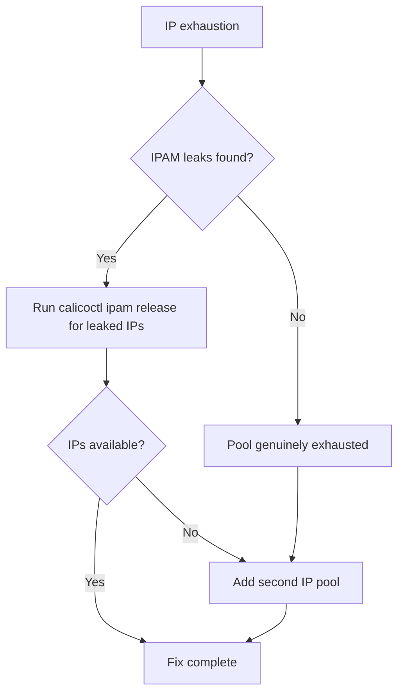

# How to Fix IP Pool Exhaustion in Calico

Author: [nawazdhandala](https://github.com/nawazdhandala)

Tags: Calico, Kubernetes, Networking, Troubleshooting

Description: Fix Calico IP pool exhaustion by cleaning up leaked IPAM allocations, expanding the IP pool CIDR, or adding a new non-overlapping IP pool.

---

## Introduction

Fixing IP pool exhaustion in Calico depends on the root cause: if the exhaustion is due to leaked allocations, cleaning them up restores capacity immediately. If the pool is genuinely too small, adding a second IP pool provides the additional address space needed.

New pods cannot start until IP addresses are available, so restoring capacity is a time-sensitive operation.

## Symptoms

- Pods failing with IP allocation errors
- `calicoctl ipam show` shows 0 free IPs
- `calicoctl ipam check` reports leaked allocations

## Root Causes

- IPAM allocation leaks from improperly terminated pods
- IP pool CIDR too small for cluster pod count

## Diagnosis Steps

```bash
calicoctl ipam show
calicoctl ipam check
```

## Solution

**Fix 1: Clean up leaked IPAM allocations**

```bash
# First, identify leaked allocations

calicoctl ipam check --show-problem-ips 2>/dev/null

# Release leaked IPs
calicoctl ipam release --ip=<leaked-ip> 2>/dev/null || true

# Or use the automated cleanup
calicoctl datastore migrate lock
calicoctl ipam check -o ipam-report.json 2>/dev/null
# Review the report before releasing leaked IPs
calicoctl ipam release --from-report=ipam-report.json
calicoctl datastore migrate unlock

# After cleanup, verify free IPs
calicoctl ipam show
```

**Fix 2: Do not patch the existing IP pool CIDR**

```bash
# Check current pool
calicoctl get ippool default-ipv4-ippool -o yaml

# The IPPool spec.cidr field is immutable. Do not try to expand it with patch.
# Add a new non-overlapping pool instead, then recreate pods that need new IPs.
```

**Fix 3: Add a second IP pool (safest option)**

```bash
cat <<EOF | calicoctl apply -f -
apiVersion: projectcalico.org/v3
kind: IPPool
metadata:
  name: additional-ippool
spec:
  cidr: 192.168.0.0/16  # Must be non-overlapping and within the Kubernetes pod CIDR
  ipipMode: Always
  natOutgoing: true
  disabled: false
EOF

# Verify the new pool is active
calicoctl ipam show
```

**Fix 4: Release leaked IPs from an IPAM report**

```bash
# Release leaked allocations identified by calicoctl ipam check
calicoctl ipam release --from-report=<report-file>
```

**Verify fix: New pods can get IPs**

```bash
# Deploy test pod to confirm IP allocation works
kubectl run ip-test --image=busybox --restart=Never -- sleep 30
kubectl wait pod/ip-test --for=condition=Ready --timeout=60s
kubectl get pod ip-test -o wide
kubectl delete pod ip-test
```


```mermaid
flowchart TD
    A[IP exhaustion] --> B{IPAM leaks found?}
    B -- Yes --> C[Run calicoctl ipam release for leaked IPs]
    C --> D{IPs available?}
    D -- Yes --> E[Fix complete]
    D -- No --> F[Add second IP pool]
    B -- No --> G[Pool genuinely exhausted]
    G --> F
    F --> E
```

## Prevention

- Size IP pools at 2x expected pod count
- Monitor IP utilization and alert before exhaustion
- Run regular IPAM audits to catch leaks early

## Conclusion

Fixing Calico IP pool exhaustion requires addressing leaks first (often restoring sufficient capacity), then adding pool capacity if genuine exhaustion occurred. Adding a second IP pool is the correct expansion approach because an existing IP pool CIDR cannot be changed. Verify fix by confirming new pods receive IPs successfully.
