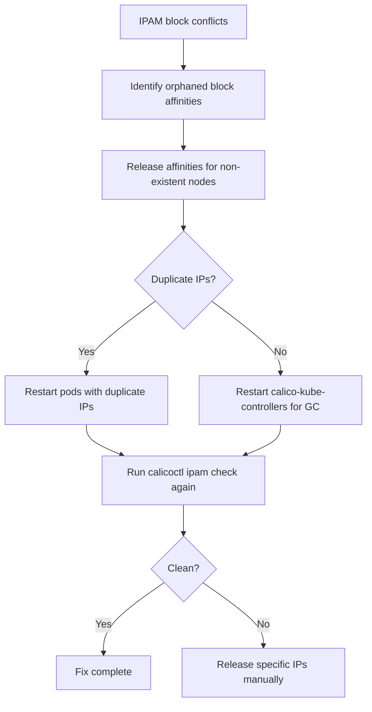

# How to Fix IPAM Block Conflicts in Calico

Author: [nawazdhandala](https://github.com/nawazdhandala)

Tags: Calico, Kubernetes, Networking, Troubleshooting

Description: Fix Calico IPAM block conflicts by releasing orphaned block affinities, resolving duplicate IP allocations, and using calicoctl to clean inconsistent IPAM state.

---

## Introduction

Fixing IPAM block conflicts requires carefully removing inconsistent IPAM state without disrupting running pods. The key principle is to identify which IPAM records are orphaned or conflicted, release them, and then allow Calico's IPAM controller to rebuild a consistent state.

## Symptoms

- `calicoctl ipam check` reports errors
- Duplicate pod IPs or failed IP allocations

## Root Causes

- Orphaned block affinities from removed nodes
- Race conditions during cluster operations

## Diagnosis Steps

```bash
calicoctl ipam check
calicoctl ipam show --show-blocks
```

## Solution

**Fix 1: Release orphaned block affinities**

```bash
# Identify nodes that no longer exist
CURRENT_NODES=$(kubectl get nodes -o jsonpath='{.items[*].metadata.name}')

for BA in $(calicoctl get blockaffinity -o jsonpath='{.items[*].metadata.name}' 2>/dev/null); do
  NODE=$(calicoctl get blockaffinity $BA -o jsonpath='{.spec.node}' 2>/dev/null)
  if ! echo "$CURRENT_NODES" | grep -qw "$NODE"; then
    echo "Releasing orphaned block affinity: $BA (node $NODE no longer exists)"
    calicoctl delete blockaffinity $BA 2>/dev/null
  fi
done
```

**Fix 2: Resolve duplicate IP allocations**

```bash
# Find pods with duplicate IPs
DUPE_IPS=$(kubectl get pods --all-namespaces -o wide \
  | awk '{print $7}' | sort | uniq -d | grep -v "IP\|<none>")

for IP in $DUPE_IPS; do
  echo "Duplicate IP: $IP"
  kubectl get pods --all-namespaces -o wide | grep "$IP"
  # Restart the pods with duplicate IPs - they will get new IPs from clean blocks
  # Identify and delete/restart pods sharing the IP
done
```

**Fix 3: Use calicoctl ipam release to clean specific allocations**

```bash
# Release a specific IP that is allocated but not in use
calicoctl ipam release --ip=<ip-address>

# Release multiple IPs using a report
calicoctl ipam check 2>/dev/null  # Check output lists problematic IPs
```

**Fix 4: Force IPAM GC by restarting calico-kube-controllers**

```bash
# calico-kube-controllers handles IPAM garbage collection
kubectl rollout restart deployment calico-kube-controllers -n kube-system
kubectl rollout status deployment calico-kube-controllers -n kube-system

# Wait for GC to run
sleep 60

# Re-check
calicoctl ipam check
```



## Prevention

- Clean IPAM records when removing nodes using proper node drain and delete procedures
- Run IPAM checks after every node replacement
- Let calico-kube-controllers run IPAM GC regularly

## Conclusion

Fixing IPAM block conflicts requires releasing orphaned block affinities from non-existent nodes, resolving duplicate IP allocations by restarting affected pods, and allowing calico-kube-controllers to perform IPAM garbage collection. Verify with a clean `calicoctl ipam check` output.
