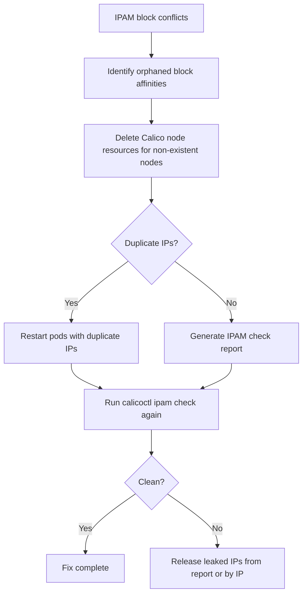

# How to Fix IPAM Block Conflicts in Calico

Author: [nawazdhandala](https://github.com/nawazdhandala)

Tags: Calico, Kubernetes, Networking, Troubleshooting

Description: Fix Calico IPAM block conflicts by releasing orphaned block affinities, resolving duplicate IP allocations, and using calicoctl to clean inconsistent IPAM state.

---

## Introduction

Fixing IPAM block conflicts requires carefully removing inconsistent IPAM state without disrupting running pods. The key principle is to identify which IPAM records are orphaned or conflicted, release only unused addresses, and then verify that Calico's IPAM state is consistent.

## Symptoms

- `calicoctl ipam check` reports errors
- Duplicate pod IPs or failed IP allocations

## Root Causes

- Orphaned block affinities from removed nodes
- Race conditions during cluster operations

## Diagnosis Steps

```bash
calicoctl ipam check
calicoctl ipam show --show-blocks
```

## Solution

**Fix 1: Remove orphaned Calico node resources**

```bash
# Identify Calico nodes that no longer exist in Kubernetes

CURRENT_NODES=$(kubectl get nodes -o jsonpath='{.items[*].metadata.name}')

for NODE in $(calicoctl get node -o go-template='{{range .}}{{range .Items}}{{.ObjectMeta.Name}}{{"\n"}}{{end}}{{end}}'); do
  if ! echo "$CURRENT_NODES" | grep -qw "$NODE"; then
    echo "Removing orphaned Calico node resource: $NODE"
    calicoctl delete node "$NODE"
  fi
done
```

**Fix 2: Resolve duplicate IP allocations**

```bash
# Find pods with duplicate IPs
DUPE_IPS=$(kubectl get pods --all-namespaces -o wide \
  | awk '{print $7}' | sort | uniq -d | grep -v "IP\|<none>")

for IP in $DUPE_IPS; do
  echo "Duplicate IP: $IP"
  kubectl get pods --all-namespaces -o wide | awk -v ip="$IP" '$7 == ip'
  # Restart the pods with duplicate IPs - they will get new IPs from clean blocks
  # Identify and delete/restart pods sharing the IP
done
```

**Fix 3: Use calicoctl ipam release to clean specific allocations**

```bash
# Release a specific IP that is allocated but not in use
calicoctl ipam release --ip=<ip-address>

# Release multiple IPs using a report
calicoctl datastore migrate lock
calicoctl ipam check -o report.json
calicoctl ipam release --from-report=report.json
calicoctl datastore migrate unlock
```

**Fix 4: Verify IPAM state**

```bash
# Re-check after cleanup
calicoctl ipam check
```


```mermaid
flowchart TD
    A[IPAM block conflicts] --> B[Identify orphaned block affinities]
    B --> C[Delete Calico node resources for non-existent nodes]
    C --> D{Duplicate IPs?}
    D -- Yes --> E[Restart pods with duplicate IPs]
    D -- No --> F[Generate IPAM check report]
    E & F --> G[Run calicoctl ipam check again]
    G --> H{Clean?}
    H -- Yes --> I[Fix complete]
    H -- No --> J[Release leaked IPs from report or by IP]
```

## Prevention

- Clean IPAM records when removing nodes using proper node drain and delete procedures
- Run IPAM checks after every node replacement
- Decommission removed Calico nodes with `calicoctl delete node <nodeName>` when manual cleanup is required

## Conclusion

Fixing IPAM block conflicts requires removing orphaned Calico node resources for non-existent nodes, resolving duplicate IP allocations by restarting affected pods, and releasing only leaked or unused IPAM allocations. Verify with a clean `calicoctl ipam check` output.
