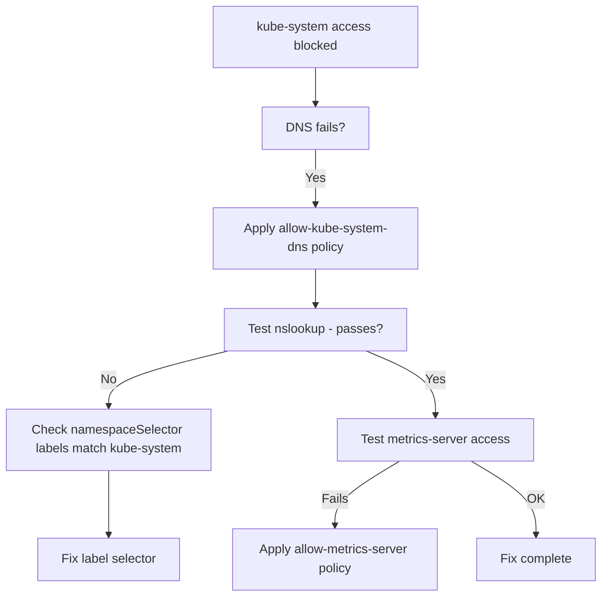

# How to Fix kube-system Access Problems with Calico NetworkPolicy

Author: [nawazdhandala](https://github.com/nawazdhandala)

Tags: Calico, Kubernetes, Networking, Troubleshooting

Description: Fix kube-system access failures caused by Calico NetworkPolicy by adding correct namespace selector egress rules for DNS, metrics-server, and other kube-system services.

---

## Introduction

Fixing kube-system access problems from Calico NetworkPolicies involves adding egress allow rules that correctly reference the `kube-system` namespace using its labels. The most common errors are using incorrect label selectors that do not match the actual kube-system namespace labels, or omitting the DNS allow rule entirely.

Each fix in this guide addresses a specific blocking scenario. The most impactful fix to apply first is restoring DNS access (UDP/TCP port 53 to kube-system), since without DNS most other connectivity tests are also broken.

## Symptoms

- `nslookup` failures from pods in application namespaces
- Metrics server queries return connection refused
- kube-system component health checks fail from application pods

## Root Causes

- egress.to namespaceSelector not matching kube-system labels
- Missing DNS allow rule (port 53)
- kube-system ingress policy blocking non-system namespaces

## Diagnosis Steps

```bash
# Get kube-system actual labels
kubectl get namespace kube-system --show-labels

# Test DNS before fix
kubectl exec <pod> -n <namespace> -- nslookup kubernetes.default 2>&1
```

## Solution

**Fix 1: Add egress allow for DNS (most common fix)**

```yaml
apiVersion: networking.k8s.io/v1
kind: NetworkPolicy
metadata:
  name: allow-kube-system-dns
  namespace: <affected-namespace>
spec:
  podSelector: {}
  policyTypes:
  - Egress
  egress:
  - to:
    - namespaceSelector:
        matchLabels:
          kubernetes.io/metadata.name: kube-system
    ports:
    - protocol: UDP
      port: 53
    - protocol: TCP
      port: 53
```

**Fix 2: Add metrics-server access**

```yaml
apiVersion: networking.k8s.io/v1
kind: NetworkPolicy
metadata:
  name: allow-metrics-server
  namespace: <affected-namespace>
spec:
  podSelector: {}
  policyTypes:
  - Egress
  egress:
  - to:
    - namespaceSelector:
        matchLabels:
          kubernetes.io/metadata.name: kube-system
    - podSelector:
        matchLabels:
          k8s-app: metrics-server
    ports:
    - protocol: TCP
      port: 4443
```

**Fix 3: Fix incorrect namespaceSelector labels**

```bash
# Check actual kube-system labels
kubectl get namespace kube-system -o yaml | grep -A 10 "labels:"
# kubernetes.io/metadata.name: kube-system  <-- this is always present

# Update the NetworkPolicy to use the correct label
kubectl patch networkpolicy <policy-name> -n <namespace> --type=json \
  -p='[{"op":"replace","path":"/spec/egress/0/to/0/namespaceSelector/matchLabels","value":{"kubernetes.io/metadata.name":"kube-system"}}]'
```

**Fix 4: Fix kube-system ingress policy if blocking**

```yaml
apiVersion: networking.k8s.io/v1
kind: NetworkPolicy
metadata:
  name: allow-from-application-namespaces
  namespace: kube-system
spec:
  podSelector:
    matchLabels:
      k8s-app: kube-dns
  policyTypes:
  - Ingress
  ingress:
  - from:
    - namespaceSelector:
        matchExpressions:
        - key: kubernetes.io/metadata.name
          operator: NotIn
          values: [kube-system]
    ports:
    - protocol: UDP
      port: 53
    - protocol: TCP
      port: 53
```

**Verify fix**

```bash
kubectl exec <pod-name> -n <namespace> -- nslookup kubernetes.default
# Expected: resolves to kubernetes Service ClusterIP
```



## Prevention

- Use `kubernetes.io/metadata.name: kube-system` as the canonical label in selectors (always present)
- Include DNS and common kube-system allows in namespace policy templates
- Validate DNS resolution from new namespaces during onboarding

## Conclusion

Fixing kube-system access failures in Calico NetworkPolicies starts with restoring DNS egress allow (UDP/TCP 53). Use `kubernetes.io/metadata.name: kube-system` as the namespaceSelector label since it is always present. Apply additional allows for specific kube-system services as needed.
