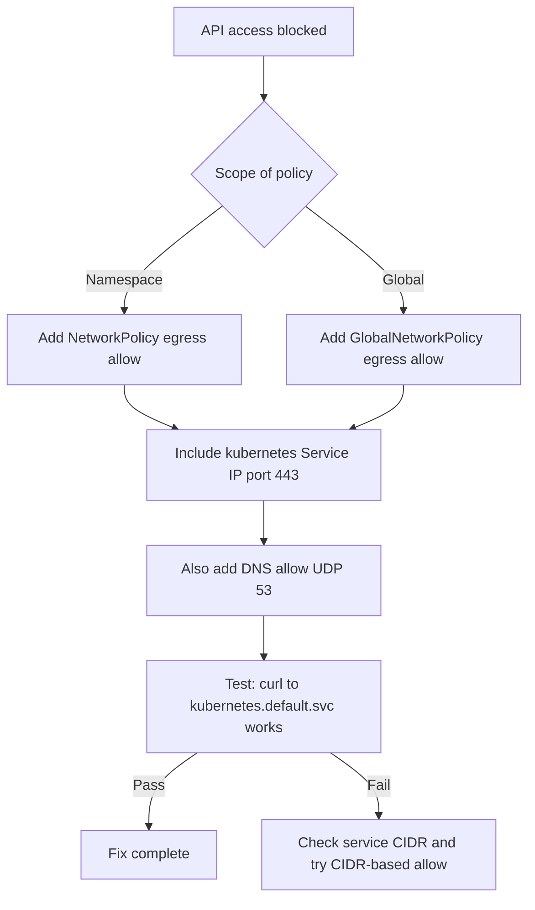

# How to Fix Kubernetes API Access Problems with Calico Egress Policy

Author: [nawazdhandala](https://github.com/nawazdhandala)

Tags: Calico, Kubernetes, Networking, Troubleshooting

Description: Fix Kubernetes API server access failures blocked by Calico egress policies by adding correct allow rules for the API service IP, port 443, and kube-system namespace.

---

## Introduction

When Calico egress policies block access to the Kubernetes API server, the fix involves adding explicit egress allow rules for the `kubernetes` Service in the default namespace. This is a common omission when default-deny egress policies are applied without accounting for control plane communication requirements.

The fix must cover the specific IP and port that the pod uses to reach the API server. In most clusters this is the `kubernetes.default.svc.cluster.local` Service (ClusterIP, port 443), but some workloads may resolve the API server directly by node IP and port 6443. Both paths may need to be covered depending on your cluster's DNS configuration.

This guide covers the fix for both Kubernetes-native NetworkPolicy and Calico-specific GlobalNetworkPolicy, along with the approach for namespace-scoped vs. cluster-wide egress restrictions.

## Symptoms

- `curl -sk https://kubernetes.default.svc.cluster.local/api/v1` fails from inside pod
- Operators return `context deadline exceeded` for API calls
- `kubectl exec <pod> -- nc -zv <kubernetes-service-ip> 443` shows connection refused or times out

## Root Causes

- Egress NetworkPolicy in namespace blocks all or specific outbound traffic without API allow
- GlobalNetworkPolicy default-deny without kubernetes Service allow
- Service CIDR not included in egress allow CIDR rules

## Diagnosis Steps

```bash
# Get kubernetes Service IP
KUBE_IP=$(kubectl get svc kubernetes -o jsonpath='{.spec.clusterIP}')
echo "API Server Service IP: $KUBE_IP"

# Test from affected pod
kubectl exec <pod> -- nc -zv $KUBE_IP 443
```

## Solution

**Fix 1: Add egress allow for Kubernetes API in namespace NetworkPolicy**

```yaml
apiVersion: networking.k8s.io/v1
kind: NetworkPolicy
metadata:
  name: allow-api-server-egress
  namespace: <affected-namespace>
spec:
  podSelector: {}
  policyTypes:
  - Egress
  egress:
  - to:
    - namespaceSelector:
        matchLabels:
          kubernetes.io/metadata.name: default
    - podSelector:
        matchLabels:
          component: apiserver
    ports:
    - protocol: TCP
      port: 443
  # Alternative: allow by CIDR (replace with your service CIDR)
  - to:
    - ipBlock:
        cidr: 10.96.0.0/12
    ports:
    - protocol: TCP
      port: 443
```

**Fix 2: Add egress allow in Calico GlobalNetworkPolicy**

```yaml
apiVersion: projectcalico.org/v3
kind: GlobalNetworkPolicy
metadata:
  name: allow-kubernetes-api-egress
spec:
  selector: all()
  order: 100
  types:
  - Egress
  egress:
  - action: Allow
    destination:
      services:
        name: kubernetes
        namespace: default
  - action: Allow
    destination:
      ports:
      - 443
      - 6443
      nets:
      - 10.96.0.0/12  # Service CIDR
```

**Fix 3: Apply immediately and test**

```bash
kubectl apply -f allow-api-server-egress.yaml

# Test from affected pod
kubectl exec <pod-name> -- \
  curl -sk https://kubernetes.default.svc.cluster.local/api/v1 \
  --header "Authorization: Bearer $(cat /var/run/secrets/kubernetes.io/serviceaccount/token)" \
  | python3 -m json.tool | head -5
```

**Fix 4: Allow DNS egress as well (required for hostname resolution)**

```yaml
# Many default-deny egress policies also block DNS which breaks API hostname resolution
apiVersion: networking.k8s.io/v1
kind: NetworkPolicy
metadata:
  name: allow-dns-egress
  namespace: <affected-namespace>
spec:
  podSelector: {}
  policyTypes:
  - Egress
  egress:
  - to:
    - namespaceSelector:
        matchLabels:
          kubernetes.io/metadata.name: kube-system
    ports:
    - protocol: UDP
      port: 53
    - protocol: TCP
      port: 53
```



## Prevention

- Include API server egress allow and DNS egress allow in your default NetworkPolicy template
- Validate operator functionality after every NetworkPolicy change
- Use a pre-deployment checklist for NetworkPolicy changes that includes API access testing

## Conclusion

Fixing Kubernetes API access failures from Calico egress policies requires adding explicit egress allow rules for the `kubernetes` Service ClusterIP on port 443 and DNS on UDP port 53. Apply the fix at the namespace or global level depending on where the blocking policy is defined, then verify with a curl test from the affected pod.
