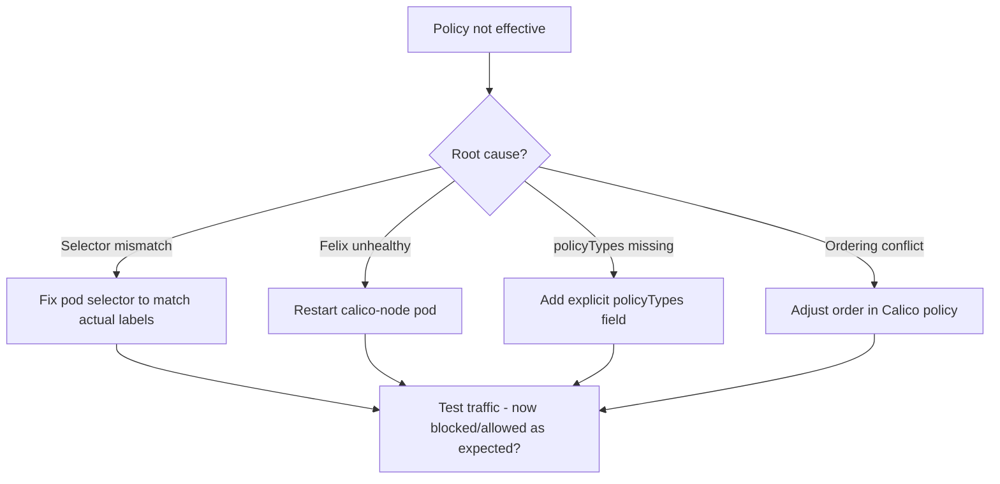

# How to Fix Network Policy Not Taking Effect in Calico

Author: [nawazdhandala](https://github.com/nawazdhandala)

Tags: Calico, Kubernetes, Networking, Troubleshooting

Description: Fix Calico NetworkPolicy enforcement issues by correcting pod selectors, ensuring Felix is healthy, and resolving policy ordering conflicts.

---

## Introduction

Fixing NetworkPolicy not taking effect requires addressing the specific root cause identified during diagnosis. The most common fix is correcting a pod selector mismatch. For ordering issues, understanding Calico's policy evaluation model is essential.

## Symptoms

- Traffic flows or blocks unexpectedly despite applied policy
- Policy exists but has no observable effect

## Root Causes

- Pod selector mismatch
- Felix not healthy
- Policy ordering conflict with GlobalNetworkPolicy

## Diagnosis Steps

```bash
kubectl get pods -n <namespace> --show-labels
kubectl get networkpolicy <policy-name> -n <namespace> -o yaml | grep -A 5 "podSelector:"
```

## Solution

**Fix 1: Correct pod selector in NetworkPolicy**

```bash
# Check current pod labels
kubectl get pod <pod-name> -n <namespace> --show-labels

# Fix the NetworkPolicy selector to match actual labels
kubectl patch networkpolicy <policy-name> -n <namespace> --type=json \
  -p='[{"op":"replace","path":"/spec/podSelector/matchLabels","value":{"app":"<correct-label>"}}]'

# Or recreate with correct selector
kubectl apply -f - <<EOF
apiVersion: networking.k8s.io/v1
kind: NetworkPolicy
metadata:
  name: <policy-name>
  namespace: <namespace>
spec:
  podSelector:
    matchLabels:
      app: <correct-label>  # Matches actual pod label
  policyTypes:
  - Ingress
  - Egress
  ...
EOF
```

**Fix 2: Ensure policyTypes is specified**

```yaml
# Without policyTypes, Kubernetes infers the type from the rules
# Be explicit to avoid confusion:
spec:
  podSelector: ...
  policyTypes:
  - Ingress
  - Egress
```

**Fix 3: Fix policy ordering in Calico GlobalNetworkPolicy**

```yaml
# If a GlobalNetworkPolicy with higher priority is overriding your policy,
# adjust the order field (lower number = higher priority in Calico)
apiVersion: projectcalico.org/v3
kind: GlobalNetworkPolicy
metadata:
  name: my-policy
spec:
  order: 200  # Lower priority than your baseline policies
  selector: ...
```

**Fix 4: Restart Felix on the affected node to re-sync rules**

```bash
NODE_POD=$(kubectl get pods -n kube-system -l k8s-app=calico-node \
  --field-selector spec.nodeName=<pod-node> -o name)
kubectl delete pod $NODE_POD -n kube-system

# Wait for restart
kubectl wait pods -n kube-system -l k8s-app=calico-node \
  --field-selector spec.nodeName=<pod-node> \
  --for=condition=Ready --timeout=120s
```

**Verify policy is being enforced**

```bash
# Deploy a test pod and verify traffic is blocked/allowed as expected
kubectl run test-src --image=busybox --restart=Never -- sleep 120
kubectl run test-dst --image=busybox --labels="app=<policy-target-label>" \
  --restart=Never -- sleep 120

kubectl wait pod/test-src pod/test-dst --for=condition=Ready --timeout=60s

DST_IP=$(kubectl get pod test-dst -o jsonpath='{.status.podIP}')
kubectl exec test-src -- ping -c 2 -W 3 $DST_IP
# Expected: blocked or allowed depending on your policy intent

kubectl delete pod test-src test-dst
```



## Prevention

- Always test policies with known allow/block scenarios after applying
- Use `kubectl describe networkpolicy` to see the Resolved selector
- Set explicit policyTypes in all NetworkPolicy resources

## Conclusion

Fixing NetworkPolicy not taking effect starts with selector accuracy (most common issue), then Felix health, then policy ordering. After applying the fix, verify with a concrete traffic test that the policy is now enforcing the intended behavior.
