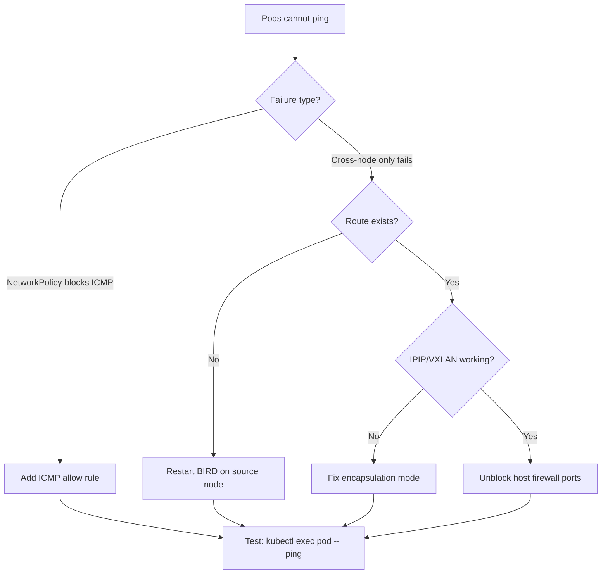

# How to Fix Pods That Cannot Ping Each Other with Calico

Author: [nawazdhandala](https://github.com/nawazdhandala)

Tags: Calico, Kubernetes, Networking, Troubleshooting

Description: Targeted fixes for pods that cannot ping each other in Calico including NetworkPolicy corrections, IPIP mode repair, and BGP route restoration.

---

## Introduction

Fixing pod-to-pod ping failures in Calico involves addressing the root cause identified during diagnosis. The most frequent fix is correcting or adding NetworkPolicy rules to allow ICMP traffic. However, cross-node failures may require fixing BGP routing, correcting encapsulation mode, or unblocking firewall ports on the underlying node network.

Each fix in this guide is self-contained and targets a specific failure layer. Apply the fix that matches your diagnosis. After each fix, run a connectivity test to confirm the specific issue is resolved before moving to the next potential cause.

In production environments, test NetworkPolicy changes in a staging namespace first. Policy changes take effect immediately and may impact other traffic flows beyond the intended target.

## Symptoms

- Pod-to-pod ICMP (ping) fails
- Application traffic between pods also affected
- `kubectl exec <pod> -- traceroute` shows traffic dropped at node or destination pod

## Root Causes

- Default-deny NetworkPolicy without ICMP allow rule
- IP-in-IP mode mismatch between IP pools
- BGP routes missing for remote pod CIDR
- Host firewall blocking encapsulation traffic

## Diagnosis Steps

```bash
# Quick diagnosis: check for NetworkPolicies with default deny
kubectl get networkpolicy -n <namespace> -o yaml | grep -A 5 "podSelector: {}"

# Check if IPIP is configured correctly
calicoctl get ippool default-ipv4-ippool -o yaml | grep ipipMode
```

## Solution

**Fix 1: Allow ICMP in NetworkPolicy**

```yaml
apiVersion: networking.k8s.io/v1
kind: NetworkPolicy
metadata:
  name: allow-icmp
  namespace: <namespace>
spec:
  podSelector: {}
  policyTypes:
  - Ingress
  - Egress
  ingress:
  - ports:
    - protocol: SCTP   # ICMP is handled implicitly when no ports are specified
  # For ICMP, omit ports entirely in the rule:
  - {}   # Allow all ingress including ICMP
  egress:
  - {}   # Allow all egress including ICMP
```

A more targeted policy that allows ICMP specifically:

```yaml
apiVersion: projectcalico.org/v3
kind: NetworkPolicy
metadata:
  name: allow-icmp
  namespace: default
spec:
  selector: all()
  types:
  - Ingress
  - Egress
  ingress:
  - action: Allow
    protocol: ICMP
  egress:
  - action: Allow
    protocol: ICMP
```

**Fix 2: Correct IP-in-IP encapsulation mode**

```bash
# Check current mode
calicoctl get ippool -o yaml | grep ipipMode

# Fix: set ipipMode to CrossSubnet for multi-subnet environments
calicoctl patch ippool default-ipv4-ippool \
  --patch='{"spec": {"ipipMode": "CrossSubnet"}}'
```

**Fix 3: Restore missing BGP routes**

```bash
# Restart BIRD to re-establish BGP sessions and re-advertise routes
NODE_POD=$(kubectl get pods -n kube-system -l k8s-app=calico-node \
  --field-selector spec.nodeName=<affected-node> -o name)
kubectl delete pod $NODE_POD -n kube-system

# Wait for pod recovery
kubectl wait pods -n kube-system -l k8s-app=calico-node \
  --for=condition=Ready --timeout=120s

# Verify routes restored
ssh <affected-node> "ip route show | grep bird"
```

**Fix 4: Unblock IPIP/VXLAN on host firewall**

```bash
# On each node where iptables is managing host firewall:
# Allow IPIP (protocol 4)
iptables -I INPUT -p 4 -j ACCEPT
iptables -I OUTPUT -p 4 -j ACCEPT

# Or allow VXLAN (UDP 4789)
iptables -I INPUT -p udp --dport 4789 -j ACCEPT
iptables -I OUTPUT -p udp --dport 4789 -j ACCEPT

# Make permanent
iptables-save > /etc/iptables/rules.v4
```



## Prevention

- Test pod-to-pod ping after every NetworkPolicy change
- Document encapsulation mode requirements in cluster topology docs
- Verify host firewall rules allow encapsulation traffic during cluster setup

## Conclusion

Fixing pod-to-pod ping failures in Calico requires matching the repair to the diagnosed root cause. NetworkPolicy ICMP rules are the most common fix, while cross-node failures may need BGP route restoration or encapsulation mode correction. Always verify with a live ping test after applying each fix.
