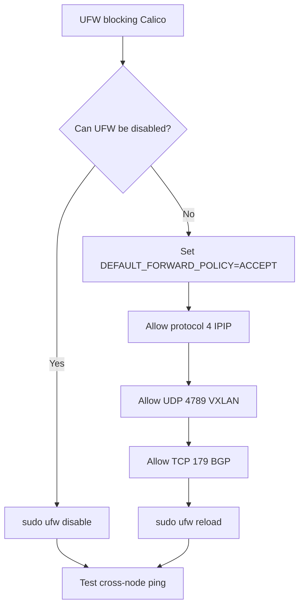

# How to Fix UFW Blocking Kubernetes When Using Calico

Author: [nawazdhandala](https://github.com/nawazdhandala)

Tags: Calico, Kubernetes, Networking, Troubleshooting

Description: Fix UFW conflicts with Calico by configuring the FORWARD policy, adding encapsulation protocol allows, and ensuring BGP port 179 is not blocked.

---

## Introduction

Fixing UFW conflicts with Calico requires either disabling UFW and relying on Calico NetworkPolicy for node security, or carefully configuring UFW to allow Calico's required traffic while maintaining host-level security. The safest approach for most Kubernetes clusters is to disable UFW since Calico's NetworkPolicy provides equivalent (and more granular) security.

If UFW must remain enabled, specific configuration changes prevent it from interfering with Calico. These include setting the FORWARD policy to ACCEPT, allowing IPIP or VXLAN encapsulation traffic, and permitting BGP port 179 between nodes.

## Symptoms

- Cross-node pods cannot communicate with UFW enabled
- Calico IPIP tunnel not carrying traffic
- BGP peer state stuck in Connect when UFW is active

## Root Causes

- UFW FORWARD policy is DROP
- UFW blocking protocol 4 (IPIP) or UDP 4789 (VXLAN)
- UFW blocking BGP port 179

## Diagnosis Steps

```bash
sudo ufw status verbose
sudo iptables -L FORWARD -n | head -5
```

## Solution

**Option 1: Disable UFW (recommended for clusters using Calico NetworkPolicy)**

```bash
sudo ufw disable
sudo systemctl disable ufw

# Verify iptables FORWARD is no longer DROP
sudo iptables -L FORWARD -n | head -5
# Should show policy ACCEPT now (or Calico's own chain)
```

**Option 2: Configure UFW to allow Calico traffic**

```bash
# Allow FORWARD traffic (critical for pod-to-pod)
sudo ufw default allow FORWARD

# Allow IPIP (Calico uses this by default)
sudo ufw allow in proto 4 from <node-cidr>
sudo ufw allow out proto 4 to <node-cidr>

# Allow VXLAN if used instead of IPIP
sudo ufw allow in 4789/udp from <node-cidr>
sudo ufw allow out 4789/udp to <node-cidr>

# Allow BGP
sudo ufw allow in 179/tcp from <node-cidr>
sudo ufw allow out 179/tcp to <node-cidr>

# Allow Kubernetes API
sudo ufw allow 6443/tcp
sudo ufw allow 443/tcp

# Reload UFW
sudo ufw reload
```

**Option 3: Configure UFW via /etc/ufw/before.rules**

```bash
# Add to /etc/ufw/before.rules BEFORE the *filter section
# or in a dedicated before.rules section
sudo tee -a /etc/ufw/before.rules << 'EOF'

# Allow IPIP for Calico
-A ufw-before-forward -p 4 -j ACCEPT

# Allow VXLAN for Calico
-A ufw-before-forward -p udp --dport 4789 -j ACCEPT
-A ufw-before-forward -p udp --sport 4789 -j ACCEPT
EOF

# Also set DefaultForwardPolicy in /etc/default/ufw
sudo sed -i 's/DEFAULT_FORWARD_POLICY="DROP"/DEFAULT_FORWARD_POLICY="ACCEPT"/' \
  /etc/default/ufw

sudo ufw reload
```

**Verify fix**

```bash
# Test cross-node pod communication
kubectl run test-a --image=busybox --restart=Never -- sleep 120
kubectl run test-b --image=busybox --restart=Never -- sleep 120
kubectl wait pod/test-a pod/test-b --for=condition=Ready --timeout=60s
B_IP=$(kubectl get pod test-b -o jsonpath='{.status.podIP}')
kubectl exec test-a -- ping -c 3 $B_IP
kubectl delete pod test-a test-b
```



## Prevention

- Decide on UFW vs Calico NetworkPolicy strategy before cluster setup
- If using both, document the required UFW exceptions and automate them in node setup scripts
- Test Kubernetes networking after every UFW rule change

## Conclusion

Fixing UFW-Calico conflicts requires either disabling UFW or carefully allowing Calico's required traffic: FORWARD policy ACCEPT, protocol 4 for IPIP, UDP 4789 for VXLAN, and TCP 179 for BGP. Disabling UFW is the simpler approach when Calico NetworkPolicy handles cluster security.
