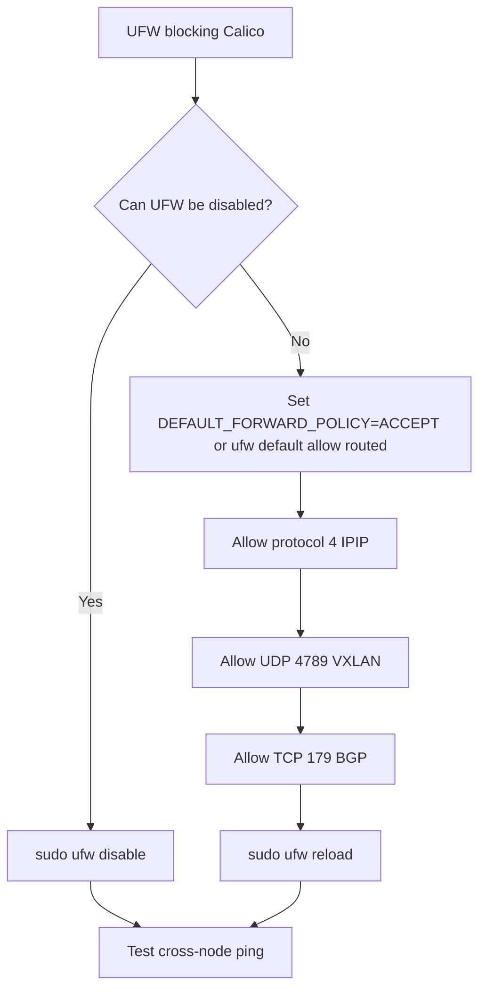

# How to Fix UFW Blocking Kubernetes When Using Calico

Author: [nawazdhandala](https://github.com/nawazdhandala)

Tags: Calico, Kubernetes, Networking, Troubleshooting

Description: Fix UFW conflicts with Calico by configuring the FORWARD policy, adding encapsulation protocol allows, and ensuring BGP port 179 is not blocked.

---

## Introduction

Fixing UFW conflicts with Calico requires either disabling UFW and relying on Calico policy for workload security, or carefully configuring UFW to allow Calico's required traffic while maintaining host-level security. The simplest approach for many Kubernetes clusters is to disable UFW because host firewalls can interfere with the iptables rules and interfaces managed by Calico.

If UFW must remain enabled, specific configuration changes prevent it from interfering with Calico. These include setting the routed traffic policy to ACCEPT, allowing IPIP or VXLAN encapsulation traffic, and permitting BGP port 179 between nodes.

## Symptoms

- Cross-node pods cannot communicate with UFW enabled
- Calico IPIP tunnel not carrying traffic
- BGP peer state stuck in Connect when UFW is active

## Root Causes

- UFW routed traffic policy is DROP
- UFW blocking protocol 4 (IPIP) or UDP 4789 (VXLAN)
- UFW blocking BGP port 179

## Diagnosis Steps

```bash
sudo ufw status verbose
sudo iptables -L FORWARD -n | head -5
```

## Solution

**Option 1: Disable UFW (recommended for clusters using Calico policy for workload security)**

```bash
sudo ufw disable
sudo systemctl disable ufw

# Verify iptables FORWARD is no longer DROP

sudo iptables -L FORWARD -n | head -5
# Should show policy ACCEPT now (or Calico's own chain)
```

**Option 2: Configure UFW to allow Calico traffic**

```bash
# Allow routed/forwarded traffic (critical for pod-to-pod)
sudo ufw default allow routed

# UFW's CLI does not accept protocol 4 (IPIP) on common Ubuntu versions.
# If Calico uses IPIP, add the /etc/ufw/before.rules entries shown in Option 3.

# Allow VXLAN if used instead of IPIP
sudo ufw allow in proto udp from <node-cidr> to any port 4789
sudo ufw allow out proto udp to <node-cidr> port 4789

# Allow BGP
sudo ufw allow in proto tcp from <node-cidr> to any port 179
sudo ufw allow out proto tcp to <node-cidr> port 179

# Allow Kubernetes API (use the secure port configured for your cluster)
sudo ufw allow 6443/tcp
sudo ufw allow 443/tcp

# Reload UFW
sudo ufw reload
```

**Option 3: Configure UFW via /etc/ufw/before.rules**

```bash
# Add these lines inside the existing *filter section in /etc/ufw/before.rules,
# after the ufw-before-* chain definitions and before the COMMIT line.

# Allow IPIP for Calico
-A ufw-before-input -s <node-cidr> -p 4 -j ACCEPT
-A ufw-before-output -d <node-cidr> -p 4 -j ACCEPT

# Allow VXLAN for Calico
-A ufw-before-input -s <node-cidr> -p udp --dport 4789 -j ACCEPT
-A ufw-before-output -d <node-cidr> -p udp --dport 4789 -j ACCEPT

# Also set DEFAULT_FORWARD_POLICY in /etc/default/ufw
sudo sed -i 's/DEFAULT_FORWARD_POLICY="DROP"/DEFAULT_FORWARD_POLICY="ACCEPT"/' \
  /etc/default/ufw

sudo ufw reload
```

**Verify fix**

```bash
# Test cross-node pod communication
kubectl run test-a --image=busybox --restart=Never -- sleep 120
kubectl run test-b --image=busybox --restart=Never -- sleep 120
kubectl wait pod/test-a pod/test-b --for=condition=Ready --timeout=60s
B_IP=$(kubectl get pod test-b -o jsonpath='{.status.podIP}')
kubectl exec test-a -- ping -c 3 $B_IP
kubectl delete pod test-a test-b
```


```mermaid
flowchart TD
    A[UFW blocking Calico] --> B{Can UFW be disabled?}
    B -- Yes --> C[sudo ufw disable]
    B -- No --> D[Set DEFAULT_FORWARD_POLICY=ACCEPT or ufw default allow routed]
    D --> E[Allow protocol 4 IPIP]
    E --> F[Allow UDP 4789 VXLAN]
    F --> G[Allow TCP 179 BGP]
    G --> H[sudo ufw reload]
    C & H --> I[Test cross-node ping]
```

## Prevention

- Decide on UFW vs Calico NetworkPolicy strategy before cluster setup
- If using both, document the required UFW exceptions and automate them in node setup scripts
- Test Kubernetes networking after every UFW rule change

## Conclusion

Fixing UFW-Calico conflicts requires either disabling UFW or carefully allowing Calico's required traffic: routed traffic policy ACCEPT, protocol 4 for IPIP, UDP 4789 for VXLAN, and TCP 179 for BGP. Disabling UFW is the simpler approach when Calico policy handles workload security.
