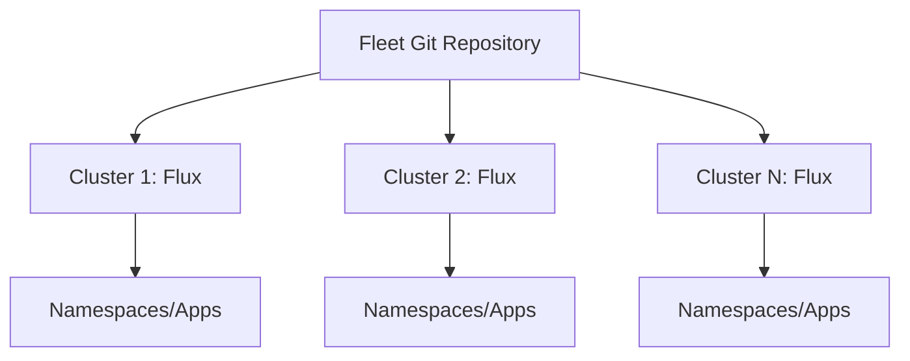

# Flux CD vs ArgoCD: Which Scales Better for 100+ Clusters

Author: [nawazdhandala](https://github.com/nawazdhandala)

Tags: Flux CD, ArgoCD, Multi-Cluster, Scaling, GitOps, Kubernetes, Fleet Management

Description: Compare the multi-cluster scaling capabilities of Flux CD and ArgoCD for organizations managing 100+ Kubernetes clusters with GitOps.

---

## Introduction

Managing GitOps at scale-across dozens or hundreds of Kubernetes clusters-is one of the most demanding use cases for any GitOps tool. Both Flux CD and ArgoCD have architectural patterns for multi-cluster management, but they approach it differently: Flux CD uses a hub-and-spoke model where each cluster runs its own Flux controllers, while ArgoCD uses a centralized control plane that manages remote clusters via the ArgoCD API server.

At 100+ clusters, both architectures have tradeoffs around blast radius, operational overhead, network connectivity requirements, and how changes are distributed. This post examines these tradeoffs with concrete architectural examples.

## Prerequisites

- Multiple Kubernetes clusters
- Understanding of GitOps concepts
- Familiarity with either Flux CD or ArgoCD

## Step 1: Flux CD Multi-Cluster Architecture

Flux CD's recommended approach is to run independent Flux installations on each cluster, all pointing to a common fleet repository:



Each cluster's Flux reads from its own path in the fleet repository:

```yaml
# clusters/cluster-01/flux-system/gotk-sync.yaml
apiVersion: kustomize.toolkit.fluxcd.io/v1
kind: Kustomization
metadata:
  name: flux-system
  namespace: flux-system
spec:
  interval: 10m
  path: ./clusters/cluster-01
  prune: true
  sourceRef:
    kind: GitRepository
    name: flux-system
```

## Step 2: ArgoCD Multi-Cluster Architecture

ArgoCD uses a centralized ApplicationSet controller to generate Applications across registered clusters:

```yaml
# ArgoCD ApplicationSet for 100+ clusters
apiVersion: argoproj.io/v1alpha1
kind: ApplicationSet
metadata:
  name: production-apps
  namespace: argocd
spec:
  generators:
    - clusters:
        selector:
          matchLabels:
            environment: production
  template:
    metadata:
      name: '{{name}}-myapp'
    spec:
      project: production
      source:
        repoURL: https://github.com/your-org/fleet-repo
        targetRevision: main
        path: apps/myapp
      destination:
        server: '{{server}}'
        namespace: myapp
      syncPolicy:
        automated:
          prune: true
          selfHeal: true
```

## Step 3: Scaling Comparison

| Dimension | Flux CD | ArgoCD |
|---|---|---|
| Control plane location | Distributed (per cluster) | Centralized |
| Blast radius on tool failure | Limited to one cluster | All managed clusters |
| Network requirements | Only Git access needed | ArgoCD API access to all clusters |
| Resource per cluster | ~150 MB Flux controllers | Shared ArgoCD control plane |
| Git polling load | N clusters × poll interval | 1 centralized poll |
| Upgrade complexity | N separate upgrades | 1 centralized upgrade |

## Step 4: Flux CD at Scale with Bootstrap Automation

For 100+ clusters, automate Flux bootstrap with a script or Terraform:

```bash
#!/bin/bash
# bootstrap-cluster.sh
CLUSTER_NAME=$1
REGION=$2

# Get cluster credentials
aws eks update-kubeconfig --name $CLUSTER_NAME --region $REGION

# Bootstrap Flux pointing to cluster-specific path
flux bootstrap github \
  --owner=your-org \
  --repository=fleet-repo \
  --branch=main \
  --path=clusters/$CLUSTER_NAME \
  --personal \
  --token-auth

echo "Bootstrapped Flux on $CLUSTER_NAME"
```

## Step 5: ArgoCD at Scale with Cluster Registration

```bash
# Register clusters with ArgoCD using CLI or cluster generator
argocd cluster add cluster-01 --name cluster-01
argocd cluster add cluster-02 --name cluster-02

# Or automate with the ArgoCD cluster secret pattern
kubectl apply -f - <<EOF
apiVersion: v1
kind: Secret
metadata:
  name: cluster-01-secret
  namespace: argocd
  labels:
    argocd.argoproj.io/secret-type: cluster
    environment: production
    region: us-east-1
type: Opaque
stringData:
  name: cluster-01
  server: https://cluster-01.example.com
  config: |
    {"bearerToken": "...", "tlsClientConfig": {"caData": "..."}}
EOF
```

## Best Practices

- Use Flux CD for large edge deployments where clusters may have limited or intermittent connectivity to a central control plane.
- Use ArgoCD when you need a single pane of glass for operations teams managing many clusters.
- With Flux CD at scale, use a tiered fleet repository structure: one root Kustomization per cluster, pointing to cluster-specific paths.
- With ArgoCD at scale, implement ApplicationSets with cluster generators and label selectors to avoid per-cluster Application management.
- Monitor Git API rate limits when hundreds of clusters poll the same repository; use repository mirroring or GitHub Enterprise for very large fleets.

## Conclusion

Flux CD scales horizontally through distributed, independent controller installations-ideal for edge or air-gapped clusters. ArgoCD scales through a centralized control plane with ApplicationSets-ideal for teams that need centralized visibility and management. At 100+ clusters, Flux CD's distributed model reduces blast radius and network dependencies, while ArgoCD's centralized model simplifies operations for teams that can maintain the central control plane.
