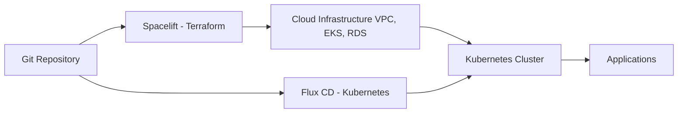

# Flux CD vs Spacelift: GitOps Comparison

Author: [nawazdhandala](https://github.com/nawazdhandala)

Tags: Flux CD, Spacelift, GitOps, Kubernetes, Terraform, Infrastructure as Code

Description: Compare Flux CD and Spacelift as GitOps platforms, examining their strengths in Kubernetes-native delivery versus polyglot infrastructure automation.

---

## Introduction

Flux CD and Spacelift address overlapping but distinct problems. Flux CD is a GitOps operator for Kubernetes, focused on reconciling cluster state with Git-declared manifests. Spacelift is a broader infrastructure automation platform that runs Terraform, Pulumi, Ansible, and Kubernetes (via kubectl) pipelines triggered by Git events. Understanding where they overlap and where they diverge helps teams make informed tooling decisions.

This post compares the two tools from the perspective of a team managing both Kubernetes workloads and cloud infrastructure through code.

## Prerequisites

- Understanding of GitOps and Infrastructure as Code concepts
- A Kubernetes cluster for Flux CD examples
- A Spacelift account for Spacelift examples (if evaluating)

## Step 1: What Flux CD Does

Flux CD is a Kubernetes-native GitOps operator:

```yaml
# Flux manages Kubernetes resources
apiVersion: kustomize.toolkit.fluxcd.io/v1
kind: Kustomization
metadata:
  name: production-apps
  namespace: flux-system
spec:
  interval: 5m
  path: ./clusters/production
  prune: true
  sourceRef:
    kind: GitRepository
    name: fleet-repo
```

Flux CD scope:
- Deploys and reconciles Kubernetes manifests, Helm charts, and Kustomizations
- Manages container image updates via Image Automation
- Sends deployment notifications
- Does NOT manage cloud infrastructure (VPCs, databases, IAM roles)

## Step 2: What Spacelift Does

Spacelift manages infrastructure automation pipelines:

```yaml
# Spacelift Stack (managed via UI or API)
# Spacelift runs Terraform plans/applies triggered by Git events
stack:
  name: production-infrastructure
  repository: your-org/terraform-repo
  branch: main
  project_root: environments/production
  runner_image: hashicorp/terraform:1.7
  autodeploy: true
  trigger_rules:
    - push:
        branches: [main]
```

Spacelift scope:
- Runs Terraform, Pulumi, CloudFormation plans and applies
- Manages drift detection for IaC (not just Kubernetes)
- Provides approval workflows and policy enforcement (OPA)
- Can also manage Kubernetes via kubectl runs
- Has a commercial SaaS model

## Step 3: Where They Overlap

Both tools can manage Kubernetes, but with different approaches:

| Capability | Flux CD | Spacelift |
|---|---|---|
| Kubernetes manifest deployment | Yes, native GitOps | Yes, via kubectl or Kubernetes stack |
| Drift detection (K8s) | Yes, interval-based | Limited, run-based |
| Terraform management | No | Yes, first-class |
| Pulumi management | No | Yes |
| Ansible support | No | Yes |
| Self-hosted option | Yes (open-source) | Yes (enterprise) |
| Cost model | Free (CNCF) | Paid (SaaS/enterprise) |

## Step 4: Complementary Usage

The most common production pattern combines both tools:



Spacelift provisions the EKS cluster and VPC, Flux CD manages the application workloads on that cluster.

## Step 5: Policy and Governance

**Flux CD** uses Kubernetes RBAC and optionally OPA/Kyverno (deployed via Flux) for policy:

```yaml
# OPA Gatekeeper deployed via Flux
apiVersion: helm.toolkit.fluxcd.io/v2
kind: HelmRelease
metadata:
  name: gatekeeper
  namespace: gatekeeper-system
spec:
  chart:
    spec:
      chart: gatekeeper
      version: "3.14.x"
      sourceRef:
        kind: HelmRepository
        name: gatekeeper
```

**Spacelift** has built-in OPA policy support for Terraform plan approval:

```rego
# Spacelift OPA policy for Terraform
package spacelift

deny[msg] {
  resource := input.terraform.resource_changes[_]
  resource.type == "aws_security_group"
  resource.change.after.ingress[_].from_port == 22
  msg := "SSH access from 0.0.0.0/0 is not allowed"
}
```

## Best Practices

- Use Flux CD for all Kubernetes workload management; it is the right tool for this job.
- Use Spacelift for Terraform/cloud infrastructure automation when you need approval workflows and policy enforcement at the IaC level.
- Do not use Spacelift to manage Kubernetes applications that Flux CD should own; the two tools will conflict.
- Establish clear ownership boundaries: Spacelift provisions clusters and network infrastructure, Flux CD manages what runs on them.
- Both tools support Git-based workflows; use the same Git branching strategy (trunk-based or environment branches) consistently across both.

## Conclusion

Flux CD and Spacelift are complementary rather than competing tools for most organizations. Flux CD is the right tool for Kubernetes GitOps, providing pull-based reconciliation with deep Kubernetes integration. Spacelift is the right tool for cloud infrastructure automation where you need multi-language IaC support, approval gates, and policy enforcement at the Terraform plan level. Teams managing both Kubernetes and cloud infrastructure benefit from using both together.
