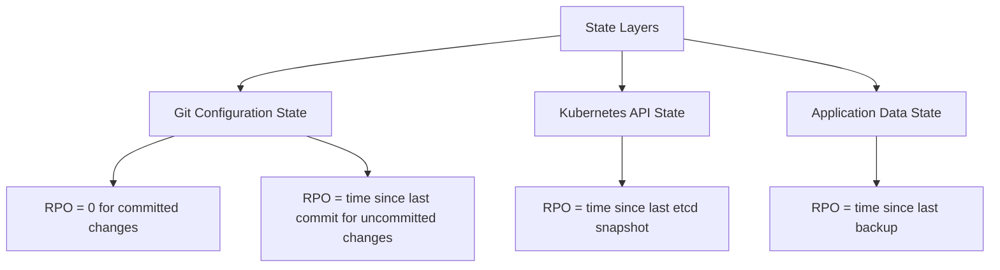

# How to Measure Recovery Point Objective (RPO) with Flux CD

Author: [nawazdhandala](https://github.com/nawazdhandala)

Tags: Flux CD, Kubernetes, GitOps, Disaster Recovery, RPO, SRE, Data Protection

Description: Measure and minimize Recovery Point Objective (RPO) for Flux CD managed deployments, understanding what state can be lost and how to reduce that window.

---

## Introduction

Recovery Point Objective (RPO) defines the maximum amount of data or state change that can be lost during a disaster. For a GitOps-managed system like Flux CD, RPO has an interesting nuance: the Git repository itself has a near-zero RPO for configuration changes, because every committed change is immediately durable in Git. However, in-cluster state — running pod data, database writes, unsynced secrets — has a different RPO that depends on your backup strategy.

Understanding where your RPO exposure lies in a Flux environment requires separating the different layers of state. Configuration state (in Git) is always recoverable to the last commit. Runtime state (in pods, databases, PVCs) depends on backup frequency. Flux-specific state (reconciliation history, image tags detected) is tracked in etcd and has the same RPO as your etcd backup.

This guide covers identifying your RPO exposure across all state layers, measuring the actual gap between your current state and last recoverable state, and implementing practices to minimize RPO.

## Prerequisites

- Flux CD managing a production cluster
- An understanding of what data your applications write (database, object storage, local volumes)
- Prometheus for metrics, or at minimum cluster audit logs
- etcd backup configured (required for RPO measurement)

## Step 1: Identify the Three Layers of State



For each layer, document:
- What state is stored there
- How frequently it is backed up
- What the actual RPO is

```yaml
# rpo-assessment.yaml - Document and track in Git
state_layers:
  git_configuration:
    description: "Flux manifests, Kustomizations, HelmReleases, etc."
    backup_mechanism: "Distributed Git clones + cloud provider backup"
    rpo_seconds: 0  # Zero for committed changes
    rpo_notes: "Any uncommitted work-in-progress has infinite RPO"

  kubernetes_api_state:
    description: "All Kubernetes objects stored in etcd"
    backup_mechanism: "Automated etcd snapshots every 6 hours"
    rpo_seconds: 21600  # 6 hours
    rpo_notes: "Objects created/modified after last snapshot are lost on etcd failure"

  application_data:
    description: "Database rows, file uploads, user-generated content"
    backup_mechanism: "Application-specific; database backups every 1 hour"
    rpo_seconds: 3600  # 1 hour
    rpo_notes: "Depends on application backup strategy, not Flux"
```

## Step 2: Measure Actual RPO for Kubernetes API State

```bash
#!/bin/bash
# measure-etcd-rpo.sh
set -euo pipefail

# Get the timestamp of the most recent etcd backup
LATEST_BACKUP=$(aws s3 ls s3://my-etcd-backups/ | \
  sort | tail -1 | awk '{print $4}')

BACKUP_TIMESTAMP=$(aws s3 ls s3://my-etcd-backups/"$LATEST_BACKUP" \
  --recursive | awk '{print $1 "T" $2}')

NOW=$(date -u +%Y-%m-%dT%H:%M:%SZ)

# Calculate the gap
BACKUP_EPOCH=$(date -d "$BACKUP_TIMESTAMP" +%s 2>/dev/null || \
  date -jf "%Y-%m-%dT%H:%M:%S" "$BACKUP_TIMESTAMP" +%s)
NOW_EPOCH=$(date +%s)
GAP_SECONDS=$((NOW_EPOCH - BACKUP_EPOCH))
GAP_MINUTES=$((GAP_SECONDS / 60))

echo "Latest etcd backup: $BACKUP_TIMESTAMP"
echo "Current time: $NOW"
echo "Current RPO exposure: ${GAP_MINUTES} minutes"

# Alert if RPO exceeds target
RPO_TARGET_MINUTES=360  # 6 hours
if [ "$GAP_MINUTES" -gt "$RPO_TARGET_MINUTES" ]; then
  echo "WARNING: RPO exposure ($GAP_MINUTES min) exceeds target ($RPO_TARGET_MINUTES min)"
  curl -X POST "$ALERTING_WEBHOOK" \
    -d "{\"severity\":\"warning\",\"message\":\"etcd backup is ${GAP_MINUTES} minutes old\"}"
fi
```

## Step 3: Measure Flux-Specific RPO

Flux tracks reconciliation state, image tags, and automation state in Kubernetes objects. These are stored in etcd and have the same RPO as your etcd backup — but you can also measure the Flux-specific gap.

```bash
#!/bin/bash
# measure-flux-rpo.sh

# Find the last time each Flux resource was reconciled
echo "=== Last Reconciliation Times ==="
kubectl get kustomizations -A -o json | \
  jq -r '.items[] |
    [.metadata.namespace, .metadata.name,
     .status.lastHandledReconcileAt // "never"] |
    join(" | ")'

# For image automation, check how far behind the last scan is
echo ""
echo "=== Image Repository Last Scan ==="
kubectl get imagerepositories -A -o json | \
  jq -r '.items[] |
    [.metadata.namespace, .metadata.name,
     .status.lastScanResult.scanTime // "never",
     (.status.lastScanResult.tagCount // 0 | tostring) + " tags"] |
    join(" | ")'

# Calculate staleness
kubectl get imagerepositories -A -o json | \
  jq -r '.items[] |
    (.status.lastScanResult.scanTime // "1970-01-01T00:00:00Z") as $last |
    now - ($last | fromdateiso8601) as $age_seconds |
    "\(.metadata.name): \($age_seconds / 60 | floor) minutes since last scan"'
```

## Step 4: Improve etcd Backup Frequency

The most impactful way to reduce Kubernetes API RPO is to take more frequent etcd snapshots.

```yaml
# Increase etcd backup frequency to every 30 minutes
apiVersion: batch/v1
kind: CronJob
metadata:
  name: etcd-backup
  namespace: kube-system
spec:
  schedule: "*/30 * * * *"  # Every 30 minutes reduces RPO from 6h to 30m
  successfulJobsHistoryLimit: 3
  failedJobsHistoryLimit: 3
  jobTemplate:
    spec:
      template:
        spec:
          hostNetwork: true
          containers:
            - name: etcd-backup
              image: bitnami/etcd:latest
              env:
                - name: S3_BUCKET
                  value: my-etcd-backups
                - name: AWS_DEFAULT_REGION
                  value: us-east-1
              command:
                - /bin/sh
                - -c
                - |
                  SNAPSHOT_FILE="/tmp/snapshot-$(date +%Y%m%d-%H%M%S).db"
                  ETCDCTL_API=3 etcdctl snapshot save "$SNAPSHOT_FILE" \
                    --endpoints=https://127.0.0.1:2379 \
                    --cacert=/etc/etcd/ca.crt \
                    --cert=/etc/etcd/healthcheck-client.crt \
                    --key=/etc/etcd/healthcheck-client.key
                  aws s3 cp "$SNAPSHOT_FILE" "s3://${S3_BUCKET}/$(basename $SNAPSHOT_FILE)"
                  # Keep only last 48 snapshots (24 hours worth)
                  aws s3 ls "s3://${S3_BUCKET}/" | sort | head -n -48 | \
                    awk '{print $4}' | \
                    xargs -I{} aws s3 rm "s3://${S3_BUCKET}/{}"
          restartPolicy: OnFailure
          nodeSelector:
            node-role.kubernetes.io/control-plane: ""
          tolerations:
            - key: node-role.kubernetes.io/control-plane
              effect: NoSchedule
```

## Step 5: Track RPO as a Prometheus Metric

```yaml
# PrometheusRule for RPO alerts
apiVersion: monitoring.coreos.com/v1
kind: PrometheusRule
metadata:
  name: flux-rpo-alerts
  namespace: monitoring
spec:
  groups:
    - name: flux-rpo
      interval: 5m
      rules:
        # Alert if Flux Kustomization has not reconciled recently
        - alert: FluxKustomizationNotReconciled
          expr: |
            (time() - gotk_reconcile_duration_seconds_sum{
              kind="Kustomization", type="Ready", status="True"
            }) > 1800
          for: 5m
          labels:
            severity: warning
          annotations:
            summary: "Kustomization {{ $labels.name }} has not reconciled in 30 minutes"
            description: "RPO exposure: {{ $value | humanizeDuration }}"

        - alert: FluxImageScanStale
          expr: |
            (time() - gotk_source_duration_seconds_sum{
              kind="ImageRepository"
            }) > 3600
          for: 5m
          labels:
            severity: warning
          annotations:
            summary: "ImageRepository {{ $labels.name }} scan is stale"
```

## Step 6: Document RPO in Your SLA

```markdown
## Flux CD Recovery Point Objectives

| State Type         | Backup Mechanism          | Current RPO | Target RPO |
|--------------------|---------------------------|-------------|------------|
| Git configuration  | Git (distributed)          | 0           | 0          |
| Kubernetes objects | etcd snapshot (30 min)    | 30 minutes  | 15 minutes |
| Application data   | Database backup (1 hour)  | 60 minutes  | 30 minutes |
| Image automation   | etcd snapshot (30 min)    | 30 minutes  | 15 minutes |

**Last reviewed:** 2026-03-13
**Next review:** 2026-06-13
```

## Best Practices

- Separate RPO analysis by state layer — Git has zero RPO, etcd has backup-interval RPO.
- Increase etcd backup frequency to reduce Kubernetes API RPO beyond the 6-hour default.
- Store etcd backups in cross-region object storage so the backup survives a regional outage.
- Build RPO measurement into your DR drills — calculate actual data loss, not just recovery time.
- Alert proactively when etcd backup age exceeds half your RPO target.
- Include RPO in your SLA and review it quarterly.

## Conclusion

RPO in a Flux CD environment has a unique profile: configuration state is effectively zero-RPO because Git is the source of truth, but Kubernetes API state and application data have RPO windows tied to backup frequency. By understanding this distinction, increasing backup frequency, and monitoring backup staleness proactively, you can minimize the data loss window and make realistic RPO commitments to your organization.
