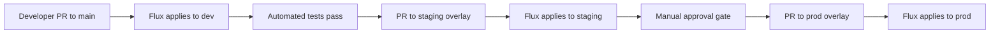

# How to Set Up Flux Multi-Project Deployment on GCP

Author: [nawazdhandala](https://github.com/nawazdhandala)

Tags: Flux CD, Kubernetes, GitOps, GKE, Google Cloud, Multi-Project, Workload Identity, Multi-Tenancy

Description: Deploy applications across multiple GCP projects using Flux CD with Workload Identity, enabling isolated environments with centralized GitOps control.

---

## Introduction

Large organizations on Google Cloud often split workloads across multiple GCP projects for billing isolation, security boundaries, and compliance requirements. A typical setup has separate projects for development, staging, and production, each with its own GKE cluster, IAM policies, and Cloud resources. Managing deployments across this landscape manually is error-prone and slows down release velocity.

Flux CD's multi-tenancy model is well-suited to this challenge. A central "fleet management" repository defines which clusters receive which applications, while each GCP project hosts a GKE cluster that Flux reconciles independently. Workload Identity federates IAM roles across projects so Flux controllers and application pods can access GCP APIs in the correct project without static service account key files.

This guide walks through a hub-and-spoke architecture where a single Git repository drives deployments into three GCP projects, each with its own GKE cluster, using Flux CD and Workload Identity.

## Prerequisites

- Three GCP projects: `my-org-dev`, `my-org-staging`, `my-org-prod`
- A GKE cluster in each project with Workload Identity enabled
- `flux` CLI installed
- `gcloud` configured with permissions across all three projects
- A GitHub organization and repository for the fleet manifests

## Step 1: Repository Structure for Multi-Project Fleet

Organize your fleet repository so each cluster has its own directory and inherits from shared base configuration.

```plaintext
fleet-infra/
├── clusters/
│   ├── dev/
│   │   ├── flux-system/       # Flux bootstrap output
│   │   └── apps/              # Dev-specific app configs
│   ├── staging/
│   │   ├── flux-system/
│   │   └── apps/
│   └── prod/
│       ├── flux-system/
│       └── apps/
├── infrastructure/
│   └── base/                  # Shared infrastructure manifests
└── apps/
    ├── base/                  # Base app manifests
    └── overlays/
        ├── dev/
        ├── staging/
        └── prod/
```

## Step 2: Bootstrap Flux in Each GCP Project

Run bootstrap separately for each cluster, using the project-specific path.

```bash
# Bootstrap the dev cluster
gcloud container clusters get-credentials dev-cluster \
  --region us-central1 --project my-org-dev

flux bootstrap github \
  --owner=your-org \
  --repository=fleet-infra \
  --branch=main \
  --path=clusters/dev \
  --personal

# Bootstrap the staging cluster
gcloud container clusters get-credentials staging-cluster \
  --region us-central1 --project my-org-staging

flux bootstrap github \
  --owner=your-org \
  --repository=fleet-infra \
  --branch=main \
  --path=clusters/staging \
  --personal

# Bootstrap the prod cluster
gcloud container clusters get-credentials prod-cluster \
  --region us-central1 --project my-org-prod

flux bootstrap github \
  --owner=your-org \
  --repository=fleet-infra \
  --branch=main \
  --path=clusters/prod \
  --personal
```

## Step 3: Configure Workload Identity for Cross-Project Access

Applications in the dev cluster that need to access resources in `my-org-dev` must be granted Workload Identity bindings in that project.

```bash
# For each project, bind the Kubernetes SA to a GCP SA
for PROJECT in my-org-dev my-org-staging my-org-prod; do
  # Create an application GCP service account in each project
  gcloud iam service-accounts create my-app-sa \
    --project="${PROJECT}" \
    --display-name="My App Service Account"

  # Grant the app SA access to project-specific resources
  gcloud projects add-iam-policy-binding "${PROJECT}" \
    --member="serviceAccount:my-app-sa@${PROJECT}.iam.gserviceaccount.com" \
    --role="roles/storage.objectViewer"
done
```

```yaml
# apps/base/serviceaccount.yaml
apiVersion: v1
kind: ServiceAccount
metadata:
  name: my-app
  namespace: my-app
  annotations:
    # This annotation is overridden per environment via Kustomize
    iam.gke.io/gcp-service-account: my-app-sa@PROJECT_ID.iam.gserviceaccount.com
```

```yaml
# apps/overlays/dev/kustomization.yaml
apiVersion: kustomize.config.k8s.io/v1beta1
kind: Kustomization
resources:
  - ../../base
patches:
  - target:
      kind: ServiceAccount
      name: my-app
    patch: |-
      - op: replace
        path: /metadata/annotations/iam.gke.io~1gcp-service-account
        value: my-app-sa@my-org-dev.iam.gserviceaccount.com
```

## Step 4: Define Per-Cluster Flux Kustomizations

Each cluster directory contains a Flux Kustomization that points to the appropriate overlay.

```yaml
# clusters/dev/apps/my-app/kustomization.yaml
apiVersion: kustomize.toolkit.fluxcd.io/v1
kind: Kustomization
metadata:
  name: my-app
  namespace: flux-system
spec:
  interval: 5m
  sourceRef:
    kind: GitRepository
    name: flux-system   # The bootstrap GitRepository pointing to fleet-infra
  path: ./apps/overlays/dev
  prune: true
  postBuild:
    substitute:
      PROJECT_ID: "my-org-dev"
      ENVIRONMENT: "dev"
      REPLICA_COUNT: "1"   # Fewer replicas in dev
---
# clusters/prod/apps/my-app/kustomization.yaml
apiVersion: kustomize.toolkit.fluxcd.io/v1
kind: Kustomization
metadata:
  name: my-app
  namespace: flux-system
spec:
  interval: 5m
  sourceRef:
    kind: GitRepository
    name: flux-system
  path: ./apps/overlays/prod
  prune: true
  postBuild:
    substitute:
      PROJECT_ID: "my-org-prod"
      ENVIRONMENT: "prod"
      REPLICA_COUNT: "3"   # Higher availability in prod
```

## Step 5: Promote Releases Across Projects

Use Git branch protection and pull requests to enforce promotion gates between environments.



```bash
# To promote from dev to staging, update the image tag in the staging overlay
# (or use Flux image automation to do this automatically)
cd apps/overlays/staging
kustomize edit set image my-app=gcr.io/my-org-dev/my-app:v1.2.3

git add .
git commit -m "chore: promote my-app v1.2.3 to staging"
git push
# Open a pull request - staging Flux reconciles after merge
```

## Best Practices

- Use separate GitHub repositories or repository paths per GCP project to enforce access control at the Git level, not just at the Kubernetes RBAC level.
- Enable Flux notifications (`Alert` resources) per cluster so the correct team is notified of reconciliation failures in their project.
- Use Google Cloud Deploy alongside Flux for complex promotion pipelines that require integration testing between environments.
- Store environment-specific secrets (API keys, connection strings) in Secret Manager per project and reference them via the External Secrets Operator synced by Flux.
- Tag all GCP resources created by Flux-managed workloads with `env: dev/staging/prod` labels for accurate cost attribution per project.

## Conclusion

Flux CD's path-based multi-cluster model maps cleanly onto a GCP multi-project architecture. Each cluster reconciles its own directory in the fleet repository, environment-specific configuration is managed through Kustomize overlays, and Workload Identity ensures IAM isolation between projects. The result is a scalable GitOps platform that supports independent team autonomy with centralized visibility and control.
