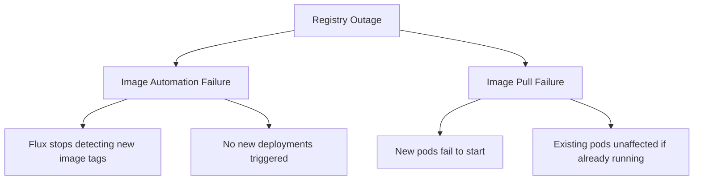

# How to Handle Flux Recovery After Container Registry Outage

Author: [nawazdhandala](https://github.com/nawazdhandala)

Tags: Flux CD, Kubernetes, GitOps, Disaster Recovery, Container Registry, Image Pull

Description: Configure Flux CD to handle container registry outages gracefully using image pull caching, registry mirrors, and fallback strategies.

---

## Introduction

Container registry outages are more common than most teams expect. Docker Hub rate limiting, AWS ECR authentication token expiry, and GCR service disruptions have all caused production incidents for teams that had no mitigation strategy. When Flux attempts to roll out a new deployment but cannot pull the image from the registry, pods fail to start and the rollout stalls.

The key insight for resilience is that registry availability matters most at two different times: when Flux performs image automation (checking for new tags) and when Kubernetes nodes pull images for new pods. These are different failure modes requiring different mitigations.

This guide covers configuring Flux and Kubernetes to handle registry outages gracefully, using registry mirrors, image caching, and pull-through caches to ensure your cluster can continue operating even when your primary registry is unavailable.

## Prerequisites

- Flux CD installed on a Kubernetes cluster
- An image registry (ECR, GCR, Docker Hub, or self-hosted)
- Access to configure cluster node settings or a registry mirror
- `flux` and `kubectl` CLI tools installed

## Step 1: Understand the Two Registry Failure Modes



Existing running pods are unaffected by registry outages - the image is already on the node. Only new pod scheduling fails. This means a registry outage during stable operation is less critical than during a deployment.

## Step 2: Configure Image Pull Policies to Reduce Registry Dependency

Set `imagePullPolicy: IfNotPresent` for production workloads so nodes use cached images when available.

```yaml
# In your Git-managed deployment manifests
apiVersion: apps/v1
kind: Deployment
metadata:
  name: my-app
  namespace: production
spec:
  template:
    spec:
      containers:
        - name: my-app
          image: my-registry.example.com/my-app:v1.2.3
          # Use IfNotPresent so cached images work during outages
          imagePullPolicy: IfNotPresent
```

Avoid `imagePullPolicy: Always` in production - it requires registry access on every pod start.

## Step 3: Set Up a Registry Mirror with Pull-Through Cache

A local pull-through cache (using Harbor, Nexus, or a cloud provider's registry proxy) stores images locally so node pulls succeed even when the upstream is down.

```yaml
# Harbor proxy project configuration (stored in Git)
# After setting up Harbor, configure containerd on each node
# /etc/containerd/config.toml addition:
# [plugins."io.containerd.grpc.v1.cri".registry.mirrors."docker.io"]
#   endpoint = ["https://harbor.internal.example.com/v2/dockerhub-proxy"]
```

Configure Flux to pull from your mirror instead of the upstream registry:

```yaml
apiVersion: image.toolkit.fluxcd.io/v1
kind: ImageRepository
metadata:
  name: my-app
  namespace: flux-system
spec:
  image: harbor.internal.example.com/my-org/my-app
  interval: 5m
  secretRef:
    name: harbor-credentials
```

## Step 4: Configure ECR Authentication with Automatic Token Refresh

AWS ECR tokens expire every 12 hours. Use the ECR credential helper to keep tokens fresh.

```yaml
# ECR token refresh CronJob
apiVersion: batch/v1
kind: CronJob
metadata:
  name: ecr-token-refresh
  namespace: flux-system
spec:
  schedule: "0 */6 * * *"
  jobTemplate:
    spec:
      template:
        spec:
          serviceAccountName: ecr-token-refresh
          containers:
            - name: refresh
              image: amazon/aws-cli:latest
              command:
                - /bin/sh
                - -c
                - |
                  TOKEN=$(aws ecr get-login-password --region us-east-1)
                  kubectl create secret docker-registry ecr-credentials \
                    --docker-server=123456789.dkr.ecr.us-east-1.amazonaws.com \
                    --docker-username=AWS \
                    --docker-password="$TOKEN" \
                    --namespace=flux-system \
                    --dry-run=client -o yaml | kubectl apply -f -
          restartPolicy: OnFailure
```

## Step 5: Configure Flux Image Automation to Tolerate Registry Errors

Flux's ImageRepository will report errors when it cannot reach the registry, but it will retain the last-known tag list. Use a longer interval to reduce the frequency of failed checks during an outage.

```yaml
apiVersion: image.toolkit.fluxcd.io/v1
kind: ImageRepository
metadata:
  name: my-app
  namespace: flux-system
spec:
  image: my-registry.example.com/my-org/my-app
  # During outages, Flux retains the last successful scan result
  interval: 10m
  timeout: 30s
  secretRef:
    name: registry-credentials
```

```bash
# During an outage, check what Flux last recorded
flux get imagerepositories -A

# Manually check the last seen tags
kubectl describe imagerepository my-app -n flux-system | grep "Last Scan"
```

## Step 6: Set Up Multi-Registry Redundancy

Store critical images in multiple registries and configure failover at the deployment level using an init container or a registry that aggregates multiple upstreams.

```yaml
# Kustomization overlay for registry failover
# apps/production/registry-failover-patch.yaml
apiVersion: apps/v1
kind: Deployment
metadata:
  name: my-app
spec:
  template:
    spec:
      initContainers:
        - name: image-prefetch
          image: alpine:latest
          command: ["/bin/sh", "-c", "echo prefetch complete"]
          imagePullPolicy: IfNotPresent
      imagePullSecrets:
        - name: primary-registry-secret
        - name: backup-registry-secret
```

## Best Practices

- Use `imagePullPolicy: IfNotPresent` for all production workloads.
- Run a pull-through cache (Harbor or Nexus) as an internal registry mirror.
- Automate ECR token refresh - 12-hour expiry causes predictable 2 AM incidents.
- Store critical base images in your own registry to avoid Docker Hub rate limits.
- Configure Flux ImageRepository with a reasonable `timeout` to fail fast and retry.
- Pin image digests in production rather than mutable tags so the exact image is always known.
- Set up registry health monitoring with alerts before Flux starts failing.

## Conclusion

Container registry outages are disruptive but manageable with the right architecture. The combination of `IfNotPresent` pull policies, a pull-through cache, and proper ECR token rotation dramatically reduces your exposure to registry availability. Flux's behavior during an outage - retaining last-known state and continuing to reconcile non-image resources - means most cluster operations continue normally even when the registry is temporarily unreachable.
