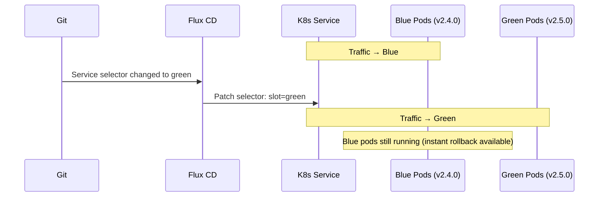

# How to Implement GitOps Blue-Green Environment Switching with Flux

Author: [nawazdhandala](https://github.com/nawazdhandala)

Tags: Flux CD, GitOps, Kubernetes, Blue-Green, Deployments, Kustomize

Description: Implement blue-green environment switching using Flux CD Kustomizations and Kubernetes Services to achieve zero-downtime deployments with instant rollback capability.

---

## Introduction

Blue-green deployment maintains two identical production environments - "blue" (currently live) and "green" (the new version). Traffic is switched from blue to green atomically by updating a Kubernetes Service selector. If green has problems, you switch back to blue instantly with no need to redeploy the old version - it is still running.

In a GitOps workflow with Flux CD, both the blue and green deployments are declared in Git. The "switch" is a change to the Service selector in Git, which Flux reconciles within seconds. Because the old version is still running when you switch, instant rollback is a git revert away.

This guide shows how to structure blue-green deployments in Flux, execute a switch, and roll back when needed.

## Prerequisites

- Flux CD managing a production cluster
- `flux` CLI and `kubectl` installed
- A Kubernetes Service that routes traffic to your application
- An ingress controller or load balancer

## Step 1: Define Blue and Green Deployments

Both deployments exist simultaneously. They differ only in image tag and version labels.

```yaml
# apps/my-app/base/deployment-blue.yaml
apiVersion: apps/v1
kind: Deployment
metadata:
  name: my-app-blue
  labels:
    app: my-app
    slot: blue
spec:
  replicas: 3
  selector:
    matchLabels:
      app: my-app
      slot: blue
  template:
    metadata:
      labels:
        app: my-app
        slot: blue
        version: "2.4.0"
    spec:
      containers:
        - name: my-app
          image: my-registry/my-app:2.4.0
          ports:
            - containerPort: 8080
          resources:
            requests:
              cpu: 100m
              memory: 128Mi
            limits:
              cpu: 500m
              memory: 256Mi
```

```yaml
# apps/my-app/base/deployment-green.yaml
apiVersion: apps/v1
kind: Deployment
metadata:
  name: my-app-green
  labels:
    app: my-app
    slot: green
spec:
  replicas: 3
  selector:
    matchLabels:
      app: my-app
      slot: green
  template:
    metadata:
      labels:
        app: my-app
        slot: green
        version: "2.5.0"          # New version runs in green
    spec:
      containers:
        - name: my-app
          image: my-registry/my-app:2.5.0
          ports:
            - containerPort: 8080
          resources:
            requests:
              cpu: 100m
              memory: 128Mi
            limits:
              cpu: 500m
              memory: 256Mi
```

## Step 2: Define the Traffic-Routing Service

The Service selector determines which slot receives traffic. Switching between blue and green is just a selector change.

```yaml
# apps/my-app/base/service.yaml
apiVersion: v1
kind: Service
metadata:
  name: my-app
  labels:
    app: my-app
spec:
  selector:
    app: my-app
    slot: blue              # Currently routing to blue; change to green to switch
  ports:
    - protocol: TCP
      port: 80
      targetPort: 8080
```

## Step 3: Configure Flux Kustomization

```yaml
# clusters/production/apps/my-app.yaml
apiVersion: kustomize.toolkit.fluxcd.io/v1
kind: Kustomization
metadata:
  name: my-app
  namespace: flux-system
spec:
  interval: 5m
  path: ./apps/my-app/base
  prune: true
  sourceRef:
    kind: GitRepository
    name: flux-system
  healthChecks:
    # Both slots should be healthy - this confirms the pre-switch state
    - apiVersion: apps/v1
      kind: Deployment
      name: my-app-blue
      namespace: production
    - apiVersion: apps/v1
      kind: Deployment
      name: my-app-green
      namespace: production
  timeout: 5m
```

## Step 4: Prepare Green and Verify Before Switching

Before switching traffic, verify that the green deployment is healthy:

```bash
# Check that green pods are all running
kubectl get pods -n production -l slot=green

# Run a smoke test against green directly (bypassing the service)
GREEN_POD=$(kubectl get pod -n production -l slot=green \
  -o jsonpath='{.items[0].metadata.name}')

kubectl exec -n production "$GREEN_POD" -- \
  wget -qO- http://localhost:8080/healthz

# Or port-forward to test green directly
kubectl port-forward -n production \
  deployment/my-app-green 8081:8080

curl http://localhost:8081/healthz
```

## Step 5: Execute the Blue-Green Switch via Git

When green is verified, update the Service selector in Git:

```bash
# Switch traffic from blue to green
sed -i 's/slot: blue/slot: green/' apps/my-app/base/service.yaml

git add apps/my-app/base/service.yaml
git commit -m "deploy: switch my-app traffic from blue to green (v2.5.0)"
git push origin main
```

Flux detects the commit and updates the Service selector within the interval. The switch is atomic from the Kubernetes perspective - the Service selector update causes all new connections to go to green while existing connections to blue complete normally.



## Step 6: Rollback by Switching Back to Blue

If green has problems after the switch, roll back by reverting the selector change:

```bash
# Option A: git revert (preferred for audit trail)
git revert HEAD --no-edit
git push origin main
# Flux reconciles and switches traffic back to blue

# Option B: Direct edit (faster, for incidents)
sed -i 's/slot: green/slot: blue/' apps/my-app/base/service.yaml
git add apps/my-app/base/service.yaml
git commit -m "rollback: switch my-app traffic back to blue (v2.4.0)"
git push origin main
```

Blue pods were never stopped, so rollback takes only as long as Flux reconciliation (typically under 30 seconds).

## Step 7: Clean Up the Old Slot

After green has been running successfully for a defined stability period (e.g., 24 hours), update blue to match the new version:

```bash
# Update blue to v2.5.0 so it is ready to be the stable slot for the next release
sed -i 's/image: my-registry\/my-app:2.4.0/image: my-registry\/my-app:2.5.0/' \
  apps/my-app/base/deployment-blue.yaml

git add apps/my-app/base/deployment-blue.yaml
git commit -m "chore: update blue slot to v2.5.0 post green stabilization"
git push origin main
```

## Best Practices

- Keep both deployments scaled to full production capacity during the switch window - running at half capacity defeats the purpose of the pattern.
- Always verify green is healthy before committing the selector switch - a pre-switch smoke test prevents a bad switch.
- Set a stability period (e.g., 24 hours) before updating the inactive slot. During this window instant rollback is available.
- Label pods with a `version` label in addition to `slot` so you can query running version independently of which slot is active.
- Monitor error rates and latency immediately after switching to detect problems quickly.

## Conclusion

Blue-green environment switching with Flux CD combines the safety of maintaining two running environments with the auditability of GitOps. Every switch is a Git commit, every rollback is a Git revert, and both deployments' configuration is visible in your repository at all times. The result is zero-downtime deployments with instant, declarative rollback capability.
