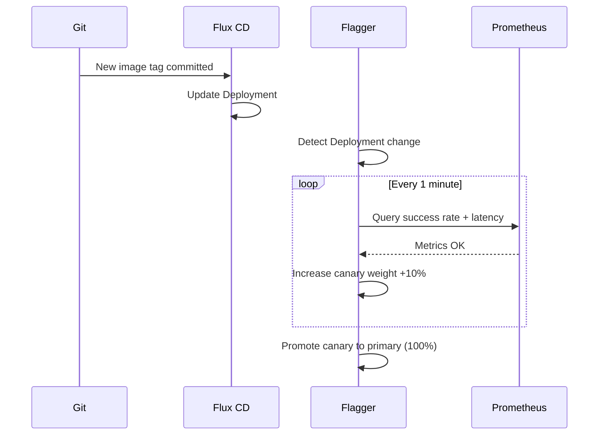

# How to Implement GitOps Canary Release Workflow with Flux and Flagger

Author: [nawazdhandala](https://github.com/nawazdhandala)

Tags: Flux CD, GitOps, Kubernetes, Canary, Flagger, Progressive Delivery

Description: Combine Flux CD with Flagger to automate canary releases that progressively shift traffic to new versions based on metrics, with automatic rollback on failure.

---

## Introduction

A canary release sends a small percentage of production traffic to a new version, monitors it for errors and latency degradation, and progressively increases traffic if metrics stay healthy. If the new version misbehaves, traffic is automatically rolled back to the stable version. This approach dramatically reduces the risk of breaking changes compared to an all-at-once deployment.

Flagger is a progressive delivery operator that integrates natively with Flux CD. While Flux manages what is deployed (image tags, configuration), Flagger manages how it is deployed (traffic shifting, metric evaluation, rollback). Together they create a fully automated canary pipeline where a Git commit eventually reaches 100% of production traffic only if it passes continuous health checks at every step.

This guide shows how to install Flagger via Flux, define a `Canary` resource, and monitor a canary progression.

## Prerequisites

- Flux CD bootstrapped on a Kubernetes cluster
- An ingress controller with traffic splitting support (Nginx, Istio, or Linkerd)
- Prometheus installed for metrics (or another supported metrics backend)
- `flux` CLI and `kubectl` installed

## Step 1: Install Flagger via Flux HelmRelease

Manage Flagger itself as a Flux HelmRelease so its installation is GitOps-managed:

```yaml
# infrastructure/controllers/flagger.yaml
apiVersion: source.toolkit.fluxcd.io/v1
kind: HelmRepository
metadata:
  name: flagger
  namespace: flux-system
spec:
  interval: 24h
  url: https://flagger.app
---
apiVersion: helm.toolkit.fluxcd.io/v2
kind: HelmRelease
metadata:
  name: flagger
  namespace: flux-system
spec:
  interval: 10m
  chart:
    spec:
      chart: flagger
      version: ">=1.35.0"
      sourceRef:
        kind: HelmRepository
        name: flagger
        namespace: flux-system
  values:
    # Use nginx ingress controller for traffic routing
    meshProvider: nginx
    # Point to Prometheus for metrics
    metricsServer: http://prometheus-operated.monitoring:9090
    # Enable Slack notifications
    slack:
      user: flagger
      channel: deployments
      url: https://hooks.slack.com/services/YOUR/SLACK/WEBHOOK
```

## Step 2: Configure the Primary Deployment

Flagger takes over management of a Deployment when it creates a `Canary` resource. Keep the Deployment definition simple - Flagger will manage the traffic routing:

```yaml
# apps/my-app/base/deployment.yaml
apiVersion: apps/v1
kind: Deployment
metadata:
  name: my-app
  namespace: production
spec:
  replicas: 1            # Flagger manages the actual replica count
  selector:
    matchLabels:
      app: my-app
  template:
    metadata:
      labels:
        app: my-app
    spec:
      containers:
        - name: my-app
          image: my-registry/my-app:2.4.0  # Flux Image Automation updates this
          ports:
            - containerPort: 8080
          resources:
            requests:
              cpu: 100m
              memory: 128Mi
            limits:
              cpu: 500m
              memory: 256Mi
```

## Step 3: Define the Flagger Canary Resource

The `Canary` resource instructs Flagger on how to manage traffic progression:

```yaml
# apps/my-app/base/canary.yaml
apiVersion: flagger.app/v1beta1
kind: Canary
metadata:
  name: my-app
  namespace: production
spec:
  # Reference to the deployment Flagger should manage
  targetRef:
    apiVersion: apps/v1
    kind: Deployment
    name: my-app

  # Ingress reference for traffic routing
  ingressRef:
    apiVersion: networking.k8s.io/v1
    kind: Ingress
    name: my-app

  # Prometheus metrics-based analysis
  analysis:
    # Evaluate metrics every 1 minute
    interval: 1m
    # Roll back after 5 consecutive failures
    threshold: 5
    # Maximum traffic weight sent to canary
    maxWeight: 50
    # Traffic increment per analysis step
    stepWeight: 10

    # Metric checks run at every analysis interval
    metrics:
      - name: request-success-rate
        # Minimum success rate required (99%)
        thresholdRange:
          min: 99
        interval: 1m

      - name: request-duration
        # Maximum p99 latency in milliseconds
        thresholdRange:
          max: 500
        interval: 1m

    # Webhooks for integration testing during rollout
    webhooks:
      - name: smoke-test
        url: http://flagger-loadtester.test/
        timeout: 15s
        metadata:
          type: cmd
          cmd: "curl -sd 'test' http://my-app-canary.production/health | grep -q OK"
```

## Step 4: Trigger a Canary Release

A canary release starts automatically when Flux updates the Deployment's image tag:

```bash
# In Git: update the image tag
sed -i 's/my-app:2.4.0/my-app:2.5.0/' apps/my-app/base/deployment.yaml
git commit -am "feat: release my-app v2.5.0"
git push origin main

# Flux reconciles the new tag to the Deployment
# Flagger detects the Deployment change and starts the canary
```

## Step 5: Monitor Canary Progression

```bash
# Watch the Canary resource status
kubectl get canary my-app -n production --watch

# Detailed canary status with traffic weights
kubectl describe canary my-app -n production

# Flagger events show each analysis step
kubectl get events -n production \
  --field-selector reason=Synced \
  --sort-by='.lastTimestamp'

# Example progression:
# Canary weight: 10% → 20% → 30% → 40% → 50% → promoted to primary
```

The progression looks like:



## Step 6: Handling a Failed Canary

If metrics breach the threshold, Flagger automatically rolls back:

```bash
# Flagger rolls back automatically on threshold breach
# Watch the rollback in action
kubectl describe canary my-app -n production

# Events will show something like:
# Halt advancement: request-success-rate 95.2% < 99%
# Rolling back my-app.production failed checks threshold reached 5

# After rollback, the primary deployment is unchanged
# Investigate the canary failure before trying again
kubectl logs -n production -l app=my-app-canary --tail=100
```

## Best Practices

- Start with conservative canary steps (5-10% per interval) for high-traffic services where small percentages still represent significant user counts.
- Use real user traffic metrics (request-success-rate, p99 latency) rather than synthetic health checks as the primary gate for promotion.
- Configure Slack or PagerDuty webhooks in Flagger so the on-call engineer is notified of both successful promotions and rollbacks.
- Test the canary configuration in staging with an artificially degraded version to confirm that automatic rollback triggers correctly.
- Set `maxWeight: 50` initially - limiting canary exposure to 50% means a bad release affects at most half of traffic before rollback.

## Conclusion

Combining Flux CD with Flagger creates a progressive delivery pipeline where every Git commit to a new image tag triggers a careful, metrics-driven rollout. Flux handles the GitOps layer (ensuring the declared state matches the cluster), while Flagger handles the progressive delivery layer (safely shifting traffic based on real metrics). The result is automated canary releases with automatic rollback - giving you the speed of continuous delivery with the safety of gradual exposure.
