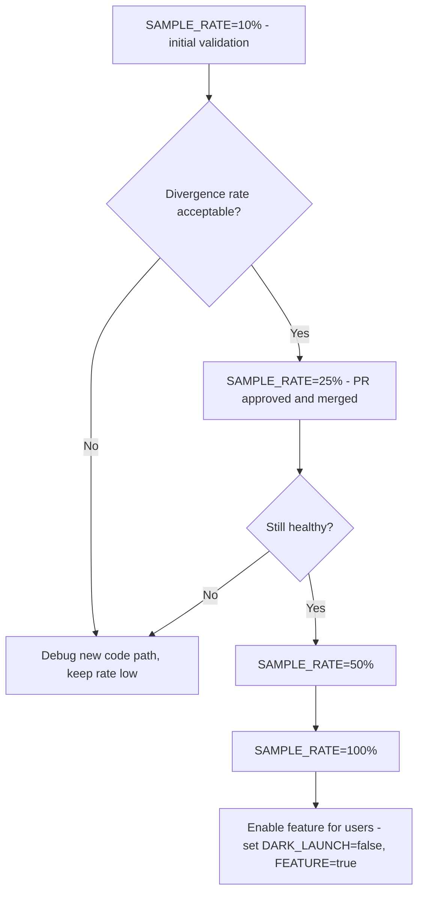

# How to Implement GitOps Dark Launch Pattern with Flux

Author: [nawazdhandala](https://github.com/nawazdhandala)

Tags: Flux CD, GitOps, Kubernetes, Dark Launch, Feature Flags, Progressive Delivery

Description: Deploy new features in dark launch mode using Flux CD, serving the new code path to all requests without exposing results to users for safe pre-production validation.

---

## Introduction

A dark launch deploys new code to production but keeps its output invisible to end users. The new code path executes alongside the existing code - handling real production traffic, querying real databases, processing real data - but the results are discarded or logged rather than returned to users. This lets you validate behavior, performance, and correctness under real production load before flipping the switch to make the feature visible.

In Kubernetes, dark launches are implemented through application-level feature flags combined with infrastructure-level traffic configuration. Flux CD manages both layers as Git-declared configuration, giving you the same review-and-merge workflow for dark launch activation as for any other change.

This guide shows how to structure a dark launch using a feature flag ConfigMap managed by Flux, combined with an application that runs both code paths and logs the dark results.

## Prerequisites

- Flux CD managing your production namespace
- An application that can be modified to support dual code paths
- Logging and observability infrastructure (Prometheus, Loki, or similar)
- `flux` CLI and `kubectl` installed

## Step 1: Define the Dark Launch Flag

```yaml
# apps/my-app/base/dark-launch-config.yaml
apiVersion: v1
kind: ConfigMap
metadata:
  name: my-app-dark-launch
  namespace: production
  labels:
    app: my-app
    config-type: dark-launch
data:
  # Controls whether the new payment processor runs in dark mode
  DARK_LAUNCH_NEW_PAYMENT_PROCESSOR: "true"

  # Percentage of requests that trigger the dark code path (0-100)
  # Start low to limit load on the new system during validation
  DARK_LAUNCH_SAMPLE_RATE: "10"

  # Log dark launch results to this log level for analysis
  DARK_LAUNCH_LOG_LEVEL: "info"

  # Whether to compare results between old and new code paths
  DARK_LAUNCH_COMPARE_RESULTS: "true"

  # Acceptable divergence threshold (results within X% are considered matching)
  DARK_LAUNCH_DIVERGENCE_THRESHOLD: "0.001"
```

## Step 2: Structure the Deployment to Mount the Dark Launch Config

```yaml
# apps/my-app/base/deployment.yaml
apiVersion: apps/v1
kind: Deployment
metadata:
  name: my-app
  namespace: production
spec:
  replicas: 3
  selector:
    matchLabels:
      app: my-app
  template:
    metadata:
      labels:
        app: my-app
      annotations:
        # Restart pods automatically when config changes (optional)
        configHash: ""        # CI can populate this with a hash of the ConfigMap
    spec:
      containers:
        - name: my-app
          image: my-registry/my-app:2.5.0
          envFrom:
            - configMapRef:
                name: my-app-dark-launch
          ports:
            - containerPort: 8080
          resources:
            requests:
              cpu: 200m      # Dark launch runs two code paths; budget extra CPU
              memory: 256Mi
            limits:
              cpu: 1000m
              memory: 512Mi
```

## Step 3: Implement the Dark Launch in Application Code

The application code handles the dual-path logic. This example shows the pattern in pseudocode:

```python
# In your application code (not a Kubernetes manifest)
import os
import random
import logging
import asyncio

DARK_LAUNCH_ENABLED = os.getenv("DARK_LAUNCH_NEW_PAYMENT_PROCESSOR") == "true"
SAMPLE_RATE = int(os.getenv("DARK_LAUNCH_SAMPLE_RATE", "0")) / 100.0

async def process_payment(payment_data):
    # Always execute the existing (stable) code path
    stable_result = await legacy_payment_processor.process(payment_data)

    # Dark launch: also execute the new code path for a sample of requests
    if DARK_LAUNCH_ENABLED and random.random() < SAMPLE_RATE:
        try:
            dark_result = await new_payment_processor.process(payment_data)

            # Compare results and log divergence
            if dark_result != stable_result:
                logging.warning(
                    "dark_launch_divergence",
                    extra={
                        "feature": "new_payment_processor",
                        "stable": stable_result,
                        "dark": dark_result,
                        "payment_id": payment_data.id
                    }
                )
            else:
                logging.info(
                    "dark_launch_match",
                    extra={"feature": "new_payment_processor"}
                )
        except Exception as e:
            # Dark launch failures are logged but NEVER returned to users
            logging.error(
                "dark_launch_error",
                extra={"feature": "new_payment_processor", "error": str(e)}
            )

    # ALWAYS return the stable result to users during dark launch
    return stable_result
```

## Step 4: Configure Flux Kustomization

```yaml
# clusters/production/apps/my-app.yaml
apiVersion: kustomize.toolkit.fluxcd.io/v1
kind: Kustomization
metadata:
  name: my-app
  namespace: flux-system
spec:
  interval: 5m
  path: ./apps/my-app/base
  prune: true
  sourceRef:
    kind: GitRepository
    name: flux-system
  healthChecks:
    - apiVersion: apps/v1
      kind: Deployment
      name: my-app
      namespace: production
```

## Step 5: Progressive Sample Rate Increase

Increase the dark launch sample rate through sequential Git commits as confidence grows:



Each step is a separate PR:

```bash
# Example: increase sample rate to 25%
sed -i 's/DARK_LAUNCH_SAMPLE_RATE: "10"/DARK_LAUNCH_SAMPLE_RATE: "25"/' \
  apps/my-app/base/dark-launch-config.yaml

git commit -am "feat: increase dark launch sample rate to 25% (no divergence at 10%)"
gh pr create --title "feat: dark launch sample rate 25%"
```

## Step 6: Monitor Dark Launch Results

```bash
# Watch for divergence logs in the application
kubectl logs -n production -l app=my-app \
  | grep dark_launch | jq '.'

# Check error rates for the dark code path
kubectl logs -n production -l app=my-app \
  | grep dark_launch_error | wc -l

# Verify no impact on stable response times
kubectl top pods -n production -l app=my-app

# Confirm ConfigMap is applied correctly
kubectl get configmap my-app-dark-launch -n production -o yaml
```

## Step 7: Promote from Dark Launch to Full Release

When the dark code path has validated successfully at 100% sample rate with no divergence:

```bash
# 1. Create a final PR: disable dark launch and enable the feature
cat > apps/my-app/base/feature-flags.yaml <<'EOF'
apiVersion: v1
kind: ConfigMap
metadata:
  name: my-app-feature-flags
  namespace: production
data:
  ENABLE_NEW_PAYMENT_PROCESSOR: "true"   # Now live for all users
  DARK_LAUNCH_NEW_PAYMENT_PROCESSOR: "false"
  DARK_LAUNCH_SAMPLE_RATE: "0"
EOF

git commit -am "feat: promote new payment processor from dark launch to live"
gh pr create --title "feat: launch new payment processor (dark launch complete)"
```

## Best Practices

- Start with a very low sample rate (5-10%) to limit load on the new code path before it has been validated.
- Always discard or ignore dark launch results - never let a dark launch response reach a user, even if the stable path fails.
- Set resource limits that account for the additional CPU and memory used by running two code paths.
- Create a dashboard that tracks dark launch divergence rate and error rate so the team can monitor progress.
- Document a clear exit criteria in the PR description for each sample rate increase - define what "no divergence" means quantitatively.

## Conclusion

The dark launch pattern implemented through Flux-managed ConfigMaps gives you the ability to validate new code under real production load without exposing users to unproven behavior. Every change to the dark launch configuration - enabling it, increasing the sample rate, and finally promoting to a real launch - flows through the same Git-based review workflow as any other deployment change, keeping your entire deployment history auditable and reversible.
