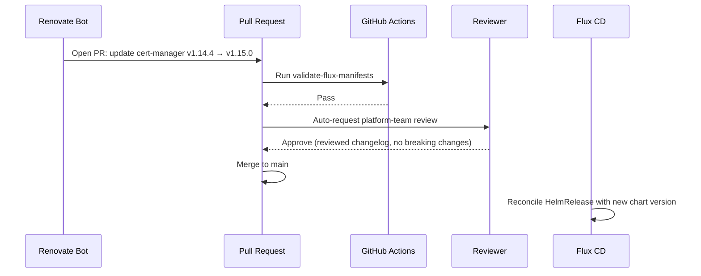

# How to Implement GitOps Dependency Update Workflow with Renovate and Flux

Author: [nawazdhandala](https://github.com/nawazdhandala)

Tags: Flux CD, GitOps, Kubernetes, Renovate, Dependency Updates, Automation

Description: Automate dependency updates in your Flux CD GitOps repository using Renovate bot to keep Helm chart versions, container images, and Flux itself up to date with minimal manual effort.

---

## Introduction

Keeping dependencies up to date is one of the most important and tedious aspects of running a production Kubernetes platform. Helm charts release new versions, container base images accumulate CVEs, and Flux itself ships new features and security fixes. Without automation, teams fall behind and end up with large, risky update batches rather than small, safe incremental updates.

Renovate is an open-source dependency update tool that scans your repository for version references, checks for new versions, and opens pull requests with the updates. When integrated with a Flux CD repository, Renovate opens PRs that update Helm chart versions, HelmRepository references, and container image tags — and your normal GitOps review workflow handles the rest.

This guide covers configuring Renovate for a Flux CD repository, setting appropriate update schedules and grouping, and integrating with your PR review process.

## Prerequisites

- A Flux CD GitOps repository on GitHub (or GitLab/Bitbucket)
- Renovate GitHub App installed on the repository (free for open source, or self-hosted)
- Existing `HelmRelease` and `HelmRepository` resources in your repository
- PR review workflow in place for the target branches

## Step 1: Add the Renovate Configuration File

Create `renovate.json` in the root of your repository:

```json
{
  "$schema": "https://docs.renovatebot.com/renovate-schema.json",
  "extends": [
    "config:base"
  ],
  "schedule": ["after 6am and before 10am on Monday"],
  "timezone": "UTC",
  "labels": ["dependencies", "renovate"],
  "reviewers": ["team:platform-team"],
  "assignees": ["nawazdhandala"],
  "prConcurrentLimit": 5,
  "prHourlyLimit": 2,
  "kubernetes": {
    "fileMatch": ["(^|/)apps/.+\\.yaml$", "(^|/)clusters/.+\\.yaml$"]
  },
  "helm-values": {
    "fileMatch": ["(^|/)helm-values/.+\\.yaml$"]
  },
  "customManagers": [
    {
      "customType": "regex",
      "description": "Update Flux HelmRelease chart versions",
      "fileMatch": ["(^|/).+\\.yaml$"],
      "matchStrings": [
        "chart:\\s+\\n\\s+spec:\\s+\\n\\s+chart:\\s+(?<depName>[^\\n]+)\\s+\\n\\s+version:\\s+[\"']?(?<currentValue>[^\"'\\n]+)[\"']?"
      ],
      "datasourceTemplate": "helm",
      "registryUrlTemplate": "https://charts.example.com"
    }
  ],
  "packageRules": [
    {
      "description": "Group Flux system updates together",
      "matchPackageNames": ["fluxcd/flux2", "flux2"],
      "groupName": "flux-system",
      "automerge": false,
      "labels": ["flux", "dependencies"]
    },
    {
      "description": "Auto-merge patch updates for non-critical infrastructure",
      "matchUpdateTypes": ["patch"],
      "matchManagers": ["helm-values"],
      "automerge": true,
      "automergeType": "pr",
      "requiredStatusChecks": ["validate-flux-manifests"]
    },
    {
      "description": "Require manual review for major updates",
      "matchUpdateTypes": ["major"],
      "labels": ["major-update", "requires-review"],
      "automerge": false,
      "reviewers": ["team:senior-platform"]
    },
    {
      "description": "Group cert-manager updates",
      "matchPackageNames": ["cert-manager"],
      "groupName": "cert-manager",
      "schedule": ["at any time"]
    }
  ]
}
```

## Step 2: Configure Renovate for Flux HelmRelease Resources

Renovate understands Flux `HelmRelease` resources natively. It detects the chart version and opens PRs when new versions are available:

```yaml
# Example HelmRelease that Renovate will update
# apps/production/cert-manager/helmrelease.yaml
apiVersion: helm.toolkit.fluxcd.io/v2
kind: HelmRelease
metadata:
  name: cert-manager
  namespace: cert-manager
spec:
  interval: 10m
  chart:
    spec:
      chart: cert-manager
      version: "v1.14.4"     # Renovate will update this line
      sourceRef:
        kind: HelmRepository
        name: jetstack
        namespace: flux-system
  values:
    installCRDs: true
```

Renovate opens a PR like:
```
chore(deps): update helm release cert-manager to v1.15.0
```

## Step 3: Configure Flux Image Update Automation

For container images updated by Renovate (rather than Flux Image Automation), configure a Renovate rule:

```json
{
  "packageRules": [
    {
      "description": "Update app container images",
      "matchManagers": ["kubernetes"],
      "matchFileNames": ["apps/*/base/deployment.yaml"],
      "matchUpdateTypes": ["minor", "patch"],
      "groupName": "app-image-updates",
      "schedule": ["after 6am and before 10am on Monday and Thursday"]
    }
  ]
}
```

Alternatively, use Flux Image Update Automation for images and Renovate for Helm charts — a common combination:

```yaml
# infrastructure/image-automation/policy.yaml
apiVersion: image.toolkit.fluxcd.io/v1
kind: ImagePolicy
metadata:
  name: my-app
  namespace: flux-system
spec:
  imageRepositoryRef:
    name: my-app
  policy:
    semver:
      range: ">=2.0.0 <3.0.0"    # Flux handles image updates within this range
```

Renovate then handles Helm chart versions while Flux handles image tags.

## Step 4: Set Up CI to Validate Renovate PRs

Renovate PRs should trigger the same validation CI as developer PRs:

```yaml
# .github/workflows/validate.yaml
name: Validate Flux Manifests

on:
  pull_request:
    branches: [main]

jobs:
  validate:
    runs-on: ubuntu-latest
    steps:
      - uses: actions/checkout@v4

      - name: Install kubeconform
        run: |
          curl -sL https://github.com/yannh/kubeconform/releases/latest/download/kubeconform-linux-amd64.tar.gz \
            | tar xz && sudo mv kubeconform /usr/local/bin/

      - name: Validate Kubernetes manifests
        run: |
          kubeconform \
            -strict \
            -ignore-missing-schemas \
            -summary \
            $(find . -name "*.yaml" -not -path "./.git/*")

      - name: Install Helm
        uses: azure/setup-helm@v4

      - name: Validate Helm template rendering
        run: |
          # For each HelmRelease, template render to check for errors
          find . -name "helmrelease.yaml" -exec helm template test {} \; || true
```

## Step 5: Review and Merge a Renovate PR

When Renovate opens a PR, the review process follows your normal workflow:



## Step 6: Automate Renovate Scheduling

```bash
# Check Renovate status on a repository using the GitHub API
gh api repos/your-org/fleet-infra/issues \
  --jq '.[] | select(.user.login == "renovate[bot]") | {title: .title, url: .html_url}'

# List all open Renovate PRs
gh pr list --author "renovate[bot]" --json title,url,createdAt

# Merge low-risk auto-merge PRs manually when auto-merge is not configured
gh pr list --author "renovate[bot]" --label "patch" \
  | awk '{print $1}' | xargs -I{} gh pr merge {} --squash
```

## Best Practices

- Group related dependencies (all Flux components, all monitoring stack charts) so they update together and testing is coherent.
- Never configure `automerge: true` for production cluster Kustomization paths — always require human review for production changes.
- Review Renovate's dependency dashboard issue (it creates one automatically) weekly to handle blocked updates and pin exceptions.
- Add the `CHANGELOG` URL to Renovate's PR template so reviewers can quickly assess the impact of an update without leaving the PR.
- Test major version updates in a staging environment before merging to the production branch.

## Conclusion

Integrating Renovate with a Flux CD repository automates the most tedious part of platform maintenance — keeping chart versions and image tags current. Renovate handles the discovery and PR creation; your existing review and CI workflow handles the quality gate; Flux handles the cluster reconciliation. The result is a platform that stays up to date with minimal manual effort, and every update is tracked in Git history with a clear audit trail.
