# How to Implement GitOps Deployment Windows with Flux Suspend/Resume

Author: [nawazdhandala](https://github.com/nawazdhandala)

Tags: Flux CD, GitOps, Kubernetes, Deployment Windows, Scheduling, Automation

Description: Schedule deployment windows by automating Flux CD suspend and resume so that cluster changes only happen during approved time windows.

---

## Introduction

Deployment windows restrict when new changes are allowed to land in production. Unlike change freezes (which block all changes), deployment windows define the affirmative periods when deployments are permitted. Outside those windows Flux is suspended; inside them Flux reconciles normally. This pattern is common in organizations that want to avoid Friday afternoon deployments, ensure an on-call engineer is always available during changes, or comply with change advisory board requirements that mandate specific change windows.

Flux CD's `suspend` field, combined with Kubernetes CronJobs or external schedulers, makes deployment windows straightforward to implement. The window schedule lives in Git alongside your manifests, making it auditable and subject to the same review process as any other configuration change.

This guide shows how to automate deployment windows using Kubernetes CronJobs, how to verify window status, and how to integrate window awareness into your CI pipeline.

## Prerequisites

- Flux CD bootstrapped on a Kubernetes cluster
- `flux` CLI and `kubectl` installed
- RBAC configured to allow a ServiceAccount to patch Flux resources
- Basic familiarity with Kubernetes CronJob scheduling

## Step 1: Define Your Deployment Window Schedule

Document the deployment windows as a comment in the CronJob manifests. A common pattern is business hours Monday through Thursday:

```plaintext
Allowed deployment windows (UTC):
  Monday–Thursday: 09:00–17:00
  Friday: 09:00–12:00
  Saturday–Sunday: No deployments

Outside these windows, Flux is suspended.
```

Translate this into four CronJob pairs (open/close) - one pair per window boundary.

## Step 2: Create the Deployment Window CronJobs

```yaml
# clusters/production/deployment-windows/cronjobs.yaml
---
# Open deployment window: Mon-Thu at 09:00 UTC
apiVersion: batch/v1
kind: CronJob
metadata:
  name: deployment-window-open-weekday
  namespace: flux-system
spec:
  schedule: "0 9 * * 1-4"    # Mon-Thu 09:00 UTC
  concurrencyPolicy: Forbid
  jobTemplate:
    spec:
      template:
        spec:
          serviceAccountName: flux-window-sa
          restartPolicy: OnFailure
          containers:
            - name: open-window
              image: bitnami/kubectl:latest
              command:
                - /bin/sh
                - -c
                - |
                  echo "Opening deployment window at $(date -u)"
                  for ks in apps-production infra-production; do
                    kubectl patch kustomization "$ks" \
                      -n flux-system \
                      --type merge \
                      -p '{"spec":{"suspend":false}}'
                    echo "Resumed: $ks"
                  done
---
# Close deployment window: Mon-Thu at 17:00 UTC
apiVersion: batch/v1
kind: CronJob
metadata:
  name: deployment-window-close-weekday
  namespace: flux-system
spec:
  schedule: "0 17 * * 1-4"   # Mon-Thu 17:00 UTC
  concurrencyPolicy: Forbid
  jobTemplate:
    spec:
      template:
        spec:
          serviceAccountName: flux-window-sa
          restartPolicy: OnFailure
          containers:
            - name: close-window
              image: bitnami/kubectl:latest
              command:
                - /bin/sh
                - -c
                - |
                  echo "Closing deployment window at $(date -u)"
                  for ks in apps-production infra-production; do
                    kubectl patch kustomization "$ks" \
                      -n flux-system \
                      --type merge \
                      -p '{"spec":{"suspend":true}}'
                    echo "Suspended: $ks"
                  done
---
# Open deployment window: Fri at 09:00 UTC
apiVersion: batch/v1
kind: CronJob
metadata:
  name: deployment-window-open-friday
  namespace: flux-system
spec:
  schedule: "0 9 * * 5"     # Friday 09:00 UTC
  concurrencyPolicy: Forbid
  jobTemplate:
    spec:
      template:
        spec:
          serviceAccountName: flux-window-sa
          restartPolicy: OnFailure
          containers:
            - name: open-window
              image: bitnami/kubectl:latest
              command:
                - /bin/sh
                - -c
                - |
                  echo "Opening Friday deployment window at $(date -u)"
                  kubectl patch kustomization apps-production \
                    -n flux-system \
                    --type merge \
                    -p '{"spec":{"suspend":false}}'
---
# Close deployment window: Fri at 12:00 UTC
apiVersion: batch/v1
kind: CronJob
metadata:
  name: deployment-window-close-friday
  namespace: flux-system
spec:
  schedule: "0 12 * * 5"    # Friday 12:00 UTC
  concurrencyPolicy: Forbid
  jobTemplate:
    spec:
      template:
        spec:
          serviceAccountName: flux-window-sa
          restartPolicy: OnFailure
          containers:
            - name: close-window
              image: bitnami/kubectl:latest
              command:
                - /bin/sh
                - -c
                - |
                  echo "Closing Friday deployment window at $(date -u)"
                  kubectl patch kustomization apps-production \
                    -n flux-system \
                    --type merge \
                    -p '{"spec":{"suspend":true}}'
```

## Step 3: Create the Required RBAC Resources

```yaml
# clusters/production/deployment-windows/rbac.yaml
apiVersion: v1
kind: ServiceAccount
metadata:
  name: flux-window-sa
  namespace: flux-system
---
apiVersion: rbac.authorization.k8s.io/v1
kind: Role
metadata:
  name: flux-window-role
  namespace: flux-system
rules:
  - apiGroups: ["kustomize.toolkit.fluxcd.io"]
    resources: ["kustomizations"]
    verbs: ["get", "list", "patch"]
  - apiGroups: ["helm.toolkit.fluxcd.io"]
    resources: ["helmreleases"]
    verbs: ["get", "list", "patch"]
---
apiVersion: rbac.authorization.k8s.io/v1
kind: RoleBinding
metadata:
  name: flux-window-binding
  namespace: flux-system
subjects:
  - kind: ServiceAccount
    name: flux-window-sa
    namespace: flux-system
roleRef:
  kind: Role
  name: flux-window-role
  apiGroup: rbac.authorization.k8s.io
```

## Step 4: Check Current Window Status

Add a simple script to check whether a deployment window is currently open:

```bash
#!/bin/bash
# scripts/check-deployment-window.sh
# Returns 0 if window is open, 1 if closed

SUSPENDED=$(kubectl get kustomization apps-production \
  -n flux-system \
  -o jsonpath='{.spec.suspend}')

if [ "$SUSPENDED" = "true" ]; then
  echo "Deployment window is CLOSED. Flux is suspended."
  exit 1
else
  echo "Deployment window is OPEN. Flux is reconciling."
  exit 0
fi
```

Use this in CI to prevent PR merges outside of deployment windows:

```yaml
# .github/workflows/window-check.yaml
name: Deployment Window Check

on:
  pull_request:
    branches: [main]
    paths:
      - 'apps/production/**'

jobs:
  window-check:
    runs-on: ubuntu-latest
    steps:
      - name: Check deployment window
        run: |
          HOUR=$(date -u +%H)
          DOW=$(date -u +%u)   # 1=Mon, 7=Sun

          # Allow Mon-Thu 09-17, Fri 09-12
          if [ "$DOW" -ge 1 ] && [ "$DOW" -le 4 ] && \
             [ "$HOUR" -ge 9 ] && [ "$HOUR" -lt 17 ]; then
            echo "Within deployment window. Proceeding."
          elif [ "$DOW" -eq 5 ] && \
               [ "$HOUR" -ge 9 ] && [ "$HOUR" -lt 12 ]; then
            echo "Within Friday deployment window. Proceeding."
          else
            echo "::error::Outside deployment window. Deployments not permitted at this time."
            exit 1
          fi
```

## Step 5: Visualize the Deployment Window Schedule

```mermaid
gantt
    title Weekly Deployment Windows (UTC)
    dateFormat HH:mm
    axisFormat %H:%M

    section Monday-Thursday
    Deployment Window Open :active, 09:00, 17:00

    section Friday
    Deployment Window Open :active, 09:00, 12:00

    section Outside Windows
    Flux Suspended :crit, 00:00, 09:00
```



## Step 6: Override for Emergency Deployments

When a critical fix must be deployed outside a window, allow platform engineers to manually resume:

```bash
# Emergency override: open window immediately
flux resume kustomization apps-production --namespace flux-system

# Force reconciliation
flux reconcile kustomization apps-production

# After deployment, re-suspend to maintain window discipline
flux suspend kustomization apps-production --namespace flux-system

# Log the override in your incident tracking system
echo "Emergency deployment override at $(date -u) by $(whoami)" \
  >> deployment-overrides.log
```

## Best Practices

- Start Flux suspended by default (set `suspend: true` in the manifest) so that on fresh bootstrap or cluster restore, windows are closed until a CronJob explicitly opens them.
- Send Slack or PagerDuty notifications when windows open and close so the on-call engineer is always aware.
- Include the window schedule in your team's runbook so developers know when to schedule their PRs for merge.
- Keep HelmRelease suspension in sync with Kustomization suspension - a suspended Kustomization won't apply new Kustomization objects, but existing HelmReleases will still reconcile unless also suspended.
- Use `concurrencyPolicy: Forbid` on the CronJobs to prevent overlapping open/close operations.

## Conclusion

Deployment windows with Flux CD give you the operational discipline of scheduled change management while retaining the speed of GitOps. CronJobs handle the schedule automatically, the window policy lives in Git for auditability, and CI checks prevent PRs from merging outside permitted times. The result is a deployment process that is predictable, safe, and easy to communicate to stakeholders and auditors.
