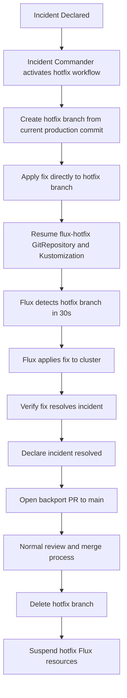

# How to Implement GitOps Emergency Hotfix Workflow with Flux

Author: [nawazdhandala](https://github.com/nawazdhandala)

Tags: Flux CD, GitOps, Kubernetes, Hotfix, Incident Response, Change Management

Description: Create a fast-track hotfix workflow that allows critical fixes to bypass normal GitOps approval gates while maintaining an audit trail in Git.

---

## Introduction

Normal GitOps workflows prioritize safety over speed: every change goes through a PR, waits for CI, and requires multiple approvals. That discipline is essential for routine deployments, but it becomes a liability during a live incident. When production is down, a multi-hour approval cycle makes the outage worse.

An emergency hotfix workflow threads this needle by creating a documented fast path. It is not a backdoor - every change still goes through Git and is still applied by Flux. The difference is that approval requirements are reduced, the path to production is shorter, and the fix can land in minutes rather than hours. Critically, a follow-up PR must still reconcile the hotfix into the normal workflow so no shadow configuration accumulates.

This guide defines the hotfix workflow, the Flux resources that support it, and the process for backporting the fix into the regular change flow afterward.

## Prerequisites

- Flux CD bootstrapped with a production Kustomization
- A protected `main` branch with standard approval gates
- A second `hotfix` branch configuration prepared in advance
- Team runbook documenting who can invoke the hotfix workflow

## Step 1: Prepare a Hotfix GitRepository Source

Create a secondary Flux `GitRepository` that watches a `hotfix` branch. This source exists permanently but is always suspended until an incident demands it.

```yaml
# clusters/production/flux-system/hotfix-source.yaml
apiVersion: source.toolkit.fluxcd.io/v1
kind: GitRepository
metadata:
  name: flux-hotfix
  namespace: flux-system
spec:
  interval: 30s             # Short interval for fast detection
  ref:
    branch: hotfix          # Dedicated hotfix branch
  url: ssh://git@github.com/your-org/fleet-infra
  secretRef:
    name: flux-system
  suspend: true             # Normally suspended; activated only during incidents
```

```yaml
# clusters/production/flux-system/hotfix-kustomization.yaml
apiVersion: kustomize.toolkit.fluxcd.io/v1
kind: Kustomization
metadata:
  name: apps-hotfix
  namespace: flux-system
spec:
  interval: 30s
  path: ./apps/production   # Same path as normal production Kustomization
  prune: false              # Do NOT prune during hotfix to avoid accidents
  sourceRef:
    kind: GitRepository
    name: flux-hotfix
  suspend: true             # Normally suspended
  timeout: 2m
```

## Step 2: Configure Reduced Branch Protection for the Hotfix Branch

In GitHub configure the `hotfix` branch with relaxed (but not absent) protection:

```plaintext
Branch name pattern: hotfix

Settings:
  ✅ Require a pull request before merging
     - Required approving reviews: 1 (reduced from 2)
     - Do NOT require review from Code Owners
     - Do NOT dismiss stale reviews

  ✅ Require status checks to pass before merging
     - Only: validate-flux-manifests (skip slow integration tests)

  ✅ Allow specific actors to bypass pull request requirements
     - @your-org/incident-commanders (on-call leads who can push directly)
```

This gives incident commanders the ability to push directly when time is critical, while still requiring at least validation CI for everyone else.

## Step 3: Define the Hotfix Runbook Steps

Document these steps in your team runbook and incident response playbook:



## Step 4: Activate the Hotfix Workflow

When an incident is declared, execute these steps in order:

```bash
# 1. Create the hotfix branch from the current production HEAD
git fetch origin main
git checkout -b hotfix origin/main
git push origin hotfix

# 2. Apply the emergency fix (example: update image tag)
# Edit the relevant manifest
# vim apps/production/my-app/deployment.yaml

# 3. Commit and push (incident commanders can bypass PR requirement)
git add apps/production/my-app/deployment.yaml
git commit -m "hotfix: emergency image rollback for incident INC-2026-001"
git push origin hotfix

# 4. Activate the hotfix Flux resources
kubectl patch gitrepository flux-hotfix \
  -n flux-system \
  --type merge \
  -p '{"spec":{"suspend":false}}'

kubectl patch kustomization apps-hotfix \
  -n flux-system \
  --type merge \
  -p '{"spec":{"suspend":false}}'

# 5. Watch Flux apply the fix (30s interval)
flux get kustomization apps-hotfix --watch
```

## Step 5: Verify the Fix and Monitor

```bash
# Confirm the correct image is running
kubectl get pods -n production -o jsonpath='{.items[*].spec.containers[*].image}'

# Watch application health
kubectl rollout status deployment/my-app -n production

# Check Flux events for any reconciliation errors
flux events --for Kustomization/apps-hotfix
```

## Step 6: Backport to Main and Clean Up

After the incident is resolved, the hotfix must be merged into the normal workflow:

```bash
# 1. Open a PR from hotfix to main with the incident context
gh pr create \
  --title "hotfix: emergency fix for INC-2026-001 (backport)" \
  --body "Backport of emergency hotfix applied during incident INC-2026-001.
Incident report: https://incidents.example.com/INC-2026-001
Applied at: $(date -u)
Reviewer: requires 1 approval per post-incident policy" \
  --base main \
  --head hotfix

# 2. After PR is merged to main, suspend the hotfix Flux resources
kubectl patch gitrepository flux-hotfix \
  -n flux-system \
  --type merge \
  -p '{"spec":{"suspend":true}}'

kubectl patch kustomization apps-hotfix \
  -n flux-system \
  --type merge \
  -p '{"spec":{"suspend":true}}'

# 3. Delete the hotfix branch
git push origin --delete hotfix

# 4. Verify production is now reconciled from main
flux reconcile kustomization apps-production
flux get kustomization apps-production
```

## Best Practices

- Pre-create the hotfix GitRepository and Kustomization resources so there is no delay in activating them during an incident.
- Limit the list of incident commanders who can bypass PR requirements - this should be a small, named group.
- Always require at least basic manifest validation CI even on the hotfix branch.
- File an incident report that references the Git commit SHA of the hotfix so the change is traceable.
- Never leave the hotfix Flux resources active after the incident is resolved - the cleanup step is mandatory.
- Run a post-incident review to determine if the hotfix could have been applied faster through the normal workflow, and whether the normal workflow needs adjustment.

## Conclusion

An emergency hotfix workflow gives your team a documented, controlled fast path for critical fixes without abandoning GitOps principles. Every hotfix still flows through Git, is applied by Flux, and is ultimately merged back into the normal change flow. The audit trail is preserved, the fix is reproducible, and the incident can be referenced against a specific commit - all the properties that make GitOps trustworthy, delivered in minutes when they are needed most.
