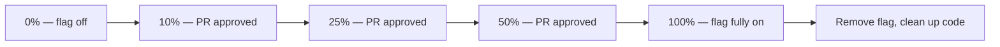

# How to Implement GitOps Feature Flag Deployment with Flux

Author: [nawazdhandala](https://github.com/nawazdhandala)

Tags: Flux CD, GitOps, Kubernetes, Feature Flags, ConfigMap, Deployment

Description: Deploy and manage feature flags using GitOps with Flux CD by storing flag configuration in Git and reconciling it to Kubernetes ConfigMaps consumed by your applications.

---

## Introduction

Feature flags decouple deployment from release — you ship code with a feature hidden behind a flag, then enable the feature separately for some or all users without a new deployment. In a GitOps workflow, feature flag configuration belongs in Git alongside the application manifests. Flux reconciles flag changes to ConfigMaps in the cluster, your application reads the ConfigMap, and features are toggled without rebuilding or redeploying the container image.

This approach keeps feature flag state in Git (auditable, reviewable, reversible) rather than in a database or external service. It works well for infrastructure-level flags — which namespaces or regions have a feature enabled — while external flag services (LaunchDarkly, Unleash) handle user-level targeting. The two patterns are complementary.

This guide covers defining feature flags as Kubernetes ConfigMaps managed by Flux, rolling out flag changes through PRs, and implementing flag-aware deployment patterns.

## Prerequisites

- Flux CD bootstrapped and managing at least one namespace
- An application that can read configuration from environment variables or mounted ConfigMaps
- `flux` CLI and `kubectl` installed
- Basic familiarity with Kubernetes ConfigMaps

## Step 1: Define Feature Flags in a ConfigMap

Store feature flags as a ConfigMap in your repository:

```yaml
# apps/my-app/base/feature-flags.yaml
apiVersion: v1
kind: ConfigMap
metadata:
  name: my-app-feature-flags
  namespace: production
  labels:
    app: my-app
    managed-by: flux
data:
  # Infrastructure-level feature flags
  ENABLE_NEW_CHECKOUT: "false"        # New checkout flow
  ENABLE_RECOMMENDATIONS: "false"    # ML recommendation engine
  ENABLE_DARK_MODE: "true"           # UI dark mode support
  ENABLE_RATE_LIMITING: "true"       # API rate limiting
  MAX_UPLOAD_SIZE_MB: "10"           # Upload size limit (configurable)
  FEATURE_ROLLOUT_PERCENTAGE: "0"    # Percentage of traffic to send to new feature
```

## Step 2: Mount Feature Flags in the Deployment

Inject the ConfigMap into your application as environment variables:

```yaml
# apps/my-app/base/deployment.yaml
apiVersion: apps/v1
kind: Deployment
metadata:
  name: my-app
  namespace: production
spec:
  replicas: 3
  selector:
    matchLabels:
      app: my-app
  template:
    metadata:
      labels:
        app: my-app
    spec:
      containers:
        - name: my-app
          image: my-registry/my-app:2.5.0
          ports:
            - containerPort: 8080
          envFrom:
            # Load all feature flags as environment variables
            - configMapRef:
                name: my-app-feature-flags
          resources:
            requests:
              cpu: 100m
              memory: 128Mi
            limits:
              cpu: 500m
              memory: 256Mi
```

For applications that need to pick up flag changes without restart, mount the ConfigMap as a file instead:

```yaml
          volumeMounts:
            - name: feature-flags
              mountPath: /etc/my-app/flags
              readOnly: true
      volumes:
        - name: feature-flags
          configMap:
            name: my-app-feature-flags
```

Kubernetes propagates ConfigMap changes to mounted volumes within ~1 minute, allowing applications that watch the file to pick up changes without restarting.

## Step 3: Configure the Flux Kustomization

```yaml
# clusters/production/apps/my-app.yaml
apiVersion: kustomize.toolkit.fluxcd.io/v1
kind: Kustomization
metadata:
  name: my-app
  namespace: flux-system
spec:
  interval: 5m
  path: ./apps/my-app/base
  prune: true
  sourceRef:
    kind: GitRepository
    name: flux-system
  healthChecks:
    - apiVersion: apps/v1
      kind: Deployment
      name: my-app
      namespace: production
```

## Step 4: Use Environment-Specific Overlays for Staged Flag Rollout

Enable a flag in staging first, validate, then enable in production via a separate PR:

```yaml
# apps/my-app/staging/feature-flags-patch.yaml
# Enable the new checkout in staging for validation
apiVersion: v1
kind: ConfigMap
metadata:
  name: my-app-feature-flags
  namespace: staging
data:
  ENABLE_NEW_CHECKOUT: "true"         # Enabled in staging
  FEATURE_ROLLOUT_PERCENTAGE: "100"   # Full rollout in staging
```

```yaml
# apps/my-app/staging/kustomization.yaml
apiVersion: kustomize.config.k8s.io/v1beta1
kind: Kustomization
resources:
  - ../base
namespace: staging
patches:
  - path: feature-flags-patch.yaml
    target:
      kind: ConfigMap
      name: my-app-feature-flags
```

After staging validation, open a separate PR to enable the flag in production:

```yaml
# apps/my-app/production/feature-flags-patch.yaml
apiVersion: v1
kind: ConfigMap
metadata:
  name: my-app-feature-flags
  namespace: production
data:
  ENABLE_NEW_CHECKOUT: "true"
  FEATURE_ROLLOUT_PERCENTAGE: "10"    # Start with 10% in production
```

## Step 5: Gradual Rollout via Sequential PRs

Roll out flags progressively by opening a series of PRs that increase the rollout percentage:



Each step requires a PR, a review, and a merge before Flux applies the next percentage.

## Step 6: Monitor Flag Changes

After Flux reconciles a flag change, verify the ConfigMap and confirm the application is using the new value:

```bash
# Verify the ConfigMap was updated
kubectl get configmap my-app-feature-flags -n production -o yaml

# Check that pods have the new environment variable
kubectl exec -n production \
  $(kubectl get pods -n production -l app=my-app -o name | head -1) \
  -- env | grep ENABLE_NEW_CHECKOUT

# Watch Flux reconcile the flag change
flux get kustomization my-app --watch

# Check events for ConfigMap updates
kubectl get events -n production \
  --field-selector involvedObject.name=my-app-feature-flags
```

## Best Practices

- Treat every feature flag change as a code change — it goes through a PR, passes CI, and requires an approving review.
- Set a sunset date for every feature flag in the PR description. Flags that are never cleaned up accumulate into technical debt.
- Use environment-specific overlays to test flags in staging before enabling them in production.
- For user-level targeting (% of users, specific users, A/B groups), combine this pattern with a dedicated feature flag service. Git-managed ConfigMaps handle infrastructure-level toggles well but are not suited for per-user targeting.
- Monitor application behavior closely after enabling a flag — set up dashboards filtered by the flag's affected code paths.

## Conclusion

Managing feature flags as Kubernetes ConfigMaps in a Flux-managed GitOps repository gives you auditable, reviewable flag management with the same workflow you use for all other configuration changes. Every flag enable, disable, or percentage adjustment is a Git commit with a PR, an approver, and a permanent record — making feature flag management as safe and traceable as any other deployment operation.
