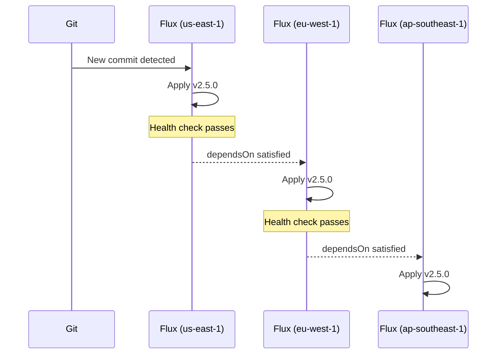

# How to Implement GitOps Multi-Region Rolling Deployment with Flux

Author: [nawazdhandala](https://github.com/nawazdhandala)

Tags: Flux CD, GitOps, Kubernetes, Multi-Region, Rolling Deployment, High Availability

Description: Roll out deployments sequentially across multiple regions using Flux CD Kustomizations with health checks to ensure each region stabilizes before the next one is updated.

---

## Introduction

Multi-region deployments spread risk by ensuring a bad deployment can be caught and stopped before it affects all your users. Instead of updating all regions simultaneously, a rolling multi-region deployment updates one region at a time, waits for it to become healthy, then proceeds to the next. If a region fails its health check, the rollout stops, limiting the blast radius to the already-updated regions.

Flux CD enables this pattern through two mechanisms: Kustomization dependencies (`dependsOn`) that enforce ordering between regions, and health checks that require a region to be fully healthy before the next one is permitted to reconcile. Combined with a region-specific overlay structure, you get a declarative multi-region rollout with no additional tooling required.

This guide walks through setting up a three-region rolling deployment with Flux Kustomizations and explains how to monitor, pause, and recover from a failed regional rollout.

## Prerequisites

- Flux CD installed on Kubernetes clusters in multiple regions (or a single cluster with regional namespaces for demonstration)
- A shared Git repository that all regional Flux instances watch
- `flux` CLI and `kubectl` with contexts for each region
- Container images tagged with immutable version tags

## Step 1: Structure the Repository for Multi-Region Overlays

```plaintext
fleet-infra/
└── apps/
    └── my-app/
        ├── base/
        │   ├── kustomization.yaml
        │   ├── deployment.yaml
        │   └── service.yaml
        ├── us-east-1/
        │   └── kustomization.yaml    # Region-specific overlay
        ├── eu-west-1/
        │   └── kustomization.yaml
        └── ap-southeast-1/
            └── kustomization.yaml
```

Each regional overlay sets the image tag. During a rollout you update the tags one region at a time.

```yaml
# apps/my-app/us-east-1/kustomization.yaml
apiVersion: kustomize.config.k8s.io/v1beta1
kind: Kustomization
resources:
  - ../base
namespace: my-app-us-east-1
images:
  - name: my-registry/my-app
    newTag: "2.5.0"          # This region has been updated to the new version
```

## Step 2: Configure Regional Flux Kustomizations with DependsOn

Use `dependsOn` to enforce the rollout order. Each region will only reconcile after the previous region's Kustomization shows `Ready: True` with the new revision.

```yaml
# clusters/production/apps/my-app-us-east-1.yaml
apiVersion: kustomize.toolkit.fluxcd.io/v1
kind: Kustomization
metadata:
  name: my-app-us-east-1
  namespace: flux-system
spec:
  interval: 10m
  path: ./apps/my-app/us-east-1
  prune: true
  sourceRef:
    kind: GitRepository
    name: flux-system
  # No dependsOn: this is the first region
  healthChecks:
    - apiVersion: apps/v1
      kind: Deployment
      name: my-app
      namespace: my-app-us-east-1
  timeout: 10m               # Must become healthy within 10 minutes
```

```yaml
# clusters/production/apps/my-app-eu-west-1.yaml
apiVersion: kustomize.toolkit.fluxcd.io/v1
kind: Kustomization
metadata:
  name: my-app-eu-west-1
  namespace: flux-system
spec:
  interval: 10m
  path: ./apps/my-app/eu-west-1
  prune: true
  sourceRef:
    kind: GitRepository
    name: flux-system
  dependsOn:
    - name: my-app-us-east-1  # Only proceed after US East is healthy
  healthChecks:
    - apiVersion: apps/v1
      kind: Deployment
      name: my-app
      namespace: my-app-eu-west-1
  timeout: 10m
```

```yaml
# clusters/production/apps/my-app-ap-southeast-1.yaml
apiVersion: kustomize.toolkit.fluxcd.io/v1
kind: Kustomization
metadata:
  name: my-app-ap-southeast-1
  namespace: flux-system
spec:
  interval: 10m
  path: ./apps/my-app/ap-southeast-1
  prune: true
  sourceRef:
    kind: GitRepository
    name: flux-system
  dependsOn:
    - name: my-app-eu-west-1  # Only proceed after EU West is healthy
  healthChecks:
    - apiVersion: apps/v1
      kind: Deployment
      name: my-app
      namespace: my-app-ap-southeast-1
  timeout: 10m
```

## Step 3: Execute a Multi-Region Rollout

To roll out a new version, update one regional overlay at a time through PRs or a CI automation:

```bash
# Step 1: Update US East to the new version
sed -i 's/newTag: "2.4.0"/newTag: "2.5.0"/' \
  apps/my-app/us-east-1/kustomization.yaml

git add apps/my-app/us-east-1/kustomization.yaml
git commit -m "deploy: my-app v2.5.0 to us-east-1"
git push origin main

# Flux applies the change to us-east-1 and must show Ready: True
# before eu-west-1 will reconcile (due to dependsOn)
```

Alternatively, use a CI script that updates all three overlays simultaneously but relies on `dependsOn` for ordering:

```bash
#!/bin/bash
# scripts/rollout-multi-region.sh
NEW_TAG=$1
REGIONS=("us-east-1" "eu-west-1" "ap-southeast-1")

for region in "${REGIONS[@]}"; do
  sed -i "s/newTag: \".*\"/newTag: \"$NEW_TAG\"/" \
    "apps/my-app/$region/kustomization.yaml"
done

git add apps/my-app/
git commit -m "deploy: my-app $NEW_TAG to all regions (rolling via dependsOn)"
git push origin main
```

Even though all three regions have the new tag in Git simultaneously, Flux enforces the rollout order through `dependsOn` and health checks.

## Step 4: Monitor the Rolling Rollout

```bash
# Watch all three regional Kustomizations
flux get kustomizations --watch | grep my-app

# Check the rollout progress in sequence
for region in us-east-1 eu-west-1 ap-southeast-1; do
  echo "=== $region ==="
  flux get kustomization "my-app-$region"
  kubectl rollout status deployment/my-app -n "my-app-$region"
done
```

The `dependsOn` chain creates this progression:



## Step 5: Handle a Regional Failure

If a region fails its health check, the `dependsOn` chain stops and subsequent regions are not updated:

```bash
# Identify the failing region
flux get kustomizations | grep my-app

# Get detailed failure information
flux describe kustomization my-app-eu-west-1

# Option 1: Roll back the failing region in Git
sed -i 's/newTag: "2.5.0"/newTag: "2.4.0"/' \
  apps/my-app/eu-west-1/kustomization.yaml
git add . && git commit -m "rollback: my-app eu-west-1 to v2.4.0 (health check failed)"
git push origin main

# Option 2: Suspend the failing region and continue with healthy regions
flux suspend kustomization my-app-eu-west-1
# Investigate the failure before resuming
```

## Best Practices

- Order regions from smallest/least critical to largest/most critical traffic so failures affect fewer users.
- Set `timeout` long enough for your application's startup time but not so long that a clearly broken deployment keeps the `dependsOn` chain waiting for the full timeout.
- Add smoke tests or synthetic monitoring checks as part of your health check strategy - Flux health checks only verify Kubernetes resource readiness, not application correctness.
- Use `postBuild.substituteFrom` with a ConfigMap to parameterize the new tag across all region overlays from a single source.
- Document the rollout order in your runbook so the on-call engineer knows which regions are already updated when investigating a failure.

## Conclusion

Multi-region rolling deployments with Flux CD `dependsOn` and health checks give you automated, sequenced rollouts without additional tooling. The entire rollout policy - order, health criteria, timeouts - lives in Git as declarative configuration. When a region fails, the chain stops automatically, and you recover by reverting that region in Git, keeping the cluster state and Git state aligned throughout.
