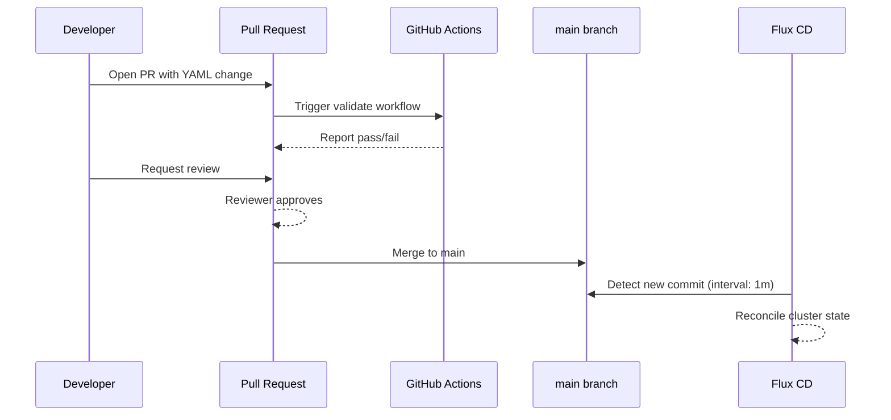

# How to Implement GitOps Pull Request Review Workflow with Flux

Author: [nawazdhandala](https://github.com/nawazdhandala)

Tags: Flux CD, GitOps, Kubernetes, Pull Requests, CI/CD

Description: Set up a PR-based review workflow for GitOps changes with Flux CD so every infrastructure change goes through code review before being applied to your cluster.

---

## Introduction

A pull request review workflow is the cornerstone of safe GitOps practice. Rather than committing directly to the branch that Flux watches, every change flows through a PR that must be reviewed, tested, and approved before it can land in the cluster. This gives your team a consistent gate for catching misconfigurations, reviewing security implications, and maintaining an auditable change history.

Flux CD reconciles whatever is committed to the branch it watches. That makes Git the single source of truth, but it also means a bad commit lands in production fast. A structured PR workflow keeps that power under control by ensuring automated checks and human eyes see every change before Flux ever acts on it.

In this guide you will configure a GitHub repository with branch protection rules, connect Flux to a protected main branch, and wire up a CI pipeline that validates Flux manifests on every PR so reviewers have confidence the YAML is correct before they approve.

## Prerequisites

- A Kubernetes cluster with Flux CD bootstrapped
- A GitHub repository that Flux is watching
- `flux` CLI and `kubectl` installed
- GitHub repository admin access to configure branch protection

## Step 1: Bootstrap Flux to Watch the Main Branch

Flux should reconcile only from a protected branch. When you bootstrap, point the `GitRepository` source at `main` (never at a feature branch).

```yaml
# clusters/production/flux-system/gotk-sync.yaml
apiVersion: source.toolkit.fluxcd.io/v1
kind: GitRepository
metadata:
  name: flux-system
  namespace: flux-system
spec:
  interval: 1m
  ref:
    branch: main          # Flux watches the protected branch
  url: ssh://git@github.com/your-org/fleet-infra
  secretRef:
    name: flux-system     # SSH deploy key secret
```

Apply any change to this source only through a merged PR — never by pushing directly to `main`.

## Step 2: Enable Branch Protection on GitHub

In your GitHub repository go to **Settings → Branches → Add rule** and configure the following for the `main` branch:

- **Require a pull request before merging** — enable this and set at least 1 required approving review.
- **Dismiss stale pull request approvals when new commits are pushed** — prevents re-using an approval after the diff changes.
- **Require status checks to pass before merging** — add the CI job name from Step 3.
- **Require branches to be up to date before merging** — ensures the PR is tested against the latest main.
- **Do not allow bypassing the above settings** — applies the rules even to repository admins.

With these rules in place no commit can land on `main` without passing CI and receiving a human approval.

## Step 3: Add a CI Validation Pipeline

Create a GitHub Actions workflow that runs on every PR to validate Flux manifests. This gives reviewers confidence before approving.

```yaml
# .github/workflows/validate.yaml
name: Validate Flux Manifests

on:
  pull_request:
    branches: [main]

jobs:
  validate:
    runs-on: ubuntu-latest
    steps:
      - name: Checkout
        uses: actions/checkout@v4

      # Install the Flux CLI for manifest validation
      - name: Install Flux CLI
        run: |
          curl -s https://fluxcd.io/install.sh | sudo bash

      # Validate all Flux custom resources in the repository
      - name: Validate Flux resources
        run: |
          flux check --pre || true
          find . -name "*.yaml" | xargs -I{} flux validate {} 2>/dev/null || true

      # Use kubeconform for broader Kubernetes schema validation
      - name: Install kubeconform
        run: |
          curl -sL https://github.com/yannh/kubeconform/releases/latest/download/kubeconform-linux-amd64.tar.gz \
            | tar xz && sudo mv kubeconform /usr/local/bin/

      - name: Run kubeconform
        run: |
          kubeconform \
            -strict \
            -ignore-missing-schemas \
            -schema-location default \
            -schema-location 'https://raw.githubusercontent.com/fluxcd/flux2/main/schemas/{{.ResourceKind}}_{{.ResourceAPIVersion}}.json' \
            -summary \
            $(find . -name "*.yaml" -not -path "./.git/*")
```

The `validate` job name is what you reference in the branch protection status check requirement.

## Step 4: Use a CODEOWNERS File for Automatic Review Requests

A `CODEOWNERS` file automatically requests reviews from the right team when paths they own are changed.

```
# .github/CODEOWNERS

# Platform team must review any changes to cluster infrastructure
/clusters/           @your-org/platform-team

# App teams review their own namespace manifests
/apps/staging/       @your-org/app-team
/apps/production/    @your-org/platform-team @your-org/app-team
```

GitHub automatically adds the listed teams or users as required reviewers when a PR touches those paths.

## Step 5: Submit and Merge a Change

A typical PR-based change follows this sequence:



Once the PR is merged, Flux detects the new commit on `main` within the configured interval and reconciles the cluster to match.

## Step 6: Monitor Reconciliation After Merge

After merging, confirm Flux applied the change successfully:

```bash
# Watch Flux Kustomization reconciliation
flux get kustomizations --watch

# Check events for any errors
kubectl get events -n flux-system --sort-by='.lastTimestamp'

# View detailed reconciliation status
flux describe kustomization flux-system
```

If the reconciliation fails, fix the issue in a new PR rather than pushing directly to `main`.

## Best Practices

- Never grant anyone (including admins) permission to bypass branch protection on the Flux-watched branch.
- Keep PRs small and focused — one logical change per PR makes review and rollback easier.
- Add a PR template that asks authors to confirm they have tested the change in a lower environment.
- Use `flux diff kustomization` in CI to surface a human-readable diff of what will change in the cluster.
- Store Flux image automation commits in a separate branch if you want automated image updates to also go through PR review.
- Tag or label PRs by environment so reviewers can assess blast radius quickly.

## Conclusion

A PR review workflow transforms Flux from a fast reconciler into a governed deployment pipeline. By combining branch protection rules, automated YAML validation, and CODEOWNERS-based review assignment, every change to your cluster passes through a consistent, auditable gate. The result is a GitOps practice that is both fast and safe — changes flow quickly once approved, and every approval is recorded permanently in Git history.
