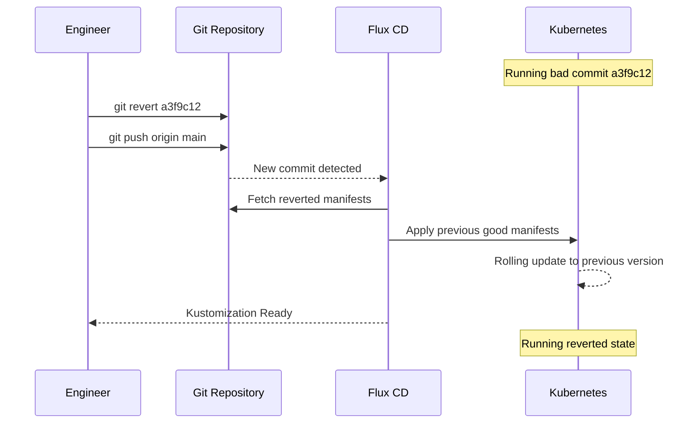

# How to Implement GitOps Rollback Workflow with git revert and Flux

Author: [nawazdhandala](https://github.com/nawazdhandala)

Tags: Flux CD, GitOps, Kubernetes, Rollback, Git Revert, Incident Response

Description: Roll back Kubernetes deployments by reverting Git commits and letting Flux CD automatically reconcile the cluster back to the previous known-good state.

---

## Introduction

In GitOps, the Git repository is the source of truth for cluster state. That property makes rollbacks conceptually simple: if you want to go back to a previous state, revert the Git commit that introduced the change and Flux will reconcile the cluster back to what it was. No manual `kubectl` commands, no imperative scripts — just a standard `git revert` that produces an auditable rollback commit.

This approach is powerful because it treats rollbacks as first-class changes. A `git revert` creates a new commit that reverses the previous change, so the full history — the original change and the rollback — is preserved in Git. Anyone can see what was changed, when it was changed, when it was rolled back, and who did each operation.

This guide covers how to execute a rollback using `git revert`, how to verify Flux applies it correctly, and how to structure your repository to make rollbacks as fast as possible.

## Prerequisites

- Flux CD reconciling a `GitRepository` pointed at your main branch
- `git` CLI installed locally
- `flux` CLI and `kubectl` for verification
- A recent change that needs to be rolled back

## Step 1: Identify the Commit to Revert

Use `git log` to find the commit that introduced the problem:

```bash
# See recent commits with one-line summaries
git log --oneline -20

# Example output:
# a3f9c12 feat: update my-app to v2.5.0
# 8b4d721 fix: adjust resource limits for worker
# c5e1034 feat: deploy new redis configuration
# 2a9b876 chore: update flux to v2.4.0

# For a more detailed view of what changed
git show a3f9c12 --stat

# To see exactly what Kubernetes manifest changed
git diff 8b4d721 a3f9c12 -- apps/production/my-app/
```

If you use conventional commits and semantic PR titles, identifying the right commit is straightforward. This is why commit message hygiene matters in GitOps.

## Step 2: Execute the Revert

```bash
# Revert a single commit
# -m 1 is needed if the commit was a merge commit (PR merge)
git revert --no-edit a3f9c12

# If the bad change spanned multiple commits, revert a range
# This reverts commits from (exclusive) 8b4d721 to (inclusive) a3f9c12
git revert --no-edit 8b4d721..a3f9c12

# If you need to adjust the revert commit message
git revert -e a3f9c12
# In the editor, add context:
# Revert "feat: update my-app to v2.5.0"
#
# Rolls back v2.5.0 due to memory leak in production.
# Incident: INC-2026-042
# Original commit: a3f9c12
```

The revert creates a new commit that undoes the specified changes. Your repository's working tree now reflects the pre-bad-change state.

## Step 3: Push the Revert Commit

For a critical rollback, you have two options depending on your branch protection configuration:

**Option A: Direct push by an incident commander (if bypass is configured)**

```bash
git push origin main
```

**Option B: Fast PR (if direct push is not permitted)**

```bash
git checkout -b rollback/INC-2026-042
git push origin rollback/INC-2026-042

# Create PR with expedited review flag
gh pr create \
  --title "rollback: revert my-app v2.5.0 (INC-2026-042)" \
  --body "Emergency rollback for incident INC-2026-042.

Reverts commit a3f9c12 (my-app v2.5.0) due to memory leak causing OOMKills.

This is a rollback-only change — no new configuration is introduced.
Approved by incident commander per emergency change process." \
  --label "rollback,incident"

# Get expedited approval and merge
gh pr merge --squash
```

## Step 4: Watch Flux Reconcile the Rollback

After the revert commit lands on `main`, Flux detects it within its configured interval (typically 1 minute) and begins reconciling:

```bash
# Watch all Kustomizations for changes
flux get kustomizations --watch

# Force immediate reconciliation if you cannot wait for the interval
flux reconcile source git flux-system
flux reconcile kustomization apps-production

# Watch the specific deployment roll back
kubectl rollout status deployment/my-app -n production --watch

# Confirm the expected image version is now running
kubectl get deployment my-app -n production \
  -o jsonpath='{.spec.template.spec.containers[0].image}'
```

## Step 5: Verify Cluster State Matches Git

After reconciliation, verify that the cluster state matches the reverted Git state:

```bash
# Use flux diff to confirm there are no remaining differences
flux diff kustomization apps-production

# Check the revision that Flux applied
flux get kustomization apps-production

# Confirm Flux shows the revert commit SHA
# Look for "Applied revision: main@sha1:..."
```

A Flux diagram showing the rollback flow:



## Step 6: Post-Rollback Cleanup

After the incident is resolved:

```bash
# Tag the known-good state for future reference
git tag stable/my-app/pre-v2.5.0 8b4d721
git push origin stable/my-app/pre-v2.5.0

# File a post-incident review noting the rollback commit
echo "Rollback executed at $(date -u) via commit $(git rev-parse HEAD)" \
  | tee -a incidents/INC-2026-042.md

# Remove the rollback branch if one was created
git push origin --delete rollback/INC-2026-042
```

## Best Practices

- Write atomic commits — one logical change per commit — so that reverting a single commit has a predictable and contained effect.
- Always use `git revert` rather than `git reset` for rollbacks on shared branches. Revert preserves history; reset rewrites it, which will conflict with other team members' local copies.
- Use the PR title and body to record the incident reference so the rollback is traceable in both Git history and your incident management system.
- Test rollbacks in staging periodically so the procedure is familiar when it is needed in production.
- After a rollback, always open a follow-up issue to investigate the root cause before the reverted change is reintroduced.

## Conclusion

Rolling back with `git revert` and Flux CD is one of the purest expressions of GitOps: the desired state is expressed in Git, and Flux makes the cluster match it. The process is fast, auditable, and reversible. Every rollback creates a permanent record in Git history that shows exactly what was rolled back, when, and by whom — which is exactly what incident reviews and compliance audits require.
