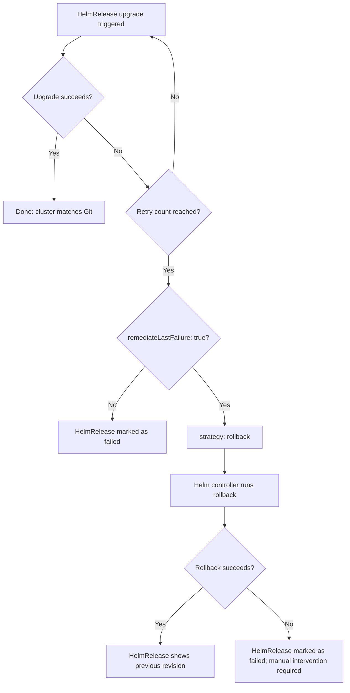

# How to Implement GitOps Rollback Workflow with HelmRelease Rollback in Flux

Author: [nawazdhandala](https://github.com/nawazdhandala)

Tags: Flux CD, GitOps, Kubernetes, HelmRelease, Rollback, Helm

Description: Use Flux CD HelmRelease rollback configuration to enable automatic rollbacks on upgrade failure and manual rollbacks for Helm-managed applications.

---

## Introduction

When your Kubernetes applications are managed by Helm charts, rollbacks can go through either the GitOps path (git revert) or Helm's own rollback mechanism. Flux CD's `HelmRelease` resource provides built-in rollback configuration that lets you define exactly what should happen when a Helm upgrade fails - including automatic rollback, retry limits, and cleanup behavior.

Understanding both paths - Git-based rollback and HelmRelease rollback - helps you choose the right tool for each scenario. Automatic HelmRelease rollback is ideal for catching upgrade failures immediately, while Git-based rollback is better for reverting changes that passed the upgrade but caused problems over time.

This guide covers configuring automatic HelmRelease rollback, triggering manual rollback when needed, and integrating rollback visibility into your monitoring stack.

## Prerequisites

- Flux CD with the Helm controller installed
- An application deployed via a `HelmRelease` resource
- `flux` CLI and `helm` CLI installed
- A Helm chart repository or OCI registry for your chart

## Step 1: Configure HelmRelease with Rollback Settings

The `upgrade.remediation` and `install.remediation` sections of a HelmRelease define what happens on failure:

```yaml
# apps/production/my-app/helmrelease.yaml
apiVersion: helm.toolkit.fluxcd.io/v2
kind: HelmRelease
metadata:
  name: my-app
  namespace: production
spec:
  interval: 10m
  chart:
    spec:
      chart: my-app
      version: ">=1.0.0"
      sourceRef:
        kind: HelmRepository
        name: my-charts
        namespace: flux-system
  values:
    replicaCount: 3
    image:
      repository: my-registry/my-app
      tag: "2.5.0"

  install:
    remediation:
      retries: 3            # Retry installation up to 3 times before giving up

  upgrade:
    remediation:
      retries: 3            # Retry upgrade up to 3 times
      remediateLastFailure: true   # Roll back after the last retry fails
      strategy: rollback    # Use Helm rollback (alternative: uninstall)
    cleanupOnFail: true     # Remove any resources created during the failed upgrade

  rollback:
    cleanupOnFail: true     # Clean up failed rollback artifacts
    disableHooks: false     # Run Helm hooks during rollback
    force: false            # Set true only if needed for stuck resources
    recreate: false         # Set true to recreate pods during rollback
    timeout: 5m             # Maximum time to wait for rollback to complete
```

With this configuration, Flux will automatically roll back to the previous Helm revision if an upgrade fails after 3 retries.

## Step 2: Understand Flux HelmRelease Remediation Strategy



## Step 3: Trigger a Manual Rollback

When you need to roll back a HelmRelease manually (for example, the upgrade succeeded from Helm's perspective but the application is behaving incorrectly):

```bash
# Check the current state of the HelmRelease
flux get helmrelease my-app -n production

# See the Helm history for this release
helm history my-app -n production

# Example output:
# REVISION  STATUS     CHART        DESCRIPTION
# 1         superseded my-app-1.0.0 Install complete
# 2         superseded my-app-2.4.0 Upgrade complete
# 3         deployed   my-app-2.5.0 Upgrade complete  <-- current, problematic

# Annotate the HelmRelease to trigger a rollback to a specific revision
# Flux watches for this annotation and executes the rollback
kubectl annotate helmrelease my-app \
  -n production \
  "helm.toolkit.fluxcd.io/rollback=2"    # Roll back to revision 2
```

However, the cleanest GitOps approach is to update the `values.image.tag` in Git rather than using the annotation. Use the annotation only during an active incident when Git workflow time is prohibitive.

## Step 4: Pin to a Known-Good Version via Git

After any rollback, update the HelmRelease in Git to pin the known-good version:

```yaml
# apps/production/my-app/helmrelease.yaml (after rollback)
spec:
  chart:
    spec:
      chart: my-app
      version: "2.4.0"    # Pinned to last known-good version
  values:
    image:
      tag: "2.4.0"        # Explicit tag, not a range
```

Commit this change through the normal PR workflow with a clear description:

```bash
git checkout -b fix/pin-my-app-to-2.4.0
# Edit the helmrelease.yaml
git add apps/production/my-app/helmrelease.yaml
git commit -m "fix: pin my-app to v2.4.0 after v2.5.0 rollback

Reverts to last known-good version following production incident INC-2026-042.
v2.5.0 caused memory leak (OOMKills) starting at 14:30 UTC.
Rollback executed at 14:45 UTC."

git push origin fix/pin-my-app-to-2.4.0
gh pr create --title "fix: pin my-app to v2.4.0 post rollback"
```

## Step 5: Monitor Rollback Status

```bash
# Watch HelmRelease status during rollback
flux get helmrelease my-app -n production --watch

# Check Flux events for detailed rollback information
flux events --for HelmRelease/my-app --namespace production

# Verify Helm release history after rollback
helm history my-app -n production

# Confirm the correct pods are running
kubectl rollout status deployment/my-app -n production
kubectl get pods -n production -l app=my-app \
  -o jsonpath='{.items[*].metadata.labels.version}'
```

## Step 6: Set Up Alerting for HelmRelease Failures

Configure Flux alerting to notify your team when a HelmRelease fails or rolls back:

```yaml
# clusters/production/alerts/helmrelease-alert.yaml
apiVersion: notification.toolkit.fluxcd.io/v1
kind: Alert
metadata:
  name: helmrelease-failures
  namespace: flux-system
spec:
  summary: "HelmRelease failure in production"
  providerRef:
    name: slack-production     # A configured notification Provider
  eventSeverity: error
  eventSources:
    - kind: HelmRelease
      namespace: production    # Alert on all HelmReleases in production
  inclusionList:
    - ".*failed.*"
    - ".*rollback.*"
```

## Best Practices

- Always pin chart versions with an exact version string in production, not a range like `>=1.0.0`. Ranges allow unexpected upgrades that are harder to roll back because you may not know which version was running before.
- Set `retries: 3` on both install and upgrade remediation. Zero retries means transient errors immediately trigger rollback; too many retries delays the rollback.
- After an automatic rollback, Flux will continue trying to upgrade on the next interval unless you pin the version in Git. Pin immediately to prevent Flux from re-triggering the bad upgrade.
- Test your rollback configuration in staging with a deliberately broken chart version to confirm that automatic remediation works as configured.
- Record every rollback in your incident tracking system with the Helm revision numbers and timestamps.

## Conclusion

HelmRelease rollback in Flux CD gives you two complementary rollback mechanisms: automatic remediation for upgrade failures caught immediately, and Git-based version pinning for problems discovered after a successful upgrade. Understanding when to use each mechanism - and how to return to a stable GitOps state after either - is essential for maintaining reliable Helm-managed applications in production.
