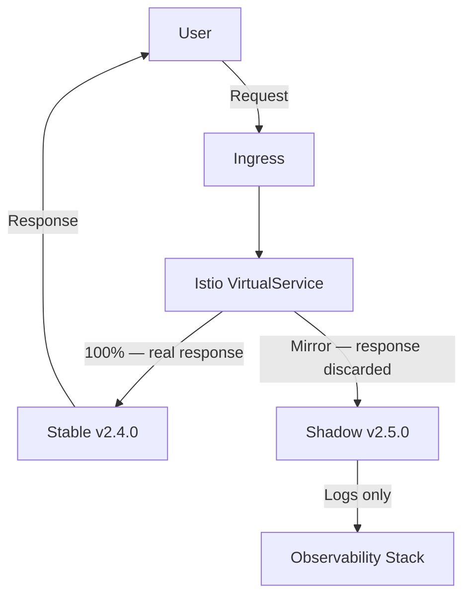

# How to Implement GitOps Shadow Traffic Pattern with Flux

Author: [nawazdhandala](https://github.com/nawazdhandala)

Tags: Flux CD, GitOps, Kubernetes, Shadow Traffic, Traffic Mirroring, Istio

Description: Mirror production traffic to a new service version using Flux CD and Istio traffic mirroring to validate the new version under real load without affecting users.

---

## Introduction

Shadow traffic (also called traffic mirroring or traffic shadowing) sends a copy of every production request to a new version of your service simultaneously. The new version receives identical requests, processes them, and produces responses — but those responses are discarded. Users see only the responses from the stable version. This lets you test the new version against the full breadth and volume of production traffic before routing any real users to it.

Unlike dark launch (where the application code decides whether to call a new path), shadow traffic is implemented at the infrastructure layer — the ingress controller or service mesh mirrors requests transparently. In a GitOps workflow with Flux CD, the mirroring configuration is declared in Git as Istio `VirtualService` resources and managed by Flux like any other manifest.

This guide uses Istio for traffic mirroring, deployed and managed via Flux CD.

## Prerequisites

- Flux CD bootstrapped on a Kubernetes cluster
- Istio installed on the cluster (managed via Flux HelmRelease)
- An application deployed with an Istio sidecar (`istio-injection: enabled` namespace)
- `flux` CLI and `kubectl` with `istioctl` installed

## Step 1: Deploy the Shadow Version

Deploy the new version as a separate Deployment alongside the stable version. The shadow version receives mirrored traffic only:

```yaml
# apps/my-app/base/deployment-stable.yaml
apiVersion: apps/v1
kind: Deployment
metadata:
  name: my-app-stable
  namespace: production
  labels:
    app: my-app
    version: stable
spec:
  replicas: 3
  selector:
    matchLabels:
      app: my-app
      version: stable
  template:
    metadata:
      labels:
        app: my-app
        version: stable
    spec:
      containers:
        - name: my-app
          image: my-registry/my-app:2.4.0
          ports:
            - containerPort: 8080
```

```yaml
# apps/my-app/base/deployment-shadow.yaml
apiVersion: apps/v1
kind: Deployment
metadata:
  name: my-app-shadow
  namespace: production
  labels:
    app: my-app
    version: shadow
spec:
  replicas: 2              # Shadow can run fewer replicas
  selector:
    matchLabels:
      app: my-app
      version: shadow
  template:
    metadata:
      labels:
        app: my-app
        version: shadow
    spec:
      containers:
        - name: my-app
          image: my-registry/my-app:2.5.0    # New version receives mirrored traffic
          ports:
            - containerPort: 8080
```

## Step 2: Define Kubernetes Services for Each Version

```yaml
# apps/my-app/base/services.yaml
apiVersion: v1
kind: Service
metadata:
  name: my-app
  namespace: production
spec:
  selector:
    app: my-app
    version: stable         # Primary service routes to stable
  ports:
    - port: 80
      targetPort: 8080
---
apiVersion: v1
kind: Service
metadata:
  name: my-app-shadow
  namespace: production
spec:
  selector:
    app: my-app
    version: shadow         # Shadow service routes to shadow deployment
  ports:
    - port: 80
      targetPort: 8080
```

## Step 3: Configure Istio Traffic Mirroring

The Istio `VirtualService` is the key resource. It routes all traffic to stable but mirrors a copy to shadow:

```yaml
# apps/my-app/base/virtualservice.yaml
apiVersion: networking.istio.io/v1beta1
kind: VirtualService
metadata:
  name: my-app
  namespace: production
spec:
  hosts:
    - my-app
  http:
    - route:
        # 100% of traffic goes to stable (users see stable responses)
        - destination:
            host: my-app
            port:
              number: 80
          weight: 100
      # Mirror a copy of all requests to the shadow service
      mirror:
        host: my-app-shadow
        port:
          number: 80
      # Percentage of traffic to mirror (100 = mirror every request)
      mirrorPercentage:
        value: 100.0
```

## Step 4: Add an Istio DestinationRule

```yaml
# apps/my-app/base/destinationrule.yaml
apiVersion: networking.istio.io/v1beta1
kind: DestinationRule
metadata:
  name: my-app
  namespace: production
spec:
  host: my-app
  trafficPolicy:
    connectionPool:
      tcp:
        maxConnections: 100
      http:
        h2UpgradePolicy: UPGRADE
    outlierDetection:
      consecutive5xxErrors: 5
      interval: 10s
      baseEjectionTime: 30s
```

## Step 5: Configure Flux to Manage These Resources

```yaml
# clusters/production/apps/my-app.yaml
apiVersion: kustomize.toolkit.fluxcd.io/v1
kind: Kustomization
metadata:
  name: my-app
  namespace: flux-system
spec:
  interval: 5m
  path: ./apps/my-app/base
  prune: true
  sourceRef:
    kind: GitRepository
    name: flux-system
  healthChecks:
    - apiVersion: apps/v1
      kind: Deployment
      name: my-app-stable
      namespace: production
    - apiVersion: apps/v1
      kind: Deployment
      name: my-app-shadow
      namespace: production
```

## Step 6: Monitor Shadow Traffic Results

Compare error rates, latency, and behavior between stable and shadow:

```bash
# View shadow deployment logs to see how it handles mirrored requests
kubectl logs -n production -l version=shadow \
  --tail=100 -f

# Check error rates via Prometheus (if Istio metrics are enabled)
# Query: rate(istio_requests_total{destination_service="my-app-shadow",
#   response_code=~"5.."}[5m])

# Use Kiali (Istio observability) to compare traffic graphs
istioctl dashboard kiali

# Compare pod resource usage between stable and shadow
kubectl top pods -n production -l app=my-app
```

The shadow traffic flow:



## Step 7: Promote or Abort Shadow

After sufficient validation, promote shadow to stable via Git:

```bash
# Promotion: update VirtualService to route to v2.5.0
# and remove the mirror configuration
sed -i 's/my-app:2.4.0/my-app:2.5.0/' \
  apps/my-app/base/deployment-stable.yaml

# Remove mirror section from VirtualService
# Edit apps/my-app/base/virtualservice.yaml to remove the mirror block

git commit -am "deploy: promote my-app v2.5.0 from shadow to stable"
git push origin main

# If shadow revealed problems, simply remove the shadow deployment via Git:
# Delete apps/my-app/base/deployment-shadow.yaml and the shadow Service
```

## Best Practices

- Shadow traffic doubles the load on your infrastructure. Ensure your database and downstream services can handle the extra requests before enabling 100% mirroring.
- Start with a lower mirror percentage (10-25%) if resource headroom is limited, then increase as you gain confidence.
- Shadow requests may have side effects (database writes, email sends, payment charges). Ensure your new version's test/shadow behavior does not cause real-world side effects.
- Set up log correlation between stable and shadow using a shared request ID header so you can compare specific request handling.
- Clean up shadow deployments promptly — running two full deployments indefinitely is expensive.

## Conclusion

Shadow traffic mirroring managed by Flux CD and Istio lets you validate a new service version against 100% of production traffic with zero risk to users. The mirroring configuration is a Git-managed `VirtualService` — enabling, adjusting, or disabling mirroring is a merge operation subject to normal review and approval. When the shadow version passes validation, promotion is another Git commit, and Flux reconciles the cluster to the new stable state.
