# How to Implement GitOps Staging to Production Promotion with Flux

Author: [nawazdhandala](https://github.com/nawazdhandala)

Tags: Flux CD, GitOps, Kubernetes, Promotion, Staging, Production, Kustomize

Description: Promote application versions from staging to production using a GitOps workflow with Flux CD and Kustomize overlays, ensuring only validated versions reach production.

---

## Introduction

Promotion is the act of moving a validated application version from one environment to the next. In a GitOps workflow, promotion means updating the Git repository to declare that production should run a version that has already been validated in staging. Flux then reconciles production to match.

The key insight is that promotion should be a Git operation, not a script that directly modifies a running cluster. When you promote by updating Git, every promotion is recorded, reviewable, and reversible. You also get a clear paper trail showing which version was in staging, when it was validated, and when it was promoted to production — exactly what change management audits require.

This guide uses Kustomize overlays to separate staging and production configuration, and shows how to implement promotion via a CI workflow that opens a PR updating the production image tag.

## Prerequisites

- Flux CD managing both staging and production environments
- A repository structured with Kustomize base and overlays
- `flux` CLI, `kubectl`, and `kustomize` installed
- A container image registry and CI system (GitHub Actions)

## Step 1: Structure Your Repository with Kustomize Overlays

```
fleet-infra/
├── apps/
│   └── my-app/
│       ├── base/                    # Shared manifests
│       │   ├── kustomization.yaml
│       │   ├── deployment.yaml
│       │   └── service.yaml
│       ├── staging/                 # Staging-specific overrides
│       │   ├── kustomization.yaml
│       │   └── image-patch.yaml    # Staging image tag
│       └── production/             # Production-specific overrides
│           ├── kustomization.yaml
│           └── image-patch.yaml    # Production image tag
```

```yaml
# apps/my-app/staging/kustomization.yaml
apiVersion: kustomize.config.k8s.io/v1beta1
kind: Kustomization
resources:
  - ../base
namespace: staging
images:
  - name: my-registry/my-app
    newTag: "2.5.0"              # Staging runs the latest candidate
```

```yaml
# apps/my-app/production/kustomization.yaml
apiVersion: kustomize.config.k8s.io/v1beta1
kind: Kustomization
resources:
  - ../base
namespace: production
images:
  - name: my-registry/my-app
    newTag: "2.4.0"              # Production runs the last promoted version
replicas:
  - name: my-app
    count: 5                     # Production has more replicas
```

## Step 2: Create Flux Kustomizations for Each Environment

```yaml
# clusters/staging/apps/my-app.yaml
apiVersion: kustomize.toolkit.fluxcd.io/v1
kind: Kustomization
metadata:
  name: my-app-staging
  namespace: flux-system
spec:
  interval: 5m
  path: ./apps/my-app/staging
  prune: true
  sourceRef:
    kind: GitRepository
    name: flux-system
  healthChecks:
    - apiVersion: apps/v1
      kind: Deployment
      name: my-app
      namespace: staging
```

```yaml
# clusters/production/apps/my-app.yaml
apiVersion: kustomize.toolkit.fluxcd.io/v1
kind: Kustomization
metadata:
  name: my-app-production
  namespace: flux-system
spec:
  interval: 10m
  path: ./apps/my-app/production
  prune: true
  sourceRef:
    kind: GitRepository
    name: flux-system
  healthChecks:
    - apiVersion: apps/v1
      kind: Deployment
      name: my-app
      namespace: production
```

## Step 3: Automate Promotion with a CI Workflow

Create a GitHub Actions workflow that automatically opens a production promotion PR after staging validation passes:

```yaml
# .github/workflows/promote.yaml
name: Promote to Production

on:
  # Trigger when staging kustomization file is updated
  push:
    branches: [main]
    paths:
      - 'apps/my-app/staging/kustomization.yaml'

jobs:
  validate-staging:
    runs-on: ubuntu-latest
    outputs:
      image-tag: ${{ steps.get-tag.outputs.tag }}
    steps:
      - uses: actions/checkout@v4

      - name: Get staging image tag
        id: get-tag
        run: |
          TAG=$(grep 'newTag' apps/my-app/staging/kustomization.yaml \
            | awk '{print $2}' | tr -d '"')
          echo "tag=$TAG" >> $GITHUB_OUTPUT
          echo "Staging tag: $TAG"

      - name: Wait for staging health check
        run: |
          # In a real workflow, poll your observability platform or
          # wait for a staging test suite to pass
          echo "Staging version ${{ steps.get-tag.outputs.tag }} validated"

  open-promotion-pr:
    needs: validate-staging
    runs-on: ubuntu-latest
    steps:
      - uses: actions/checkout@v4
        with:
          token: ${{ secrets.PROMOTION_BOT_TOKEN }}

      - name: Update production image tag
        env:
          NEW_TAG: ${{ needs.validate-staging.outputs.image-tag }}
        run: |
          sed -i "s/newTag: \".*\"/newTag: \"$NEW_TAG\"/" \
            apps/my-app/production/kustomization.yaml

      - name: Create promotion PR
        env:
          NEW_TAG: ${{ needs.validate-staging.outputs.image-tag }}
          GH_TOKEN: ${{ secrets.PROMOTION_BOT_TOKEN }}
        run: |
          git config user.name "promotion-bot"
          git config user.email "bot@example.com"
          git checkout -b "promote/my-app-$NEW_TAG"
          git add apps/my-app/production/kustomization.yaml
          git commit -m "promote: my-app $NEW_TAG to production

          Promoted from staging after successful validation.
          Staging deployed at: $(date -u)
          Image: my-registry/my-app:$NEW_TAG"
          git push origin "promote/my-app-$NEW_TAG"

          gh pr create \
            --title "promote: my-app $NEW_TAG to production" \
            --body "Automated promotion PR from staging to production.

          **Version**: $NEW_TAG
          **Validated in staging**: Yes
          **Requires approval from**: @your-org/platform-team" \
            --label "promotion"
```

## Step 4: Review and Merge the Promotion PR

The promotion workflow is:

```mermaid
flowchart LR
    A[Developer merges feature] --> B[CI builds image v2.5.0]
    B --> C[Update staging tag to v2.5.0]
    C --> D[Flux deploys to staging]
    D --> E[Automated and manual validation]
    E --> F[Promotion bot opens PR for production]
    F --> G[Platform team reviews and approves]
    G --> H[Merge promotion PR]
    H --> I[Flux deploys v2.5.0 to production]
```



After the promotion PR is reviewed and merged, Flux reconciles production with the new image tag.

## Step 5: Verify the Promotion

```bash
# Check that production Kustomization reconciled successfully
flux get kustomization my-app-production -n flux-system

# Confirm the correct image version is running in production
kubectl get deployment my-app -n production \
  -o jsonpath='{.spec.template.spec.containers[0].image}'

# View events to confirm the reconciliation
flux events --for Kustomization/my-app-production
```

## Best Practices

- Never update the production image tag directly — always go through a PR so the promotion has a record and a reviewer.
- Add a mandatory waiting period or explicit staging sign-off step before the promotion bot opens the production PR. Automated promotion that is too eager can promote a version that passed CI but failed real traffic.
- Use semantic version tags (not `latest`) so every promotion references an immutable, traceable artifact.
- Include the staging deployment timestamp in the promotion PR description so reviewers can see how long the version has been running in staging.
- Set up Flux health checks on the production Kustomization so that Flux marks the promotion as failed if the new version does not become healthy within the timeout.

## Conclusion

Staging-to-production promotion with Flux CD and Kustomize overlays gives you a repeatable, auditable process for advancing validated versions through your environments. By automating the promotion PR with CI and requiring human approval before merging, you get the speed of automation with the safety of review — and every promotion is permanently recorded in Git history.
