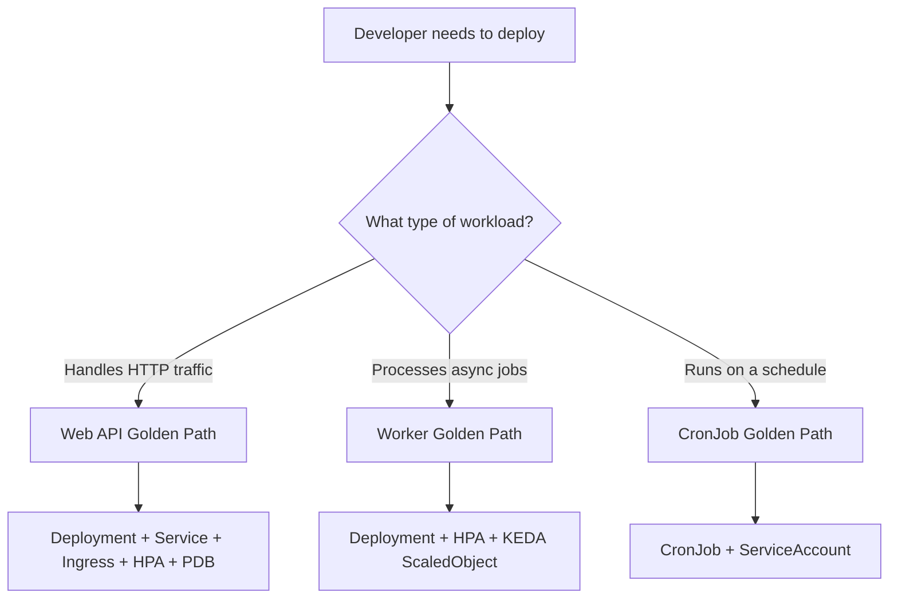

# How to Implement Golden Path Templates with Flux CD

Author: [nawazdhandala](https://github.com/nawazdhandala)

Tags: Flux CD, Kubernetes, GitOps, Platform Engineering, Golden Path, Developer Experience

Description: Create golden path templates for application deployment using Flux CD so developers follow the fastest, most reliable path to production with organizational best practices baked in.

---

## Introduction

The "golden path" concept in platform engineering describes the paved road that makes the right thing the easy thing. When you build a golden path, you codify your organization's best practices — security defaults, observability, scaling, reliability — into a template that developers can use without understanding every underlying decision. The golden path should be the path of least resistance to production.

Flux CD is the ideal runtime for golden path templates. The templates define what a properly configured workload looks like in your organization, and Flux ensures every workload continuously matches that definition. When the platform team improves the golden path (adding a new security control, updating default resource limits), all workloads that follow the path inherit the improvement automatically.

In this guide you will build complete golden path templates for three common workload archetypes: a web API, a background worker, and a scheduled job. Each template bundles everything a production workload needs without requiring developers to understand Kubernetes internals.

## Prerequisites

- Flux CD v2 bootstrapped in your cluster with multi-tenancy configured
- A platform Git repository with Kustomize support
- Developers have write access to their own application repositories
- An internal Helm chart or Kustomize base for each workload archetype

## Step 1: Define the Golden Path Archetypes

Map your organization's workloads to three archetypes:



## Step 2: Build the Web API Golden Path

The web API template includes everything needed for a production HTTP service.

```yaml
# golden-paths/web-api/base/kustomization.yaml
apiVersion: kustomize.config.k8s.io/v1beta1
kind: Kustomization
resources:
  - deployment.yaml
  - service.yaml
  - ingress.yaml
  - hpa.yaml
  - pdb.yaml
  - service-monitor.yaml   # Prometheus scraping
  - network-policy.yaml
```

```yaml
# golden-paths/web-api/base/pdb.yaml
# Ensures at least one pod is always available during node drains or deployments
apiVersion: policy/v1
kind: PodDisruptionBudget
metadata:
  name: web-api
spec:
  selector:
    matchLabels:
      golden-path: web-api
  minAvailable: 1
```

```yaml
# golden-paths/web-api/base/service-monitor.yaml
# Auto-configures Prometheus scraping for the service
apiVersion: monitoring.coreos.com/v1
kind: ServiceMonitor
metadata:
  name: web-api
spec:
  selector:
    matchLabels:
      golden-path: web-api
  endpoints:
    - port: http
      path: /metrics
      interval: 30s
```

## Step 3: Add Security Defaults to the Template

Encode security best practices into the deployment template so developers get them for free.

```yaml
# golden-paths/web-api/base/deployment.yaml
apiVersion: apps/v1
kind: Deployment
metadata:
  name: web-api
  labels:
    golden-path: web-api
spec:
  replicas: 2
  revisionHistoryLimit: 5
  selector:
    matchLabels:
      golden-path: web-api
  template:
    metadata:
      labels:
        golden-path: web-api
    spec:
      # Security: non-root, read-only root filesystem
      securityContext:
        runAsNonRoot: true
        runAsUser: 65534
        fsGroup: 65534
        seccompProfile:
          type: RuntimeDefault
      # Topology spread for high availability
      topologySpreadConstraints:
        - maxSkew: 1
          topologyKey: kubernetes.io/hostname
          whenUnsatisfiable: DoNotSchedule
          labelSelector:
            matchLabels:
              golden-path: web-api
      containers:
        - name: app
          image: REPLACE_ME
          securityContext:
            allowPrivilegeEscalation: false
            readOnlyRootFilesystem: true
            capabilities:
              drop: ["ALL"]
          ports:
            - containerPort: 8080
              name: http
          # Graceful shutdown
          lifecycle:
            preStop:
              exec:
                command: ["/bin/sh", "-c", "sleep 5"]
          terminationMessagePolicy: FallbackToLogsOnError
          resources:
            requests:
              cpu: 100m
              memory: 128Mi
            limits:
              cpu: 500m
              memory: 256Mi
          livenessProbe:
            httpGet:
              path: /healthz
              port: http
            initialDelaySeconds: 10
            failureThreshold: 3
          readinessProbe:
            httpGet:
              path: /ready
              port: http
            initialDelaySeconds: 5
            failureThreshold: 3
```

## Step 4: Create Developer-Facing Overlays

Developers should only need to provide their image and domain name.

```yaml
# my-service/deploy/kustomization.yaml
apiVersion: kustomize.config.k8s.io/v1beta1
kind: Kustomization
resources:
  # Reference the golden path from the platform catalog
  - https://github.com/acme/platform-gitops//golden-paths/web-api/base?ref=v2.0.0
patches:
  # Developer sets: image, domain, and optional resource adjustments
  - patch: |-
      - op: replace
        path: /metadata/name
        value: my-service
      - op: replace
        path: /spec/template/spec/containers/0/image
        value: ghcr.io/acme/my-service:v1.5.0
    target:
      kind: Deployment
  - patch: |-
      - op: replace
        path: /spec/rules/0/host
        value: my-service.acme.example.com
    target:
      kind: Ingress
commonLabels:
  app.kubernetes.io/name: my-service
```

## Step 5: Wire into Flux

```yaml
# tenants/overlays/team-alpha/kustomization-my-service.yaml
apiVersion: kustomize.toolkit.fluxcd.io/v1
kind: Kustomization
metadata:
  name: my-service
  namespace: team-alpha
spec:
  interval: 5m
  path: ./deploy
  prune: true
  sourceRef:
    kind: GitRepository
    name: team-alpha-apps
  targetNamespace: team-alpha
  healthChecks:
    - apiVersion: apps/v1
      kind: Deployment
      name: my-service
      namespace: team-alpha
```

## Step 6: Validate Golden Path Compliance

Use Kyverno policies to prevent deployments that bypass the golden path.

```yaml
# infrastructure/policies/golden-path-compliance.yaml
apiVersion: kyverno.io/v1
kind: ClusterPolicy
metadata:
  name: require-golden-path-labels
spec:
  validationFailureAction: Warn   # Start with Warn, move to Enforce after rollout
  rules:
    - name: check-golden-path-label
      match:
        any:
          - resources:
              kinds: ["Deployment"]
              namespaces: ["team-*"]
      validate:
        message: "Deployments should use a golden path template and have the golden-path label."
        pattern:
          metadata:
            labels:
              golden-path: "?*"
```

## Best Practices

- Keep the developer-facing patch surface minimal: image, domain, and environment variables should cover 90% of use cases
- Version golden path templates carefully — changes propagate to every team using the path
- Provide a migration guide when releasing a new major version of a golden path
- Monitor adoption: track what percentage of team workloads use golden path templates
- Include runbook annotations in the templates linking to operational documentation
- Test template changes with `kustomize build` and apply to a staging cluster before releasing

## Conclusion

Golden path templates with Flux CD create a virtuous cycle: the platform team invests in making the right path the easy path, and every team that follows the path automatically gets the latest security, reliability, and observability improvements. Developers move faster because they don't need to solve solved problems, and platform teams gain leverage because one improvement propagates everywhere simultaneously.
