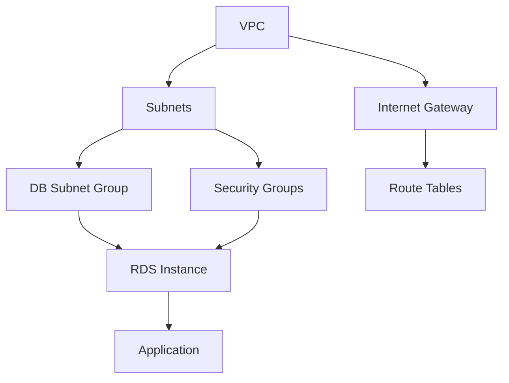

# How to Handle Crossplane Resource Dependencies in Flux

Author: [nawazdhandala](https://github.com/nawazdhandala)

Tags: Flux CD, Crossplane, Dependencies, GitOps, Kubernetes, Kustomization, Infrastructure as Code

Description: Manage dependencies between Crossplane resources using Flux Kustomization ordering and Crossplane reference selectors to prevent race conditions.

---

## Introduction

Infrastructure resources rarely exist in isolation. A database instance depends on a subnet group, which depends on subnets, which depend on a VPC. When provisioning these resources through Crossplane and Flux, applying them all simultaneously causes failures as resources that depend on others are created before their prerequisites exist.

Flux and Crossplane offer complementary mechanisms for managing these dependencies. Flux Kustomization `dependsOn` ensures entire groups of resources are healthy before dependent groups are applied. Crossplane's reference selectors (`nameRef`, `selector`) let individual resources reference others and wait for them to be ready. Understanding when to use each mechanism is key to building reliable infrastructure automation.

This guide demonstrates both approaches using a realistic multi-tier infrastructure example.

## Prerequisites

- Crossplane with AWS providers installed
- Flux CD bootstrapped on the cluster
- Basic understanding of Flux Kustomizations and Crossplane managed resources

## Step 1: Understand the Dependency Graph



## Step 2: Use Flux dependsOn for Coarse-Grained Ordering

Flux Kustomization `dependsOn` creates hard ordering between groups of resources. The dependent Kustomization will not be applied until the referenced Kustomization is healthy.

```yaml
# clusters/my-cluster/infrastructure/01-networking.yaml
apiVersion: kustomize.toolkit.fluxcd.io/v1
kind: Kustomization
metadata:
  name: networking
  namespace: flux-system
spec:
  interval: 10m
  path: ./infrastructure/networking
  prune: false
  sourceRef:
    kind: GitRepository
    name: flux-system
  # Health checks tell Flux when this Kustomization is truly ready
  healthChecks:
    - apiVersion: ec2.aws.upbound.io/v1beta1
      kind: VPC
      name: production-vpc
    - apiVersion: ec2.aws.upbound.io/v1beta1
      kind: Subnet
      name: private-subnet-1a
    - apiVersion: ec2.aws.upbound.io/v1beta1
      kind: Subnet
      name: private-subnet-1b

---
# clusters/my-cluster/infrastructure/02-databases.yaml
apiVersion: kustomize.toolkit.fluxcd.io/v1
kind: Kustomization
metadata:
  name: databases
  namespace: flux-system
spec:
  interval: 10m
  path: ./infrastructure/databases
  prune: false
  sourceRef:
    kind: GitRepository
    name: flux-system
  # Databases will NOT be applied until networking is healthy
  dependsOn:
    - name: networking

---
# clusters/my-cluster/apps/03-applications.yaml
apiVersion: kustomize.toolkit.fluxcd.io/v1
kind: Kustomization
metadata:
  name: applications
  namespace: flux-system
spec:
  interval: 5m
  path: ./apps/production
  prune: true
  sourceRef:
    kind: GitRepository
    name: flux-system
  # Applications deploy only after databases are ready
  dependsOn:
    - name: databases
    - name: networking
```

## Step 3: Use Crossplane nameRef for Fine-Grained Resource References

Within a Kustomization, use Crossplane's `nameRef` to reference a prerequisite resource. Crossplane will poll the referenced resource until it is ready before proceeding.

```yaml
# infrastructure/databases/rds-subnet-group.yaml
apiVersion: rds.aws.upbound.io/v1beta1
kind: SubnetGroup
metadata:
  name: production-db-subnet-group
spec:
  forProvider:
    region: us-east-1
    description: "Subnet group referencing Crossplane-managed subnets"
    # nameRef waits for the subnet to be ready and resolves its ID
    subnetIdRefs:
      - name: private-subnet-1a
      - name: private-subnet-1b
      - name: private-subnet-1c
  providerConfigRef:
    name: default

---
# infrastructure/databases/rds-instance.yaml
apiVersion: rds.aws.upbound.io/v1beta1
kind: Instance
metadata:
  name: production-postgres
spec:
  forProvider:
    region: us-east-1
    engine: postgres
    engineVersion: "15.4"
    instanceClass: db.t3.medium
    allocatedStorage: 100
    # References the SubnetGroup above by name
    dbSubnetGroupNameRef:
      name: production-db-subnet-group
    # References a security group managed by Crossplane
    vpcSecurityGroupIdRefs:
      - name: production-rds-sg
    username: dbadmin
    passwordSecretRef:
      namespace: crossplane-system
      name: rds-master-password
      key: password
    skipFinalSnapshot: false
  providerConfigRef:
    name: default
```

## Step 4: Use Selector-Based References for Dynamic Lookups

When you don't know the exact name of a resource, use label selectors to reference it.

```yaml
# infrastructure/databases/rds-instance-with-selector.yaml
apiVersion: rds.aws.upbound.io/v1beta1
kind: Instance
metadata:
  name: staging-postgres
spec:
  forProvider:
    region: us-east-1
    engine: postgres
    engineVersion: "15.4"
    instanceClass: db.t3.small
    allocatedStorage: 20
    # Select subnets by label instead of name
    subnetIdSelector:
      matchLabels:
        environment: staging
        tier: private
    username: dbadmin
    passwordSecretRef:
      namespace: crossplane-system
      name: rds-staging-password
      key: password
    skipFinalSnapshot: true
  providerConfigRef:
    name: default
```

## Step 5: Configure Health Checks for Crossplane Resources

Flux health checks for Crossplane resources check the `Ready` condition.

```yaml
# clusters/my-cluster/infrastructure/databases.yaml
apiVersion: kustomize.toolkit.fluxcd.io/v1
kind: Kustomization
metadata:
  name: databases
  namespace: flux-system
spec:
  interval: 10m
  path: ./infrastructure/databases
  prune: false
  sourceRef:
    kind: GitRepository
    name: flux-system
  dependsOn:
    - name: networking
  # Flux checks these resources for the Ready=True condition
  healthChecks:
    - apiVersion: rds.aws.upbound.io/v1beta1
      kind: SubnetGroup
      name: production-db-subnet-group
    - apiVersion: rds.aws.upbound.io/v1beta1
      kind: Instance
      name: production-postgres
  # Give long-running resources time to become ready
  timeout: 30m
```

## Best Practices

- Use Flux `dependsOn` for ordering between logical groups (networking, databases, applications) rather than between individual resources.
- Use Crossplane `nameRef` and `selector` for fine-grained dependencies between resources within the same Kustomization path.
- Always set `healthChecks` on Kustomizations that contain Crossplane resources so `dependsOn` waits for resources to be truly ready, not just applied.
- Set `timeout` generously on Kustomizations with long-provisioning resources like RDS (30 minutes) or GKE clusters (45 minutes).
- Never use Flux `dependsOn` with a circular reference—model your dependency graph carefully before implementing.

## Conclusion

Crossplane resource dependencies are now handled correctly using a combination of Flux Kustomization `dependsOn` for coarse-grained ordering and Crossplane `nameRef`/`selector` for fine-grained resource references. This ensures infrastructure is provisioned in the correct order without race conditions, and dependent groups are applied only after prerequisites are healthy and ready.
