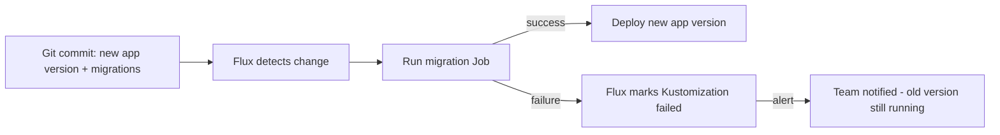

# How to Handle Database Schema Migrations in Flux CD Deployments

Author: [nawazdhandala](https://github.com/nawazdhandala)

Tags: Flux CD, Kubernetes, GitOps, Database Migrations, Flyway, Liquibase, Schema Management

Description: Manage database schema migrations as part of Flux CD GitOps deployments using init containers, Jobs, and migration tools like Flyway and Liquibase.

---

## Introduction

Database schema migrations are one of the most challenging aspects of GitOps for stateful workloads. Unlike application code that can be rolled back by deploying a previous container image, schema changes like adding columns or creating tables may be difficult or impossible to reverse cleanly. Coordinating schema migrations with application deployments requires careful ordering: the migration must complete successfully before the new application version starts.

Flux CD provides several mechanisms for handling this coordination: Kustomization `dependsOn`, Kubernetes Jobs with `healthChecks`, and init containers on application Deployments. This post explores each pattern and gives you production-ready examples using Flyway and Liquibase.

## Prerequisites

- Kubernetes v1.26+ with Flux CD bootstrapped
- A PostgreSQL (or compatible) database accessible from the cluster
- Database credentials stored in Kubernetes Secrets
- `kubectl` and `flux` CLIs installed

## Step 1: Understand the Migration Ordering Problem



The key insight: migrations run as Kubernetes Jobs, and the application Deployment only proceeds after the Job completes successfully. Flux's `healthChecks` and `dependsOn` enforce this ordering.

## Step 2: Flyway Migration Job Pattern

Store migration SQL files in a ConfigMap and run Flyway as a Kubernetes Job:

```yaml
# infrastructure/databases/migrations/migration-scripts.yaml
apiVersion: v1
kind: ConfigMap
metadata:
  name: flyway-migrations
  namespace: myapp
data:
  V1__initial_schema.sql: |
    CREATE TABLE IF NOT EXISTS users (
      id BIGSERIAL PRIMARY KEY,
      email TEXT NOT NULL UNIQUE,
      created_at TIMESTAMPTZ DEFAULT NOW()
    );
    CREATE INDEX idx_users_email ON users(email);

  V2__add_user_profile.sql: |
    ALTER TABLE users ADD COLUMN IF NOT EXISTS full_name TEXT;
    ALTER TABLE users ADD COLUMN IF NOT EXISTS avatar_url TEXT;

  V3__add_events_table.sql: |
    CREATE TABLE IF NOT EXISTS events (
      id BIGSERIAL PRIMARY KEY,
      user_id BIGINT REFERENCES users(id) ON DELETE CASCADE,
      event_type TEXT NOT NULL,
      payload JSONB,
      occurred_at TIMESTAMPTZ DEFAULT NOW()
    );
    CREATE INDEX idx_events_user_id ON events(user_id);
    CREATE INDEX idx_events_occurred_at ON events(occurred_at);
```

```yaml
# infrastructure/databases/migrations/flyway-job.yaml
apiVersion: batch/v1
kind: Job
metadata:
  name: flyway-migrate-v3
  namespace: myapp
  annotations:
    # Append a version hash to job name via Kustomize nameSuffix or manually
spec:
  # Job runs to completion, not restarted
  completions: 1
  backoffLimit: 3
  ttlSecondsAfterFinished: 3600  # clean up after 1 hour
  template:
    spec:
      restartPolicy: OnFailure
      initContainers:
        # Wait for database to be ready
        - name: wait-for-db
          image: postgres:16-alpine
          command:
            - /bin/sh
            - -c
            - |
              until pg_isready -h $PGHOST -p $PGPORT -U $PGUSER; do
                echo "Waiting for PostgreSQL..."
                sleep 5
              done
          env:
            - name: PGHOST
              value: "app-postgres-rw.databases.svc.cluster.local"
            - name: PGPORT
              value: "5432"
            - name: PGUSER
              valueFrom:
                secretKeyRef:
                  name: app-postgres-credentials
                  key: username
      containers:
        - name: flyway
          image: flyway/flyway:10-alpine
          args:
            - migrate
          env:
            - name: FLYWAY_URL
              value: "jdbc:postgresql://app-postgres-rw.databases.svc.cluster.local:5432/app"
            - name: FLYWAY_USER
              valueFrom:
                secretKeyRef:
                  name: app-postgres-credentials
                  key: username
            - name: FLYWAY_PASSWORD
              valueFrom:
                secretKeyRef:
                  name: app-postgres-credentials
                  key: password
            - name: FLYWAY_LOCATIONS
              value: "filesystem:/flyway/sql"
            - name: FLYWAY_CONNECT_RETRIES
              value: "10"
            - name: FLYWAY_OUT_OF_ORDER
              value: "false"
            - name: FLYWAY_VALIDATE_ON_MIGRATE
              value: "true"
          volumeMounts:
            - name: migration-scripts
              mountPath: /flyway/sql
      volumes:
        - name: migration-scripts
          configMap:
            name: flyway-migrations
```

## Step 3: Use Kustomization DependsOn for Ordering

Create two Flux Kustomizations: one for migrations, one for the application. The app depends on migrations:

```yaml
# clusters/production/migrations-kustomization.yaml
apiVersion: kustomize.toolkit.fluxcd.io/v1
kind: Kustomization
metadata:
  name: db-migrations
  namespace: flux-system
spec:
  interval: 5m
  sourceRef:
    kind: GitRepository
    name: flux-system
  path: ./infrastructure/databases/migrations
  prune: false  # never prune migration jobs
  healthChecks:
    - apiVersion: batch/v1
      kind: Job
      name: flyway-migrate-v3
      namespace: myapp
  timeout: 10m
---
# clusters/production/app-kustomization.yaml
apiVersion: kustomize.toolkit.fluxcd.io/v1
kind: Kustomization
metadata:
  name: myapp
  namespace: flux-system
spec:
  interval: 5m
  sourceRef:
    kind: GitRepository
    name: flux-system
  path: ./apps/myapp
  prune: true
  dependsOn:
    - name: db-migrations  # app waits for migration Job to succeed
```

## Step 4: Liquibase Alternative

For teams preferring Liquibase with its changelog format:

```yaml
# infrastructure/databases/migrations/liquibase-changelog.yaml
apiVersion: v1
kind: ConfigMap
metadata:
  name: liquibase-changelog
  namespace: myapp
data:
  changelog.xml: |
    <?xml version="1.1" encoding="UTF-8"?>
    <databaseChangeLog xmlns="http://www.liquibase.org/xml/ns/dbchangelog"
                       xmlns:xsi="http://www.w3.org/2001/XMLSchema-instance"
                       xsi:schemaLocation="http://www.liquibase.org/xml/ns/dbchangelog
                         http://www.liquibase.org/xml/ns/dbchangelog/dbchangelog-4.20.xsd">

      <changeSet id="1" author="platform-team">
        <createTable tableName="users">
          <column name="id" type="BIGSERIAL">
            <constraints primaryKey="true" nullable="false"/>
          </column>
          <column name="email" type="TEXT">
            <constraints nullable="false" unique="true"/>
          </column>
          <column name="created_at" type="TIMESTAMPTZ" defaultValueComputed="NOW()"/>
        </createTable>
      </changeSet>

      <changeSet id="2" author="platform-team">
        <addColumn tableName="users">
          <column name="full_name" type="TEXT"/>
        </addColumn>
      </changeSet>
    </databaseChangeLog>
```

```yaml
# infrastructure/databases/migrations/liquibase-job.yaml
apiVersion: batch/v1
kind: Job
metadata:
  name: liquibase-update-v2
  namespace: myapp
spec:
  ttlSecondsAfterFinished: 3600
  template:
    spec:
      restartPolicy: OnFailure
      containers:
        - name: liquibase
          image: liquibase/liquibase:4.27
          args:
            - --url=jdbc:postgresql://app-postgres-rw.databases.svc.cluster.local:5432/app
            - --changeLogFile=changelog.xml
            - --username=$(DB_USER)
            - --password=$(DB_PASSWORD)
            - update
          env:
            - name: DB_USER
              valueFrom:
                secretKeyRef:
                  name: app-postgres-credentials
                  key: username
            - name: DB_PASSWORD
              valueFrom:
                secretKeyRef:
                  name: app-postgres-credentials
                  key: password
          volumeMounts:
            - name: changelog
              mountPath: /liquibase/changelog
      volumes:
        - name: changelog
          configMap:
            name: liquibase-changelog
```

## Step 5: Use Init Containers for Simple Cases

For simple migration commands, use an init container on the application Deployment:

```yaml
# apps/myapp/deployment.yaml
apiVersion: apps/v1
kind: Deployment
metadata:
  name: myapp
  namespace: myapp
spec:
  template:
    spec:
      initContainers:
        - name: run-migrations
          image: myapp:v2.0.0  # same image as the app (if it includes migration code)
          command:
            - /app/migrate
          env:
            - name: DATABASE_URL
              valueFrom:
                secretKeyRef:
                  name: app-postgres-credentials
                  key: connection-string
      containers:
        - name: app
          image: myapp:v2.0.0
```

## Best Practices

- Use a dedicated migration tool (Flyway or Liquibase) rather than raw SQL scripts so migrations are checksummed and idempotent.
- Never use `prune: true` on Kustomizations that contain migration Jobs — Flux will delete completed Jobs which makes the schema history untrackable.
- Version migration Job names (e.g., `flyway-migrate-v3`) so each new migration creates a new Job rather than re-running an old one.
- Always write backward-compatible migrations: add columns as nullable, don't drop columns until the old app version is fully retired.
- Set `backoffLimit: 3` on migration Jobs to retry on transient failures, and monitor Job status in your alerting system.

## Conclusion

Handling database schema migrations in a Flux CD GitOps workflow requires explicit ordering using Kustomization `dependsOn` and Job `healthChecks`. By running migrations as Kubernetes Jobs with Flyway or Liquibase, you get idempotent, checksummed migration tracking with automatic retry. The application only starts after migrations succeed, ensuring your database schema is always compatible with the running application version — a critical property for zero-downtime deployments.
