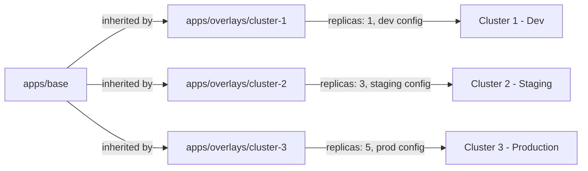

# How to Apply Cluster-Specific Application Config with Flux Overlays

Author: [nawazdhandala](https://github.com/nawazdhandala)

Tags: Flux, Kubernetes, GitOps, Multi-Cluster, Overlays, Kustomize, Configuration Management

Description: Learn how to use Kustomize overlays with Flux CD to apply cluster-specific application configurations while maintaining a shared base across your fleet.

---

When running the same application across multiple clusters, each cluster often needs slightly different configuration: different replica counts, resource limits, environment variables, ingress hostnames, or feature flags. Kustomize overlays integrated with Flux CD let you maintain a single base definition and layer cluster-specific customizations on top.

## How Overlays Work with Flux

Flux uses the Kustomize controller to build and apply manifests. When a Kustomization resource points to a directory containing a `kustomization.yaml`, Flux runs `kustomize build` on that directory and applies the result. Overlays extend a base by adding, removing, or modifying resources.



## Repository Structure

```
fleet-repo/
├── apps/
│   ├── base/
│   │   ├── kustomization.yaml
│   │   ├── namespace.yaml
│   │   ├── deployment.yaml
│   │   ├── service.yaml
│   │   ├── ingress.yaml
│   │   ├── hpa.yaml
│   │   └── configmap.yaml
│   └── overlays/
│       ├── dev/
│       │   ├── kustomization.yaml
│       │   └── config.env
│       ├── staging/
│       │   ├── kustomization.yaml
│       │   └── config.env
│       └── production/
│           ├── kustomization.yaml
│           ├── config.env
│           └── pdb.yaml
└── clusters/
    ├── dev/
    │   └── apps.yaml
    ├── staging/
    │   └── apps.yaml
    └── production/
        └── apps.yaml
```

## Step 1: Define the Base Application

The base contains the full application definition with sensible defaults. For `apps/base/kustomization.yaml`:

```yaml
apiVersion: kustomize.config.k8s.io/v1beta1
kind: Kustomization
resources:
  - namespace.yaml
  - deployment.yaml
  - service.yaml
  - ingress.yaml
  - hpa.yaml
  - configmap.yaml
```

For `apps/base/deployment.yaml`:

```yaml
apiVersion: apps/v1
kind: Deployment
metadata:
  name: webapp
  namespace: app
  labels:
    app: webapp
spec:
  replicas: 2
  selector:
    matchLabels:
      app: webapp
  template:
    metadata:
      labels:
        app: webapp
    spec:
      containers:
        - name: webapp
          image: ghcr.io/your-org/webapp:latest
          ports:
            - containerPort: 8080
          envFrom:
            - configMapRef:
                name: webapp-config
          resources:
            requests:
              cpu: 100m
              memory: 128Mi
            limits:
              cpu: 500m
              memory: 512Mi
          readinessProbe:
            httpGet:
              path: /healthz
              port: 8080
            initialDelaySeconds: 5
            periodSeconds: 10
          livenessProbe:
            httpGet:
              path: /healthz
              port: 8080
            initialDelaySeconds: 15
            periodSeconds: 20
```

For `apps/base/configmap.yaml`:

```yaml
apiVersion: v1
kind: ConfigMap
metadata:
  name: webapp-config
  namespace: app
data:
  LOG_LEVEL: "info"
  CACHE_TTL: "300"
  FEATURE_NEW_UI: "false"
  MAX_CONNECTIONS: "100"
```

For `apps/base/ingress.yaml`:

```yaml
apiVersion: networking.k8s.io/v1
kind: Ingress
metadata:
  name: webapp
  namespace: app
  annotations:
    cert-manager.io/cluster-issuer: letsencrypt
spec:
  ingressClassName: nginx
  tls:
    - hosts:
        - webapp.example.com
      secretName: webapp-tls
  rules:
    - host: webapp.example.com
      http:
        paths:
          - path: /
            pathType: Prefix
            backend:
              service:
                name: webapp
                port:
                  number: 80
```

For `apps/base/hpa.yaml`:

```yaml
apiVersion: autoscaling/v2
kind: HorizontalPodAutoscaler
metadata:
  name: webapp
  namespace: app
spec:
  scaleTargetRef:
    apiVersion: apps/v1
    kind: Deployment
    name: webapp
  minReplicas: 2
  maxReplicas: 10
  metrics:
    - type: Resource
      resource:
        name: cpu
        target:
          type: Utilization
          averageUtilization: 70
```

## Step 2: Create the Dev Overlay

The dev overlay reduces resource usage and enables debug features. For `apps/overlays/dev/kustomization.yaml`:

```yaml
apiVersion: kustomize.config.k8s.io/v1beta1
kind: Kustomization
resources:
  - ../../base
patches:
  - target:
      kind: Deployment
      name: webapp
    patch: |
      - op: replace
        path: /spec/replicas
        value: 1
      - op: replace
        path: /spec/template/spec/containers/0/resources
        value:
          requests:
            cpu: 50m
            memory: 64Mi
          limits:
            cpu: 200m
            memory: 256Mi
  - target:
      kind: HorizontalPodAutoscaler
      name: webapp
    patch: |
      - op: replace
        path: /spec/minReplicas
        value: 1
      - op: replace
        path: /spec/maxReplicas
        value: 2
  - target:
      kind: Ingress
      name: webapp
    patch: |
      - op: replace
        path: /spec/tls/0/hosts/0
        value: webapp.dev.example.com
      - op: replace
        path: /spec/tls/0/secretName
        value: webapp-dev-tls
      - op: replace
        path: /spec/rules/0/host
        value: webapp.dev.example.com
  - target:
      kind: ConfigMap
      name: webapp-config
    patch: |
      - op: replace
        path: /data/LOG_LEVEL
        value: "debug"
      - op: replace
        path: /data/FEATURE_NEW_UI
        value: "true"
```

## Step 3: Create the Staging Overlay

Staging mirrors production more closely but may use fewer resources. For `apps/overlays/staging/kustomization.yaml`:

```yaml
apiVersion: kustomize.config.k8s.io/v1beta1
kind: Kustomization
resources:
  - ../../base
patches:
  - target:
      kind: Deployment
      name: webapp
    patch: |
      - op: replace
        path: /spec/replicas
        value: 2
      - op: replace
        path: /spec/template/spec/containers/0/resources
        value:
          requests:
            cpu: 250m
            memory: 256Mi
          limits:
            cpu: "1"
            memory: 1Gi
  - target:
      kind: Ingress
      name: webapp
    patch: |
      - op: replace
        path: /spec/tls/0/hosts/0
        value: webapp.staging.example.com
      - op: replace
        path: /spec/tls/0/secretName
        value: webapp-staging-tls
      - op: replace
        path: /spec/rules/0/host
        value: webapp.staging.example.com
  - target:
      kind: ConfigMap
      name: webapp-config
    patch: |
      - op: replace
        path: /data/LOG_LEVEL
        value: "info"
      - op: replace
        path: /data/FEATURE_NEW_UI
        value: "true"
      - op: replace
        path: /data/MAX_CONNECTIONS
        value: "200"
```

## Step 4: Create the Production Overlay

Production uses maximum resources and adds a PodDisruptionBudget. For `apps/overlays/production/kustomization.yaml`:

```yaml
apiVersion: kustomize.config.k8s.io/v1beta1
kind: Kustomization
resources:
  - ../../base
  - pdb.yaml
patches:
  - target:
      kind: Deployment
      name: webapp
    patch: |
      - op: replace
        path: /spec/replicas
        value: 5
      - op: replace
        path: /spec/template/spec/containers/0/resources
        value:
          requests:
            cpu: 500m
            memory: 512Mi
          limits:
            cpu: "2"
            memory: 2Gi
      - op: add
        path: /spec/template/spec/topologySpreadConstraints
        value:
          - maxSkew: 1
            topologyKey: topology.kubernetes.io/zone
            whenUnsatisfiable: DoNotSchedule
            labelSelector:
              matchLabels:
                app: webapp
  - target:
      kind: HorizontalPodAutoscaler
      name: webapp
    patch: |
      - op: replace
        path: /spec/minReplicas
        value: 5
      - op: replace
        path: /spec/maxReplicas
        value: 50
  - target:
      kind: Ingress
      name: webapp
    patch: |
      - op: replace
        path: /spec/tls/0/hosts/0
        value: webapp.example.com
      - op: replace
        path: /spec/tls/0/secretName
        value: webapp-prod-tls
      - op: replace
        path: /spec/rules/0/host
        value: webapp.example.com
  - target:
      kind: ConfigMap
      name: webapp-config
    patch: |
      - op: replace
        path: /data/MAX_CONNECTIONS
        value: "1000"
```

For `apps/overlays/production/pdb.yaml`:

```yaml
apiVersion: policy/v1
kind: PodDisruptionBudget
metadata:
  name: webapp
  namespace: app
spec:
  minAvailable: "50%"
  selector:
    matchLabels:
      app: webapp
```

## Step 5: Point Flux Kustomizations to Overlays

Each cluster's Flux Kustomization points to its specific overlay. For `clusters/dev/apps.yaml`:

```yaml
apiVersion: kustomize.toolkit.fluxcd.io/v1
kind: Kustomization
metadata:
  name: apps
  namespace: flux-system
spec:
  interval: 5m
  sourceRef:
    kind: GitRepository
    name: flux-system
  path: ./apps/overlays/dev
  prune: true
  wait: true
```

For `clusters/production/apps.yaml`:

```yaml
apiVersion: kustomize.toolkit.fluxcd.io/v1
kind: Kustomization
metadata:
  name: apps
  namespace: flux-system
spec:
  interval: 15m
  sourceRef:
    kind: GitRepository
    name: flux-system
  path: ./apps/overlays/production
  prune: true
  wait: true
  timeout: 10m
  healthChecks:
    - apiVersion: apps/v1
      kind: Deployment
      name: webapp
      namespace: app
```

## Step 6: Using Strategic Merge Patches

For more complex changes, use strategic merge patches instead of JSON patches. Create a patch file in the overlay directory. For `apps/overlays/production/deployment-patch.yaml`:

```yaml
apiVersion: apps/v1
kind: Deployment
metadata:
  name: webapp
  namespace: app
spec:
  template:
    spec:
      containers:
        - name: webapp
          env:
            - name: GOMAXPROCS
              valueFrom:
                resourceFieldRef:
                  resource: limits.cpu
      affinity:
        podAntiAffinity:
          requiredDuringSchedulingIgnoredDuringExecution:
            - labelSelector:
                matchExpressions:
                  - key: app
                    operator: In
                    values:
                      - webapp
              topologyKey: kubernetes.io/hostname
```

Reference it in the Kustomization:

```yaml
apiVersion: kustomize.config.k8s.io/v1beta1
kind: Kustomization
resources:
  - ../../base
  - pdb.yaml
patches:
  - path: deployment-patch.yaml
```

## Step 7: Validate Overlays Locally

Before pushing changes, validate the overlay output locally:

```bash
# Build and inspect the dev overlay
kustomize build apps/overlays/dev

# Build and inspect the production overlay
kustomize build apps/overlays/production

# Diff between environments
diff <(kustomize build apps/overlays/dev) <(kustomize build apps/overlays/production)
```

## Common Overlay Patterns

**Adding sidecar containers in production:**

```yaml
patches:
  - target:
      kind: Deployment
      name: webapp
    patch: |
      - op: add
        path: /spec/template/spec/containers/-
        value:
          name: log-forwarder
          image: fluent/fluent-bit:latest
          resources:
            requests:
              cpu: 50m
              memory: 64Mi
```

**Changing image tags per environment:**

```yaml
images:
  - name: ghcr.io/your-org/webapp
    newTag: v2.1.0-rc.1
```

**Adding environment-specific labels:**

```yaml
commonLabels:
  environment: production
  team: platform
```

## Summary

Kustomize overlays give you a clean separation between what stays the same across clusters and what differs. The base defines the canonical application specification, and overlays customize it per environment or cluster. With Flux pointing each cluster's Kustomization to the right overlay directory, you get consistent, auditable, and easy-to-maintain multi-cluster deployments. Changes to the base propagate everywhere, while overlay changes stay scoped to their target cluster.
