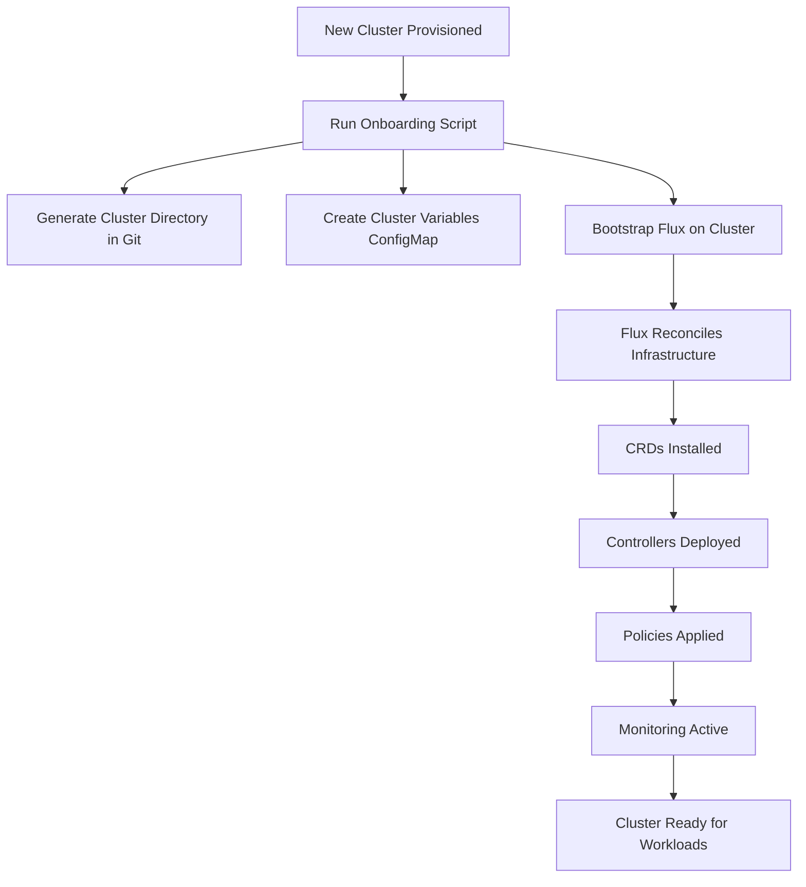
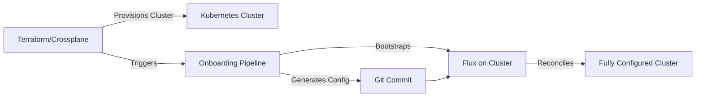

# How to Automate New Cluster Onboarding with Flux

Author: [nawazdhandala](https://github.com/nawazdhandala)

Tags: Flux, Kubernetes, GitOps, Multi-Cluster, Automation, Onboarding, Bootstrap, Cluster Management

Description: Learn how to automate the process of onboarding new Kubernetes clusters into a Flux multi-cluster GitOps setup with scripts and templates.

---

As your Kubernetes fleet grows, manually onboarding each new cluster becomes a bottleneck. Automating the onboarding process ensures every cluster gets the same baseline configuration, reduces human error, and lets you scale from a handful of clusters to hundreds. This guide shows you how to create a repeatable, automated cluster onboarding pipeline with Flux.

## The Onboarding Workflow



## Prerequisites

Before onboarding a new cluster, you need:

- A provisioned Kubernetes cluster with kubeconfig access
- The `flux` CLI installed
- The `kubectl` CLI configured with access to the new cluster
- A GitHub personal access token or deploy key for the fleet repository
- The fleet repository cloned locally

## Cluster Onboarding Script

Create a comprehensive onboarding script that handles the entire process:

```bash
#!/bin/bash
# scripts/onboard-cluster.sh

set -euo pipefail

# Required parameters
CLUSTER_NAME="${1:?Usage: $0 <cluster-name> <environment> <region> <cloud-provider>}"
CLUSTER_ENV="${2:?Specify environment: staging, production}"
CLUSTER_REGION="${3:?Specify region: us-east-1, eu-west-1, etc.}"
CLOUD_PROVIDER="${4:?Specify cloud provider: aws, gcp, azure}"

# Configuration
REPO_OWNER="my-org"
REPO_NAME="fleet-repo"
REPO_BRANCH="main"
FLEET_REPO_PATH="$(cd "$(dirname "$0")/.." && pwd)"
CLUSTER_DIR="${FLEET_REPO_PATH}/clusters/${CLUSTER_NAME}"

echo "Onboarding cluster: ${CLUSTER_NAME}"
echo "Environment: ${CLUSTER_ENV}"
echo "Region: ${CLUSTER_REGION}"
echo "Cloud Provider: ${CLOUD_PROVIDER}"

# Validate kubectl context
if ! kubectl cluster-info > /dev/null 2>&1; then
    echo "ERROR: Cannot connect to cluster. Check your kubeconfig."
    exit 1
fi

# Check if cluster directory already exists
if [ -d "${CLUSTER_DIR}" ]; then
    echo "ERROR: Cluster directory ${CLUSTER_DIR} already exists."
    exit 1
fi

echo "Step 1: Creating cluster directory structure..."
mkdir -p "${CLUSTER_DIR}/flux-system"

echo "Step 2: Generating cluster variables..."
cat > "${CLUSTER_DIR}/cluster-vars.yaml" << EOF
apiVersion: v1
kind: ConfigMap
metadata:
  name: cluster-vars
  namespace: flux-system
data:
  cluster_name: "${CLUSTER_NAME}"
  cluster_env: "${CLUSTER_ENV}"
  cluster_region: "${CLUSTER_REGION}"
  cloud_provider: "${CLOUD_PROVIDER}"
  cluster_domain: "${CLUSTER_NAME}.k8s.example.com"
EOF

echo "Step 3: Generating infrastructure Kustomization..."
cat > "${CLUSTER_DIR}/infrastructure.yaml" << 'EOF'
apiVersion: kustomize.toolkit.fluxcd.io/v1
kind: Kustomization
metadata:
  name: infrastructure-sources
  namespace: flux-system
spec:
  interval: 10m
  path: ./infrastructure/sources
  prune: true
  sourceRef:
    kind: GitRepository
    name: flux-system
  wait: true
---
apiVersion: kustomize.toolkit.fluxcd.io/v1
kind: Kustomization
metadata:
  name: infrastructure-crds
  namespace: flux-system
spec:
  interval: 10m
  path: ./infrastructure/crds
  prune: false
  sourceRef:
    kind: GitRepository
    name: flux-system
  dependsOn:
    - name: infrastructure-sources
  wait: true
  timeout: 5m
---
apiVersion: kustomize.toolkit.fluxcd.io/v1
kind: Kustomization
metadata:
  name: infrastructure-controllers
  namespace: flux-system
spec:
  interval: 10m
  path: ./infrastructure/controllers
  prune: true
  sourceRef:
    kind: GitRepository
    name: flux-system
  dependsOn:
    - name: infrastructure-crds
  wait: true
  timeout: 10m
  postBuild:
    substituteFrom:
      - kind: ConfigMap
        name: cluster-vars
      - kind: Secret
        name: cluster-secrets
        optional: true
---
apiVersion: kustomize.toolkit.fluxcd.io/v1
kind: Kustomization
metadata:
  name: infrastructure-configs
  namespace: flux-system
spec:
  interval: 10m
  path: ./infrastructure/configs
  prune: true
  sourceRef:
    kind: GitRepository
    name: flux-system
  dependsOn:
    - name: infrastructure-controllers
  wait: true
  postBuild:
    substituteFrom:
      - kind: ConfigMap
        name: cluster-vars
EOF

echo "Step 4: Generating apps Kustomization..."
cat > "${CLUSTER_DIR}/apps.yaml" << EOF
apiVersion: kustomize.toolkit.fluxcd.io/v1
kind: Kustomization
metadata:
  name: apps
  namespace: flux-system
spec:
  interval: 10m
  path: ./apps/${CLUSTER_ENV}
  prune: true
  sourceRef:
    kind: GitRepository
    name: flux-system
  dependsOn:
    - name: infrastructure-controllers
  wait: true
  timeout: 10m
  postBuild:
    substituteFrom:
      - kind: ConfigMap
        name: cluster-vars
      - kind: Secret
        name: cluster-secrets
        optional: true
  decryption:
    provider: sops
    secretRef:
      name: sops-age
EOF

echo "Step 5: Committing cluster configuration to Git..."
cd "${FLEET_REPO_PATH}"
git add "clusters/${CLUSTER_NAME}/"
git commit -m "onboard: add cluster ${CLUSTER_NAME} (${CLUSTER_ENV}/${CLUSTER_REGION})"
git push origin "${REPO_BRANCH}"

echo "Step 6: Bootstrapping Flux..."
flux bootstrap github \
  --owner="${REPO_OWNER}" \
  --repository="${REPO_NAME}" \
  --branch="${REPO_BRANCH}" \
  --path="clusters/${CLUSTER_NAME}" \
  --personal=false

echo "Step 7: Applying cluster variables ConfigMap..."
kubectl apply -f "${CLUSTER_DIR}/cluster-vars.yaml"

echo "Step 8: Waiting for Flux to reconcile..."
flux reconcile source git flux-system
sleep 10

echo "Step 9: Verifying onboarding..."
echo "Checking Flux components..."
flux check

echo "Checking Kustomizations..."
flux get kustomizations

echo ""
echo "Cluster ${CLUSTER_NAME} onboarding complete."
echo "Monitor progress with: flux get kustomizations --watch"
```

Make the script executable:

```bash
chmod +x scripts/onboard-cluster.sh
```

## Using the Onboarding Script

```bash
# Onboard a staging cluster in US East
./scripts/onboard-cluster.sh staging-us-east staging us-east-1 aws

# Onboard a production cluster in EU West
./scripts/onboard-cluster.sh production-eu-west production eu-west-1 aws

# Onboard a development cluster on GCP
./scripts/onboard-cluster.sh dev-central dev us-central1 gcp
```

## Environment-Specific Variable Templates

Create template files for each environment type so the onboarding script can apply the right defaults:

```yaml
# templates/staging-vars.yaml
apiVersion: v1
kind: ConfigMap
metadata:
  name: cluster-vars
  namespace: flux-system
data:
  cluster_name: "CLUSTER_NAME_PLACEHOLDER"
  cluster_env: "staging"
  cluster_region: "REGION_PLACEHOLDER"
  cloud_provider: "PROVIDER_PLACEHOLDER"
  # Resource sizing for staging
  ingress_replicas: "2"
  kyverno_replicas: "1"
  prometheus_storage_size: "50Gi"
  monitoring_retention: "7d"
  policy_enforcement_mode: "Audit"
  ingress_autoscaling_enabled: "false"
```

```yaml
# templates/production-vars.yaml
apiVersion: v1
kind: ConfigMap
metadata:
  name: cluster-vars
  namespace: flux-system
data:
  cluster_name: "CLUSTER_NAME_PLACEHOLDER"
  cluster_env: "production"
  cluster_region: "REGION_PLACEHOLDER"
  cloud_provider: "PROVIDER_PLACEHOLDER"
  # Resource sizing for production
  ingress_replicas: "3"
  kyverno_replicas: "3"
  prometheus_storage_size: "500Gi"
  monitoring_retention: "30d"
  policy_enforcement_mode: "Enforce"
  ingress_autoscaling_enabled: "true"
```

## SOPS Key Provisioning During Onboarding

Include age key generation and installation in the onboarding process:

```bash
# Generate a new age key for the cluster
generate_sops_key() {
    local cluster_name=$1
    local key_file="keys/${cluster_name}.agekey"

    echo "Generating SOPS age key for ${cluster_name}..."
    age-keygen -o "${key_file}" 2>&1

    local public_key
    public_key=$(grep "public key" "${key_file}" | cut -d: -f2 | tr -d ' ')

    echo "Public key: ${public_key}"

    # Install the key in the cluster
    kubectl create secret generic sops-age \
        --namespace=flux-system \
        --from-file=age.agekey="${key_file}"

    # Update .sops.yaml with the new cluster's key
    echo "  - path_regex: infrastructure/secrets/${cluster_name}/.*\\.yaml\$" >> .sops.yaml
    echo "    encrypted_regex: ^(data|stringData)\$" >> .sops.yaml
    echo "    age: ${public_key}" >> .sops.yaml

    echo "Store the private key securely and delete the local copy."
}
```

## CI/CD Pipeline for Onboarding

Automate the onboarding through a CI/CD pipeline using GitHub Actions:

```yaml
# .github/workflows/onboard-cluster.yaml
name: Onboard New Cluster

on:
  workflow_dispatch:
    inputs:
      cluster_name:
        description: "Cluster name (e.g., production-us-east-2)"
        required: true
      environment:
        description: "Environment tier"
        required: true
        type: choice
        options:
          - staging
          - production
      region:
        description: "Cloud region"
        required: true
      cloud_provider:
        description: "Cloud provider"
        required: true
        type: choice
        options:
          - aws
          - gcp
          - azure

jobs:
  onboard:
    runs-on: ubuntu-latest
    steps:
      - name: Checkout fleet repo
        uses: actions/checkout@v4

      - name: Setup Flux CLI
        uses: fluxcd/flux2/action@main

      - name: Setup kubectl
        uses: azure/setup-kubectl@v3

      - name: Configure cluster access
        run: |
          echo "${{ secrets.KUBECONFIG }}" | base64 -d > kubeconfig
          export KUBECONFIG=kubeconfig

      - name: Generate cluster configuration
        run: |
          ./scripts/onboard-cluster.sh \
            "${{ github.event.inputs.cluster_name }}" \
            "${{ github.event.inputs.environment }}" \
            "${{ github.event.inputs.region }}" \
            "${{ github.event.inputs.cloud_provider }}"

      - name: Verify onboarding
        run: |
          flux check
          flux get kustomizations
```

## Validation Checklist

After onboarding, verify the cluster is fully operational:

```bash
#!/bin/bash
# scripts/verify-cluster.sh

CLUSTER_NAME="${1:?Usage: $0 <cluster-name>}"

echo "Verifying cluster: ${CLUSTER_NAME}"
echo "=================================="

echo "1. Flux components healthy:"
flux check

echo ""
echo "2. All Kustomizations reconciled:"
flux get kustomizations

echo ""
echo "3. All HelmReleases reconciled:"
flux get helmreleases -A

echo ""
echo "4. Key pods running:"
kubectl get pods -n flux-system
kubectl get pods -n cert-manager
kubectl get pods -n ingress-nginx
kubectl get pods -n monitoring
kubectl get pods -n kyverno

echo ""
echo "5. Cluster variables applied:"
kubectl get configmap cluster-vars -n flux-system -o yaml

echo ""
echo "6. SOPS decryption key present:"
kubectl get secret sops-age -n flux-system

echo ""
echo "7. No failed Kustomizations:"
FAILED=$(flux get kustomizations --status-selector ready=false 2>/dev/null | wc -l)
if [ "$FAILED" -gt 1 ]; then
    echo "WARNING: ${FAILED} Kustomizations are not ready"
    flux get kustomizations --status-selector ready=false
else
    echo "All Kustomizations are ready"
fi
```

## Handling Onboarding Failures

If the onboarding process fails partway through:

```bash
# Check what was applied
flux get kustomizations

# Check for errors in Flux controllers
kubectl logs -n flux-system deploy/kustomize-controller --since=10m | grep -i error
kubectl logs -n flux-system deploy/source-controller --since=10m | grep -i error

# Retry the failed Kustomization
flux reconcile kustomization infrastructure-controllers -n flux-system

# If bootstrap needs to be re-run
flux bootstrap github \
  --owner=my-org \
  --repository=fleet-repo \
  --branch=main \
  --path=clusters/${CLUSTER_NAME}
```

## Scaling to Many Clusters

When managing dozens or hundreds of clusters, consider these patterns:

1. **Cluster templates**: Instead of generating files per cluster, use a template directory that all clusters of the same tier share.
2. **Cluster registry**: Maintain a registry (ConfigMap or external store) that lists all clusters with their metadata.
3. **Automated provisioning**: Integrate cluster onboarding with your infrastructure-as-code pipeline (Terraform, Crossplane) so that new clusters are automatically onboarded when provisioned.



## Conclusion

Automating cluster onboarding with Flux transforms what could be hours of manual setup into a single script or pipeline execution. By templating cluster configurations, using environment-specific variable presets, and integrating SOPS key provisioning, every new cluster starts with a consistent and secure baseline. As your fleet grows, the onboarding automation pays dividends by reducing time-to-production for new clusters from days to minutes.
