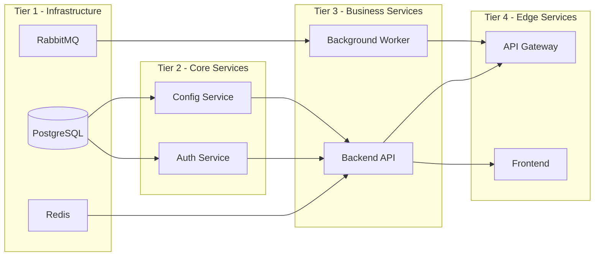

# How to Configure Deployment Order for Microservices in Flux

Author: [nawazdhandala](https://github.com/nawazdhandala)

Tags: Flux CD, Kubernetes, GitOps, Kustomization, HelmRelease, Deployment Order, Microservices

Description: Learn how to implement ordered deployment of microservices in Flux CD using Kustomization and HelmRelease dependency chains.

---

## Introduction

In a microservices architecture, deployment order matters. Databases must be initialized before applications connect to them, message brokers must be ready before consumers subscribe, and shared infrastructure services must be stable before business logic services start. Deploying everything simultaneously leads to race conditions, crash loops, and failed health checks during bootstrap.

Flux CD provides a `dependsOn` field for both Kustomization and HelmRelease resources. This field creates ordered reconciliation chains where Flux will not begin reconciling a resource until all its listed dependencies have reached a Ready state. Unlike application-level retry logic, this approach handles ordering at the infrastructure orchestration layer, which is cleaner and more reliable.

In this guide you will learn how to configure deployment order for an entire microservice stack using both Kustomization and HelmRelease `dependsOn` chains, how to use cross-namespace dependencies, and how to validate that ordering is working correctly.

## Prerequisites

- A Kubernetes cluster with Flux CD installed
- `kubectl` and `flux` CLI tools installed
- Microservices with known dependencies on shared infrastructure
- Familiarity with Flux Kustomization and HelmRelease resources

## Step 1: Design Your Deployment Tiers

Organize microservices into deployment tiers based on dependencies.



## Step 2: Deploy Tier 1 - Infrastructure (No Dependencies)

```yaml
# clusters/production/infrastructure/postgresql-helmrelease.yaml
apiVersion: helm.toolkit.fluxcd.io/v2
kind: HelmRelease
metadata:
  name: postgresql
  namespace: flux-system
spec:
  interval: 10m
  targetNamespace: infrastructure
  createNamespace: true
  chart:
    spec:
      chart: postgresql
      version: "15.x"
      sourceRef:
        kind: HelmRepository
        name: bitnami
  # No dependsOn - tier 1 has no dependencies
  values:
    primary:
      persistence:
        enabled: true
        size: 20Gi
    auth:
      postgresPassword:
        valueFrom:
          secretKeyRef:
            name: postgresql-secret
            key: password
```

```yaml
# clusters/production/infrastructure/rabbitmq-helmrelease.yaml
apiVersion: helm.toolkit.fluxcd.io/v2
kind: HelmRelease
metadata:
  name: rabbitmq
  namespace: flux-system
spec:
  interval: 10m
  targetNamespace: infrastructure
  createNamespace: true
  chart:
    spec:
      chart: rabbitmq
      version: "14.x"
      sourceRef:
        kind: HelmRepository
        name: bitnami
  values:
    replicaCount: 3
    persistence:
      enabled: true
      size: 10Gi
```

## Step 3: Deploy Tier 2 - Core Services (Depend on Tier 1)

```yaml
# clusters/production/apps/auth-service-helmrelease.yaml
apiVersion: helm.toolkit.fluxcd.io/v2
kind: HelmRelease
metadata:
  name: auth-service
  namespace: flux-system
spec:
  interval: 10m
  targetNamespace: core-services
  createNamespace: true
  chart:
    spec:
      chart: auth-service
      version: "2.x"
      sourceRef:
        kind: HelmRepository
        name: internal-charts
  # Must wait for PostgreSQL to be healthy
  dependsOn:
    - name: postgresql
      namespace: flux-system
  values:
    replicaCount: 2
    image:
      repository: myregistry/auth-service
      tag: "v2.1.0"
```

```yaml
# clusters/production/apps/config-service-helmrelease.yaml
apiVersion: helm.toolkit.fluxcd.io/v2
kind: HelmRelease
metadata:
  name: config-service
  namespace: flux-system
spec:
  interval: 10m
  targetNamespace: core-services
  chart:
    spec:
      chart: config-service
      version: "1.x"
      sourceRef:
        kind: HelmRepository
        name: internal-charts
  dependsOn:
    - name: postgresql
      namespace: flux-system
  values:
    replicaCount: 1
```

## Step 4: Deploy Tier 3 - Business Services (Depend on Tier 2)

```yaml
# clusters/production/apps/backend-api-helmrelease.yaml
apiVersion: helm.toolkit.fluxcd.io/v2
kind: HelmRelease
metadata:
  name: backend-api
  namespace: flux-system
spec:
  interval: 10m
  targetNamespace: business-services
  createNamespace: true
  chart:
    spec:
      chart: backend-api
      version: "3.x"
      sourceRef:
        kind: HelmRepository
        name: internal-charts
  # Backend API waits for all Tier 2 services plus Redis
  dependsOn:
    - name: auth-service
      namespace: flux-system
    - name: config-service
      namespace: flux-system
    - name: redis
      namespace: flux-system
  values:
    replicaCount: 3
    image:
      repository: myregistry/backend-api
      tag: "v3.5.2"
```

```yaml
# clusters/production/apps/background-worker-helmrelease.yaml
apiVersion: helm.toolkit.fluxcd.io/v2
kind: HelmRelease
metadata:
  name: background-worker
  namespace: flux-system
spec:
  interval: 10m
  targetNamespace: business-services
  chart:
    spec:
      chart: worker
      version: "1.x"
      sourceRef:
        kind: HelmRepository
        name: internal-charts
  dependsOn:
    - name: rabbitmq
      namespace: flux-system
    - name: postgresql
      namespace: flux-system
  values:
    replicaCount: 2
```

## Step 5: Deploy Tier 4 - Edge Services (Depend on Tier 3)

```yaml
# clusters/production/apps/api-gateway-helmrelease.yaml
apiVersion: helm.toolkit.fluxcd.io/v2
kind: HelmRelease
metadata:
  name: api-gateway
  namespace: flux-system
spec:
  interval: 10m
  targetNamespace: edge-services
  createNamespace: true
  chart:
    spec:
      chart: api-gateway
      version: "1.x"
      sourceRef:
        kind: HelmRepository
        name: internal-charts
  dependsOn:
    - name: backend-api
      namespace: flux-system
    - name: background-worker
      namespace: flux-system
  values:
    replicaCount: 2
    upstream:
      backendApi: "http://backend-api.business-services.svc.cluster.local:8080"
```

## Step 6: Verify and Monitor Ordering

```bash
# Apply all resources
kubectl apply -f clusters/production/infrastructure/
kubectl apply -f clusters/production/apps/

# Watch the reconciliation order in real time
flux get helmreleases --watch

# Check that tier 1 is ready before tier 2 starts
kubectl get helmrelease -n flux-system \
  -o custom-columns='NAME:.metadata.name,READY:.status.conditions[?(@.type=="Ready")].status'

# Force reconcile the entire stack in order
flux reconcile helmrelease postgresql --with-source
flux reconcile helmrelease auth-service
flux reconcile helmrelease backend-api
flux reconcile helmrelease api-gateway
```

## Best Practices

- Organize Flux resources into directories matching your deployment tiers
- Use `namespace` in `dependsOn` when the dependency lives in a different namespace
- Ensure dependencies define proper `readinessProbes` so Flux health checks pass accurately
- Keep dependency chains to 4 tiers or fewer to avoid long bootstrap times
- Add `timeout` values to each tier appropriate to how long the service takes to start
- Test full-stack bootstrap in a staging cluster after defining all dependencies

## Conclusion

Configuring deployment order in Flux CD through `dependsOn` chains lets you model complex microservice dependencies declaratively in Git. By organizing services into tiers and expressing each tier's dependencies explicitly, you ensure correct startup order during initial deployments, disaster recovery scenarios, and cluster migrations. This approach eliminates the need for imperative scripts or manual coordination, keeping your entire deployment pipeline driven by Git.
