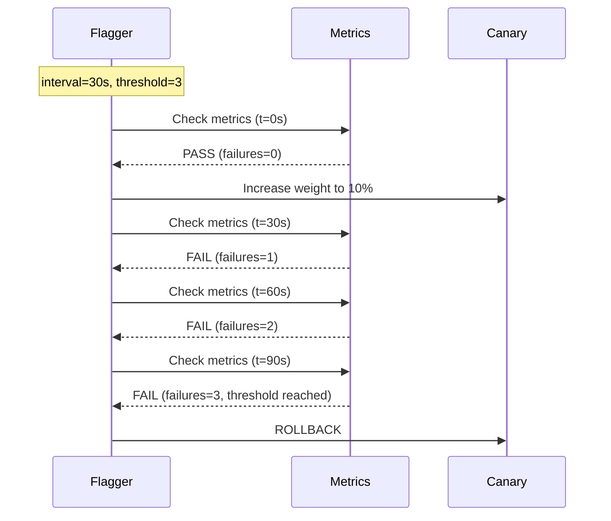

# How to Configure Flagger Canary Analysis Interval and Threshold

Author: [nawazdhandala](https://github.com/nawazdhandala)

Tags: flagger, canary, analysis, interval, threshold, kubernetes, progressive delivery

Description: Learn how to tune Flagger's canary analysis interval and failure threshold to balance deployment speed with safety for your workloads.

---

## Introduction

The analysis interval and threshold are two of the most important configuration parameters in a Flagger Canary resource. The interval controls how frequently Flagger evaluates the canary's health metrics, while the threshold defines how many consecutive failed checks are tolerated before triggering a rollback. Getting these values right is critical: too aggressive and you risk false rollbacks, too conservative and deployments take unnecessarily long.

This guide explains how these parameters work together and provides practical guidance for tuning them for different types of workloads.

## Prerequisites

- A running Kubernetes cluster with Flagger installed
- A Canary resource targeting a Deployment, DaemonSet, or StatefulSet
- A metrics provider (Prometheus, Datadog, etc.) configured
- kubectl access to your cluster

## Understanding Interval and Threshold

### The Interval Parameter

The `interval` field in the analysis spec defines the schedule on which Flagger runs metric checks. During each interval tick, Flagger queries all configured metrics and evaluates whether they meet their thresholds:

```yaml
spec:
  analysis:
    # Flagger checks metrics every 30 seconds
    interval: 30s
```

Valid duration formats include seconds (`30s`), minutes (`1m`), and combinations (`1m30s`).

### The Threshold Parameter

The `threshold` field defines the maximum number of failed metric checks before Flagger rolls back the canary:

```yaml
spec:
  analysis:
    # Rollback after 5 consecutive failures
    threshold: 5
```

When a metric check fails, Flagger increments an internal failure counter. If any subsequent check passes, the counter resets to zero. Only consecutive failures count toward the threshold.

## How Interval and Threshold Work Together

The total time Flagger waits before rolling back a failing canary is approximately:

```
rollback_time = interval * threshold
```

Here is a visualization of how this works in practice:



## Configuration Examples

### Fast Iteration for Development Environments

In development or staging environments where you want quick feedback:

```yaml
apiVersion: flagger.app/v1beta1
kind: Canary
metadata:
  name: podinfo-dev
  namespace: dev
spec:
  targetRef:
    apiVersion: apps/v1
    kind: Deployment
    name: podinfo
  service:
    port: 9898
  analysis:
    # Check every 15 seconds for fast feedback
    interval: 15s
    # Low threshold - rollback quickly on failures
    threshold: 2
    # Smaller traffic steps
    maxWeight: 50
    stepWeight: 25
    metrics:
      - name: request-success-rate
        thresholdRange:
          min: 99
        interval: 30s
```

With this configuration:
- Total rollback time: 15s * 2 = 30 seconds
- Total promotion time (if all checks pass): roughly 30 seconds for 2 steps (25% and 50%)

### Conservative Configuration for Production

For production workloads where stability matters more than speed:

```yaml
apiVersion: flagger.app/v1beta1
kind: Canary
metadata:
  name: podinfo-prod
  namespace: production
spec:
  targetRef:
    apiVersion: apps/v1
    kind: Deployment
    name: podinfo
  service:
    port: 9898
  analysis:
    # Check every 1 minute
    interval: 1m
    # Tolerate up to 5 failures to avoid false rollbacks
    threshold: 5
    # Gradual traffic increase
    maxWeight: 50
    stepWeight: 5
    metrics:
      - name: request-success-rate
        thresholdRange:
          min: 99.5
        interval: 1m
      - name: request-duration
        thresholdRange:
          max: 500
        interval: 1m
```

With this configuration:
- Total rollback time: 1m * 5 = 5 minutes
- Total promotion time: roughly 10 minutes for 10 steps (5% increments to 50%)

### Balanced Configuration for General Use

A balanced configuration suitable for most workloads:

```yaml
apiVersion: flagger.app/v1beta1
kind: Canary
metadata:
  name: podinfo
  namespace: demo
spec:
  targetRef:
    apiVersion: apps/v1
    kind: Deployment
    name: podinfo
  service:
    port: 9898
  analysis:
    interval: 30s
    threshold: 3
    maxWeight: 50
    stepWeight: 10
    metrics:
      - name: request-success-rate
        thresholdRange:
          min: 99
        interval: 1m
      - name: request-duration
        thresholdRange:
          max: 500
        interval: 1m
```

## Tuning Guidelines

### Choosing the Right Interval

Consider these factors when setting the interval:

| Factor | Shorter Interval (15-30s) | Longer Interval (1-5m) |
|--------|---------------------------|------------------------|
| Feedback speed | Faster detection of issues | Slower detection |
| Metric stability | More prone to noise/spikes | More stable readings |
| Traffic volume | Needs high traffic for significance | Works with lower traffic |
| Metrics provider load | Higher query frequency | Lower query frequency |

A good rule of thumb: set the interval to at least 2x your metrics scrape interval. If Prometheus scrapes every 15 seconds, use an analysis interval of at least 30 seconds.

### Choosing the Right Threshold

The threshold should account for transient metric fluctuations:

```yaml
# For stable, high-traffic services
threshold: 3

# For services with occasional metric spikes
threshold: 5

# For services with noisy metrics or low traffic
threshold: 10
```

### Metric Interval vs Analysis Interval

Note that each metric has its own `interval` field that defines the query range window. This is separate from the analysis interval:

```yaml
analysis:
  interval: 30s    # How often Flagger runs checks
  metrics:
    - name: request-success-rate
      thresholdRange:
        min: 99
      interval: 1m  # Query range: success rate over the last 1 minute
```

The metric interval should generally be equal to or longer than the analysis interval. Setting it shorter can lead to incomplete data in each query window.

## Verifying Your Configuration

After applying your Canary resource, verify the settings:

```bash
# Check the canary spec
kubectl get canary podinfo -n demo -o jsonpath='{.spec.analysis.interval}'
kubectl get canary podinfo -n demo -o jsonpath='{.spec.analysis.threshold}'

# Watch analysis in action during a rollout
kubectl describe canary podinfo -n demo | grep -A 20 "Events:"
```

## Conclusion

The analysis interval and threshold work together to define how quickly Flagger detects problems and how tolerant it is of transient failures. Start with conservative values (longer intervals, higher thresholds) and tighten them as you gain confidence in your metrics stability. For development environments, use shorter intervals and lower thresholds for faster feedback. For production, prefer longer intervals and higher thresholds to avoid false rollbacks from metric noise.
