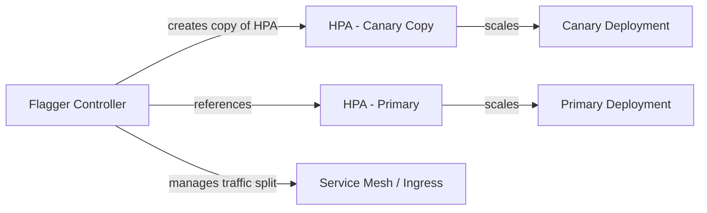

# How to Configure Flagger Canary autoscalerRef for HPA

Author: [nawazdhandala](https://github.com/nawazdhandala)

Tags: flagger, canary, hpa, autoscaling, kubernetes

Description: Learn how to integrate Flagger canary deployments with Horizontal Pod Autoscaler (HPA) using the autoscalerRef field for automatic scaling during progressive delivery.

---

## Introduction

When running canary deployments with Flagger, your primary deployment likely uses a Horizontal Pod Autoscaler (HPA) to handle varying traffic loads. By default, Flagger creates a canary Deployment but does not automatically duplicate or reference your HPA. The `autoscalerRef` field in the Canary spec solves this problem by telling Flagger which HPA to use, so the canary workload scales independently based on real traffic metrics.

This guide walks you through configuring `autoscalerRef` in your Flagger Canary resource so that both your primary and canary workloads autoscale correctly during progressive delivery.

## Prerequisites

- A Kubernetes cluster (v1.23 or later)
- Flagger installed (v1.30 or later)
- A service mesh or ingress controller configured with Flagger (e.g., Istio, Linkerd, NGINX)
- `kubectl` configured to access your cluster
- Metrics Server installed for HPA to function

## Understanding the autoscalerRef Field

Flagger's Canary CRD includes an `autoscalerRef` field that points to an existing HPA (or any autoscaler that follows the `scale` subresource pattern). When Flagger detects a new revision and creates the canary Deployment, it also creates a copy of the referenced autoscaler targeting the canary Deployment. This means the canary pods scale up and down based on the same CPU/memory thresholds you have defined for your primary workload.



## Step 1: Create the HPA for Your Primary Deployment

First, define an HPA that targets your primary Deployment. This is the autoscaler that Flagger will duplicate for the canary.

```yaml
# hpa.yaml
apiVersion: autoscaling/v2
kind: HorizontalPodAutoscaler
metadata:
  name: my-app
  namespace: default
spec:
  # Target the primary deployment
  scaleTargetRef:
    apiVersion: apps/v1
    kind: Deployment
    name: my-app
  minReplicas: 2
  maxReplicas: 10
  metrics:
    # Scale based on CPU utilization
    - type: Resource
      resource:
        name: cpu
        target:
          type: Utilization
          averageUtilization: 70
    # Optionally also scale on memory
    - type: Resource
      resource:
        name: memory
        target:
          type: Utilization
          averageUtilization: 80
```

Apply the HPA:

```bash
kubectl apply -f hpa.yaml
```

## Step 2: Define the Deployment

Create a standard Deployment that Flagger will manage:

```yaml
# deployment.yaml
apiVersion: apps/v1
kind: Deployment
metadata:
  name: my-app
  namespace: default
spec:
  replicas: 2
  selector:
    matchLabels:
      app: my-app
  template:
    metadata:
      labels:
        app: my-app
    spec:
      containers:
        - name: my-app
          image: my-app:1.0.0
          ports:
            - containerPort: 8080
          resources:
            requests:
              cpu: 100m
              memory: 128Mi
            limits:
              cpu: 500m
              memory: 256Mi
```

## Step 3: Configure the Canary with autoscalerRef

Now create the Canary resource that references the HPA via `autoscalerRef`:

```yaml
# canary.yaml
apiVersion: flagger.app/v1beta1
kind: Canary
metadata:
  name: my-app
  namespace: default
spec:
  targetRef:
    apiVersion: apps/v1
    kind: Deployment
    name: my-app
  # Reference the HPA so Flagger creates a copy for the canary
  autoscalerRef:
    apiVersion: autoscaling/v2
    kind: HorizontalPodAutoscaler
    name: my-app
  service:
    port: 8080
    targetPort: 8080
  analysis:
    # Schedule for the canary analysis
    interval: 1m
    # Max number of failed metric checks before rollback
    threshold: 5
    # Max traffic percentage routed to canary
    maxWeight: 50
    # Canary increment step
    stepWeight: 10
    metrics:
      - name: request-success-rate
        thresholdRange:
          min: 99
        interval: 1m
      - name: request-duration
        thresholdRange:
          max: 500
        interval: 1m
```

Apply all resources:

```bash
kubectl apply -f deployment.yaml
kubectl apply -f canary.yaml
```

## Step 4: Verify the Configuration

After Flagger initializes the canary, check that the primary HPA is intact and a canary HPA has been created:

```bash
# List all HPAs in the namespace
kubectl get hpa -n default

# You should see two HPAs:
# my-app           (targeting my-app-primary)
# my-app-canary    (targeting my-app-canary) - created by Flagger
```

Inspect the canary HPA to confirm it mirrors your primary HPA settings:

```bash
kubectl describe hpa my-app-canary -n default
```

The canary HPA should have the same `minReplicas`, `maxReplicas`, and metrics configuration as the primary HPA but with `scaleTargetRef` pointing to the canary Deployment.

## Step 5: Trigger a Canary Release and Observe Autoscaling

Update the container image to trigger a canary deployment:

```bash
kubectl set image deployment/my-app my-app=my-app:2.0.0 -n default
```

Monitor the canary progression and HPA behavior:

```bash
# Watch canary status
kubectl get canary my-app -n default -w

# Check HPA scaling for both primary and canary
kubectl get hpa -n default -w
```

During the rollout, the canary HPA will scale the canary pods independently based on the traffic it receives. As Flagger increases the canary traffic weight, the canary HPA reacts to the actual load.

## Using autoscalerRef with ScaledObject (KEDA)

If you use KEDA instead of the built-in HPA, you can reference a ScaledObject in `autoscalerRef`. Flagger supports any autoscaler that follows the standard Kubernetes patterns:

```yaml
# canary-keda.yaml
apiVersion: flagger.app/v1beta1
kind: Canary
metadata:
  name: my-app
  namespace: default
spec:
  targetRef:
    apiVersion: apps/v1
    kind: Deployment
    name: my-app
  # Reference a KEDA ScaledObject instead of HPA
  autoscalerRef:
    apiVersion: keda.sh/v1alpha1
    kind: ScaledObject
    name: my-app
  service:
    port: 8080
  analysis:
    interval: 1m
    threshold: 5
    maxWeight: 50
    stepWeight: 10
    metrics:
      - name: request-success-rate
        thresholdRange:
          min: 99
        interval: 1m
```

## Common Pitfalls

1. **Missing resource requests**: HPA requires resource requests set on containers to calculate utilization. Without them, HPA will not function.

2. **HPA name mismatch**: The `autoscalerRef.name` must exactly match the HPA metadata name. A mismatch causes Flagger to skip autoscaler duplication.

3. **Namespace mismatch**: The HPA must be in the same namespace as the Canary resource.

4. **Metrics Server not installed**: HPA depends on Metrics Server for CPU and memory metrics. Verify it is running with `kubectl get pods -n kube-system | grep metrics-server`.

## Conclusion

Configuring `autoscalerRef` in your Flagger Canary resource ensures that canary workloads scale independently during progressive delivery. By referencing your existing HPA, Flagger automatically creates a matching autoscaler for the canary Deployment, giving you confidence that the canary handles real traffic loads just as the primary does. This setup is essential for production environments where traffic patterns are unpredictable and autoscaling is critical.
