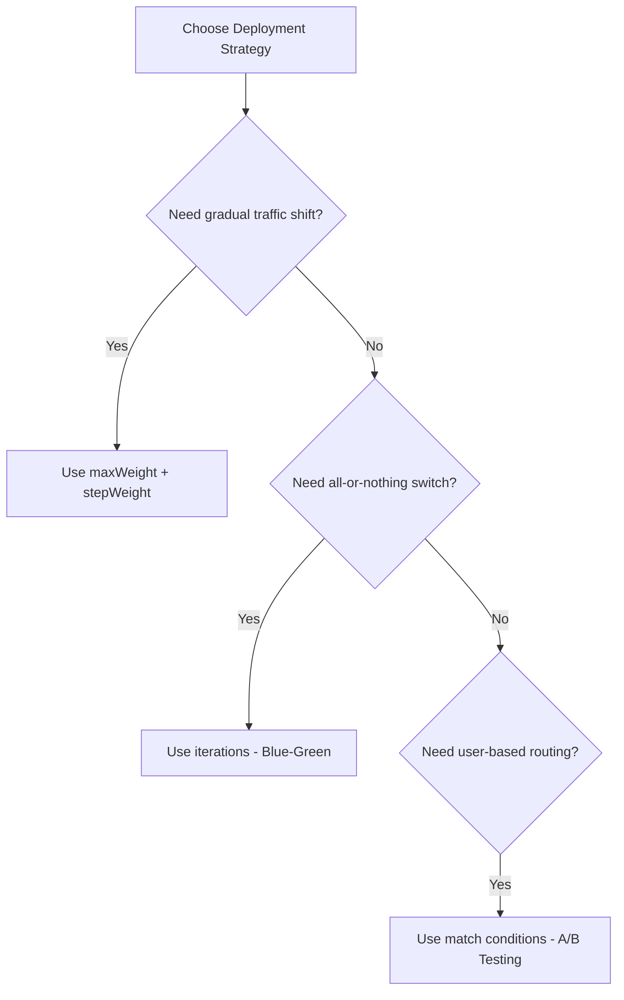
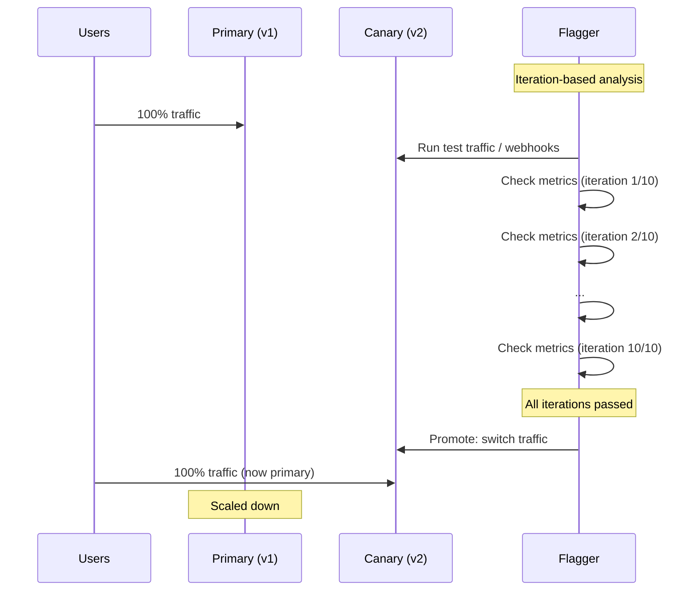

# How to Configure Flagger Canary Iterations for Blue-Green

Author: [nawazdhandala](https://github.com/nawazdhandala)

Tags: flagger, canary, blue-green, iterations, kubernetes, progressive delivery

Description: Learn how to configure Flagger's iterations parameter for blue-green deployments where traffic switches entirely from the old version to the new version after validation.

---

## Introduction

Blue-green deployment is a release strategy where two identical production environments (blue and green) are maintained. At any time, only one environment serves live traffic. When a new version is ready, traffic is switched from the current environment to the new one in a single step. If something goes wrong, traffic is switched back immediately.

Flagger supports blue-green deployments through the `iterations` parameter. Instead of gradually shifting traffic percentages (as with canary weight-based analysis), Flagger runs the new version alongside the old one for a defined number of analysis iterations. If all iterations pass, traffic is switched entirely to the new version.

## Prerequisites

- A running Kubernetes cluster with Flagger installed
- A service mesh or ingress controller (Istio, Linkerd, NGINX, etc.)
- kubectl access to your cluster
- A basic Deployment and Service to target

## Blue-Green vs Canary: When to Choose



Use blue-green when:
- Your application cannot handle mixed-version traffic
- You need atomic version switches (database migrations, breaking API changes)
- Your service mesh does not support fine-grained traffic splitting

## Configuring Iterations for Blue-Green

The key to blue-green mode is using `iterations` instead of `maxWeight` and `stepWeight`:

```yaml
apiVersion: flagger.app/v1beta1
kind: Canary
metadata:
  name: podinfo
  namespace: demo
spec:
  targetRef:
    apiVersion: apps/v1
    kind: Deployment
    name: podinfo
  service:
    port: 9898
    targetPort: http
  analysis:
    # Check every 30 seconds
    interval: 30s
    # Rollback after 3 failed checks
    threshold: 3
    # Run 10 successful iterations before promoting
    iterations: 10
    metrics:
      - name: request-success-rate
        thresholdRange:
          min: 99
        interval: 1m
      - name: request-duration
        thresholdRange:
          max: 500
        interval: 1m
```

With this configuration, Flagger will:
1. Deploy the canary version alongside the primary
2. Run analysis checks every 30 seconds
3. After 10 consecutive successful checks, switch all traffic to the new version
4. If 3 checks fail consecutively, rollback

## How Blue-Green Iterations Work

During blue-green analysis, traffic continues to flow to the primary while the canary is being tested:



## Complete Blue-Green Example with Webhooks

A production-ready blue-green configuration with load testing:

```yaml
apiVersion: flagger.app/v1beta1
kind: Canary
metadata:
  name: backend-api
  namespace: production
spec:
  targetRef:
    apiVersion: apps/v1
    kind: Deployment
    name: backend-api
  autoscalerRef:
    apiVersion: autoscaling/v2
    kind: HorizontalPodAutoscaler
    name: backend-api
  service:
    port: 8080
    targetPort: http
  analysis:
    interval: 1m
    threshold: 3
    # 15 iterations = 15 minutes of testing before promotion
    iterations: 15
    metrics:
      - name: request-success-rate
        thresholdRange:
          min: 99.5
        interval: 1m
      - name: request-duration
        thresholdRange:
          max: 300
        interval: 1m
    webhooks:
      # Generate load against the canary during analysis
      - name: load-test
        type: rollout
        url: http://flagger-loadtester.test/
        metadata:
          cmd: "hey -z 1m -q 10 -c 5 http://backend-api-canary.production:8080/healthz"
      # Run integration tests against the canary
      - name: integration-tests
        type: pre-rollout
        url: http://flagger-loadtester.test/
        metadata:
          type: bash
          cmd: "curl -sf http://backend-api-canary.production:8080/api/v1/health"
```

## Choosing the Right Number of Iterations

The number of iterations determines how long the canary version is tested before promotion:

```
total_analysis_time = interval * iterations
```

| Scenario | Interval | Iterations | Total Time |
|----------|----------|------------|------------|
| Quick validation (staging) | 15s | 5 | 1m 15s |
| Standard production | 1m | 10 | 10m |
| Critical service | 1m | 30 | 30m |
| Extended soak test | 5m | 12 | 60m |

### Guidelines

- **Minimum iterations**: At least 5 to get statistically meaningful results
- **Staging/Dev**: 5-10 iterations with short intervals
- **Production**: 10-30 iterations depending on criticality
- **Soak testing**: 30+ iterations with longer intervals to catch slow memory leaks or gradual degradation

## Combining Iterations with Mirror Traffic

For extra safety, you can mirror production traffic to the canary before promotion. This works with Istio:

```yaml
apiVersion: flagger.app/v1beta1
kind: Canary
metadata:
  name: backend-api
  namespace: production
spec:
  targetRef:
    apiVersion: apps/v1
    kind: Deployment
    name: backend-api
  service:
    port: 8080
    targetPort: http
  analysis:
    interval: 1m
    threshold: 3
    iterations: 10
    # Mirror traffic to the canary during analysis
    mirror: true
    # Percentage of traffic to mirror
    mirrorWeight: 100
    metrics:
      - name: request-success-rate
        thresholdRange:
          min: 99
        interval: 1m
```

With mirroring enabled, Flagger copies real production requests to the canary (responses are discarded). This lets you test the canary under real traffic patterns without affecting users.

## Monitoring Blue-Green Progress

Track the iteration count during a rollout:

```bash
# Watch canary status and iterations
kubectl get canary backend-api -n production -w

# Check the iteration progress in events
kubectl describe canary backend-api -n production

# View Flagger controller logs
kubectl logs -n flagger-system deploy/flagger -f | grep backend-api
```

During a blue-green rollout, the canary status will show:

```
NAME          STATUS        WEIGHT   LASTTRANSITIONTIME
backend-api   Progressing   0        2026-03-13T10:00:00Z
```

Note that `WEIGHT` stays at 0 during iteration-based analysis because traffic is not being shifted progressively.

## Triggering a Blue-Green Deployment

Update the Deployment to trigger the blue-green rollout:

```bash
kubectl set image deployment/backend-api \
  backend-api=myapp:2.0.0 \
  -n production
```

## Conclusion

Blue-green deployments with Flagger provide atomic version switches after thorough validation. By using the `iterations` parameter instead of traffic weight shifting, you ensure the new version passes all health checks before any production traffic reaches it. Choose the number of iterations based on your service's criticality and the time needed to detect potential issues. For additional safety, combine iterations with traffic mirroring to test under real production traffic patterns.
